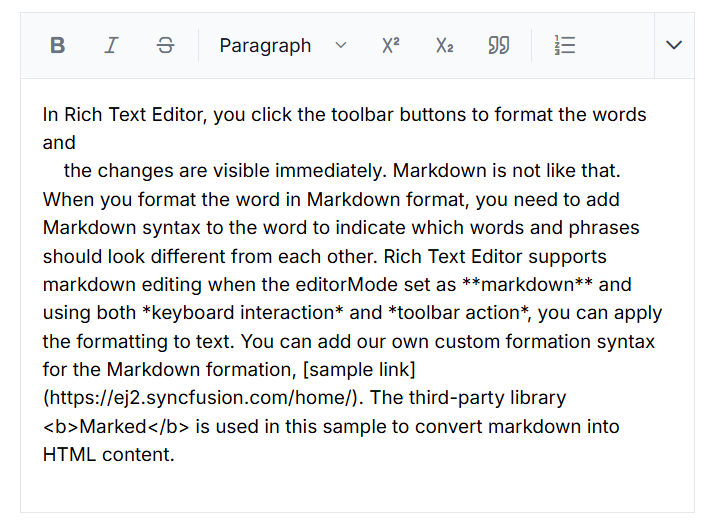
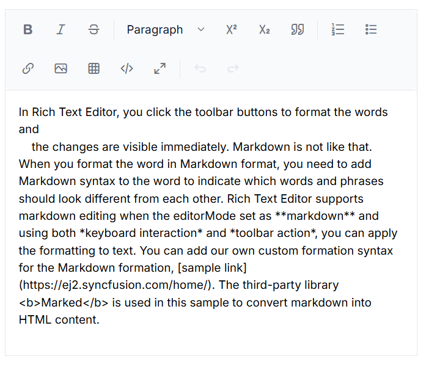
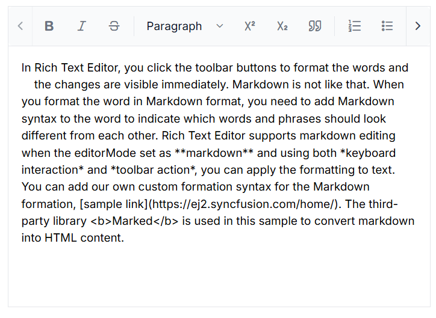
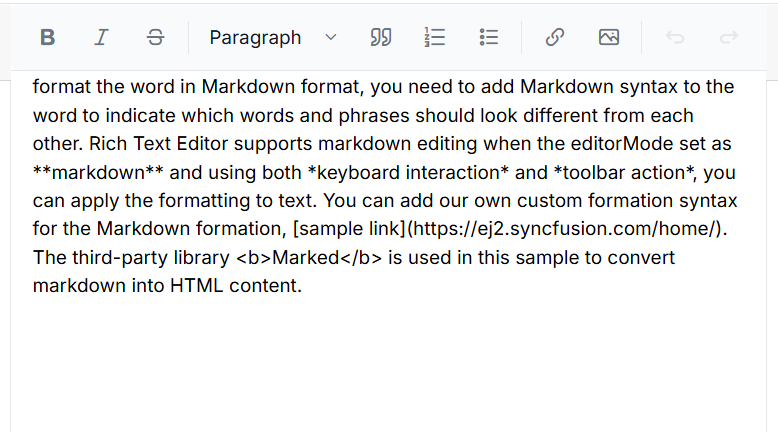
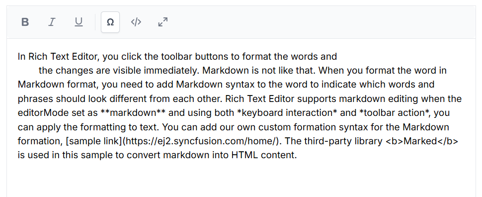

# Toolbar configuration in Markdown Editor Component

The Syncfusion&reg; Blazor Markdown Editor provides a flexible toolbar that enhances the editing experience. Users can choose from multiple toolbar layouts, enable sticky behavior, and add custom tools to suit their application needs. This guide explains the available toolbar types, configuration options, and customization techniques.

## Default toolbar items

By default, the Markdown Editor displays the following toolbar items:

> `Bold` , `Italic` , `|` , `Formats` , `Blockquote`, `OrderedList` , `UnorderedList` , `|` , `CreateLink` , `Image` , `|` , `SourceCode` , `Undo` , `Redo`

These default items cover essential text editing features, such as text formatting, lists, and linking.

## Type of toolbar 

The Syncfusion&reg; Markdown Editor allows you to configure different type of toolbars using the [Type](https://help.syncfusion.com/cr/blazor/Syncfusion.Blazor.RichTextEditor.RichTextEditorToolbarSettings.html#Syncfusion_Blazor_RichTextEditor_RichTextEditorToolbarSettings_Type) field in the [RichTextEditorToolbarSettings](https://help.syncfusion.com/cr/blazor/Syncfusion.Blazor.RichTextEditor.RichTextEditorToolbarSettings.html#Syncfusion_Blazor_RichTextEditor_RichTextEditorToolbarSettings) property.

The available toolbar types are:

1. Expand
2. MultiRow
3. Scrollable

### Expand Toolbar Configuration

The expand toolbar allows to hide the overflowing items in the next line by using the [ToolbarType.Expand](https://help.syncfusion.com/cr/blazor/Syncfusion.Blazor.RichTextEditor.ToolbarType.html#Syncfusion_Blazor_RichTextEditor_ToolbarType_Expand) property. By clicking the expand arrow, you can view the overflowing toolbar items. The default mode of toolbar is `Expand`. 









### Multi-row Toolbar Setup

You can display the toolbar items in a row-wise format by using the [ToolbarType.MultiRow](https://help.syncfusion.com/cr/blazor/Syncfusion.Blazor.RichTextEditor.ToolbarType.html#Syncfusion_Blazor_RichTextEditor_ToolbarType_MultiRow) property. All toolbar items are visible always.









### Scrollable Toolbar Implementation

You can display the toolbar items in a single line with horizontal scrolling by using the [ToolbarType.Scrollable](https://help.syncfusion.com/cr/blazor/Syncfusion.Blazor.RichTextEditor.ToolbarType.html#Syncfusion_Blazor_RichTextEditor_ToolbarType_Scrollable) property. 









### Sticky Toolbar Behavior

By default, toolbar is float at the top of the Rich Text Editor on scrolling. It can be customized by specifying the offset of the floating toolbar from documents top position using [FloatingToolbarOffset](https://help.syncfusion.com/cr/blazor/Syncfusion.Blazor.RichTextEditor.SfRichTextEditor.html#Syncfusion_Blazor_RichTextEditor_SfRichTextEditor_FloatingToolbarOffset).

You can enable or disable the floating toolbar using [RichTextEditorToolbarSettings.EnableFloating](https://help.syncfusion.com/cr/blazor/Syncfusion.Blazor.RichTextEditor.RichTextEditorToolbarSettings.html#Syncfusion_Blazor_RichTextEditor_RichTextEditorToolbarSettings_EnableFloating) property.









## Adding Custom Toolbar Items

The Rich Text Editor allows you to configure your own tools to its toolbar using the [RichTextEditorCustomToolbarItems](https://help.syncfusion.com/cr/blazor/Syncfusion.Blazor.RichTextEditor.RichTextEditorCustomToolbarItems.html) tag directive within a [RichTextEditorToolbarSettings](https://help.syncfusion.com/cr/blazor/Syncfusion.Blazor.RichTextEditor.RichTextEditorToolbarSettings.html). The tools can be plain text, icon, or HTML template. Also, define the order and group where the tool should be included.

This sample shows how to add your tools to the toolbar of the Rich Text Editor. The `Ω` command is added to insert special characters in the editor.

Refer to the following code sample for the custom tool with the tooltip text, which will be included in the [RichTextEditorToolbarSettings.Items](https://help.syncfusion.com/cr/blazor/Syncfusion.Blazor.RichTextEditor.RichTextEditorToolbarSettings.html#Syncfusion_Blazor_RichTextEditor_RichTextEditorToolbarSettings_Items) property.




@using Syncfusion.Blazor.Buttons
@using Syncfusion.Blazor.RichTextEditor

<SfRichTextEditor EditorMode="EditorMode.Markdown" Value="@MarkdownValue">
    <RichTextEditorToolbarSettings Items="@Tools">
        <RichTextEditorCustomToolbarItems>
            <RichTextEditorCustomToolbarItem Name="Symbol">
                <Template>
                    <SfButton @onclick="ClickHandler">Ω</SfButton>
                </Template>
            </RichTextEditorCustomToolbarItem>
        </RichTextEditorCustomToolbarItems>
    </RichTextEditorToolbarSettings>
</SfRichTextEditor>

@code {
    
    private string MarkdownValue { get; set; } = @"In Rich Text Editor, you click the toolbar buttons to format the words and 
        the changes are visible immediately. Markdown is not like that. When you format the word in Markdown format, you need to add Markdown syntax to the word to indicate which words and phrases should look different from each other. Rich Text Editor supports markdown editing when the editorMode set as **markdown** and using both *keyboard interaction* and *toolbar action*, you can apply the formatting to text. You can add our own custom formation syntax for the Markdown formation, [sample link](https://ej2.syncfusion.com/home/). The third-party library <b>Marked</b> is used in this sample to convert markdown into HTML content.";

    private List<ToolbarItemModel> Tools = new List<ToolbarItemModel>()
    {
        new ToolbarItemModel() { Command = ToolbarCommand.Bold },
        new ToolbarItemModel() { Command = ToolbarCommand.Italic },
        new ToolbarItemModel() { Command = ToolbarCommand.Underline },
        new ToolbarItemModel() { Command = ToolbarCommand.Separator },
        new ToolbarItemModel() { Name = "Symbol", TooltipText = "Insert Symbol" },
        new ToolbarItemModel() { Command = ToolbarCommand.SourceCode },
        new ToolbarItemModel() { Command = ToolbarCommand.FullScreen }
    };
    private void ClickHandler()
    {
        //Perform your action here
    }
}




