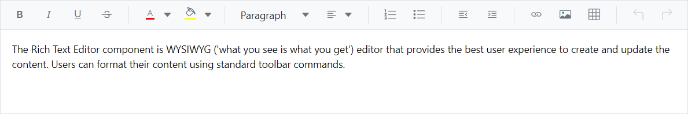
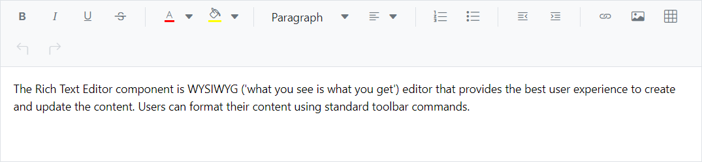
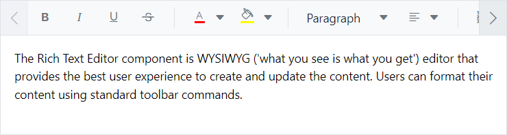
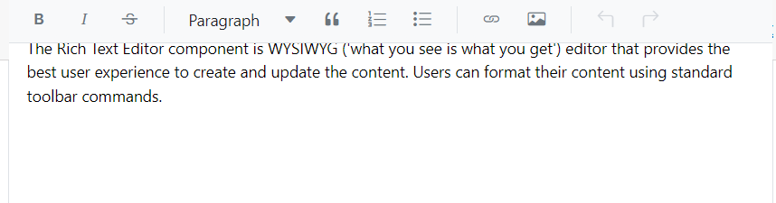

# Toolbar types in Blazor Markdown Editor in RichTextEditor

The Blazor Markdown Editor inside the Rich Text Editor toolbar contains a collection of tools such as bold, Italic, and text alignment buttons that are used to format the content.

You can customize the toolbar configurations by using the [RichTextEditorToolbarSettings.Type](https://help.syncfusion.com/cr/blazor/Syncfusion.Blazor.RichTextEditor.RichTextEditorToolbarSettings.html#Syncfusion_Blazor_RichTextEditor_RichTextEditorToolbarSettings_Type) property. The types of toolbar are:

1. Expand
2. MultiRow
3. Scrollable

## Expand Toolbar

The expand toolbar allows to hide the overflowing items in the next line by using the [ToolbarType.Expand](https://help.syncfusion.com/cr/blazor/Syncfusion.Blazor.RichTextEditor.ToolbarType.html#Syncfusion_Blazor_RichTextEditor_ToolbarType_Expand) property. By clicking the expand arrow, you can view the overflowing toolbar items. The default mode of toolbar is `Expand`.




@using Syncfusion.Blazor.RichTextEditor 

<SfRichTextEditor EditorMode="EditorMode.Markdown">
    <RichTextEditorToolbarSettings Items="@Tools" Type="ToolbarType.Expand" />
    The Rich Text Editor component is WYSIWYG ('what you see is what you get') editor that provides the best user experience to create and update the content. Users can format their content using standard toolbar commands.
</SfRichTextEditor> 

@code{ 
    private List<ToolbarItemModel> Tools = new List<ToolbarItemModel>() 
    { 
        new ToolbarItemModel() { Command = ToolbarCommand.Bold }, 
        new ToolbarItemModel() { Command = ToolbarCommand.Italic }, 
        new ToolbarItemModel() { Command = ToolbarCommand.Underline }, 
        new ToolbarItemModel() { Command = ToolbarCommand.StrikeThrough }, 
        new ToolbarItemModel() { Command = ToolbarCommand.Separator }, 
        new ToolbarItemModel() { Command = ToolbarCommand.FontColor }, 
        new ToolbarItemModel() { Command = ToolbarCommand.BackgroundColor }, 
        new ToolbarItemModel() { Command = ToolbarCommand.Separator }, 
        new ToolbarItemModel() { Command = ToolbarCommand.Formats }, 
        new ToolbarItemModel() { Command = ToolbarCommand.Alignments }, 
        new ToolbarItemModel() { Command = ToolbarCommand.Separator }, 
        new ToolbarItemModel() { Command = ToolbarCommand.OrderedList }, 
        new ToolbarItemModel() { Command = ToolbarCommand.UnorderedList }, 
        new ToolbarItemModel() { Command = ToolbarCommand.Separator }, 
        new ToolbarItemModel() { Command = ToolbarCommand.Outdent }, 
        new ToolbarItemModel() { Command = ToolbarCommand.Indent }, 
        new ToolbarItemModel() { Command = ToolbarCommand.Separator },
        new ToolbarItemModel() { Command = ToolbarCommand.CreateLink }, 
        new ToolbarItemModel() { Command = ToolbarCommand.Image }, 
        new ToolbarItemModel() { Command = ToolbarCommand.CreateTable }, 
        new ToolbarItemModel() { Command = ToolbarCommand.Separator }, 
        new ToolbarItemModel() { Command = ToolbarCommand.Undo }, 
        new ToolbarItemModel() { Command = ToolbarCommand.Redo } 
    }; 
}




## Multi-row Toolbar

You can display the toolbar items in a row-wise format by using the [ToolbarType.MultiRow](https://help.syncfusion.com/cr/blazor/Syncfusion.Blazor.RichTextEditor.ToolbarType.html#Syncfusion_Blazor_RichTextEditor_ToolbarType_MultiRow) property. All toolbar items are visible always.




@using Syncfusion.Blazor.RichTextEditor 

<SfRichTextEditor EditorMode="EditorMode.Markdown">
    <RichTextEditorToolbarSettings Items="@Tools" Type="ToolbarType.MultiRow" />
The Rich Text Editor component is WYSIWYG ('what you see is what you get') editor that provides the best user experience to create and update the content. Users can format their content using standard toolbar commands. 
</SfRichTextEditor> 

@code{ 
    private List<ToolbarItemModel> Tools = new List<ToolbarItemModel>() 
    { 
        new ToolbarItemModel() { Command = ToolbarCommand.Bold }, 
        new ToolbarItemModel() { Command = ToolbarCommand.Italic }, 
        new ToolbarItemModel() { Command = ToolbarCommand.Underline }, 
        new ToolbarItemModel() { Command = ToolbarCommand.StrikeThrough }, 
        new ToolbarItemModel() { Command = ToolbarCommand.Separator }, 
        new ToolbarItemModel() { Command = ToolbarCommand.FontColor }, 
        new ToolbarItemModel() { Command = ToolbarCommand.BackgroundColor }, 
        new ToolbarItemModel() { Command = ToolbarCommand.Separator }, 
        new ToolbarItemModel() { Command = ToolbarCommand.Formats }, 
        new ToolbarItemModel() { Command = ToolbarCommand.Alignments }, 
        new ToolbarItemModel() { Command = ToolbarCommand.Separator }, 
        new ToolbarItemModel() { Command = ToolbarCommand.OrderedList }, 
        new ToolbarItemModel() { Command = ToolbarCommand.UnorderedList }, 
        new ToolbarItemModel() { Command = ToolbarCommand.Separator }, 
        new ToolbarItemModel() { Command = ToolbarCommand.Outdent }, 
        new ToolbarItemModel() { Command = ToolbarCommand.Indent }, 
        new ToolbarItemModel() { Command = ToolbarCommand.Separator },
        new ToolbarItemModel() { Command = ToolbarCommand.CreateLink }, 
        new ToolbarItemModel() { Command = ToolbarCommand.Image }, 
        new ToolbarItemModel() { Command = ToolbarCommand.CreateTable }, 
        new ToolbarItemModel() { Command = ToolbarCommand.Separator }, 
        new ToolbarItemModel() { Command = ToolbarCommand.Undo }, 
        new ToolbarItemModel() { Command = ToolbarCommand.Redo } 
    }; 
}




## Scrollable Toolbar

You can display the toolbar items in a single line with horizontal scrolling by using the [ToolbarType.Scrollable](https://help.syncfusion.com/cr/blazor/Syncfusion.Blazor.RichTextEditor.ToolbarType.html#Syncfusion_Blazor_RichTextEditor_ToolbarType_Scrollable) property. 




@using Syncfusion.Blazor.RichTextEditor 

<SfRichTextEditor EditorMode="EditorMode.Markdown">
    <RichTextEditorToolbarSettings Items="@Tools" Type="ToolbarType.Scrollable" />
The Rich Text Editor component is WYSIWYG ('what you see is what you get') editor that provides the best user experience to create and update the content. Users can format their content using standard toolbar commands. 
</SfRichTextEditor> 

@code{ 
    private List<ToolbarItemModel> Tools = new List<ToolbarItemModel>() 
    { 
        new ToolbarItemModel() { Command = ToolbarCommand.Bold }, 
        new ToolbarItemModel() { Command = ToolbarCommand.Italic }, 
        new ToolbarItemModel() { Command = ToolbarCommand.Underline }, 
        new ToolbarItemModel() { Command = ToolbarCommand.StrikeThrough }, 
        new ToolbarItemModel() { Command = ToolbarCommand.Separator }, 
        new ToolbarItemModel() { Command = ToolbarCommand.FontColor }, 
        new ToolbarItemModel() { Command = ToolbarCommand.BackgroundColor }, 
        new ToolbarItemModel() { Command = ToolbarCommand.Separator }, 
        new ToolbarItemModel() { Command = ToolbarCommand.Formats }, 
        new ToolbarItemModel() { Command = ToolbarCommand.Alignments }, 
        new ToolbarItemModel() { Command = ToolbarCommand.Separator }, 
        new ToolbarItemModel() { Command = ToolbarCommand.OrderedList }, 
        new ToolbarItemModel() { Command = ToolbarCommand.UnorderedList }, 
        new ToolbarItemModel() { Command = ToolbarCommand.Separator }, 
        new ToolbarItemModel() { Command = ToolbarCommand.Outdent }, 
        new ToolbarItemModel() { Command = ToolbarCommand.Indent }, 
        new ToolbarItemModel() { Command = ToolbarCommand.Separator },
        new ToolbarItemModel() { Command = ToolbarCommand.CreateLink }, 
        new ToolbarItemModel() { Command = ToolbarCommand.Image }, 
        new ToolbarItemModel() { Command = ToolbarCommand.CreateTable }, 
        new ToolbarItemModel() { Command = ToolbarCommand.Separator }, 
        new ToolbarItemModel() { Command = ToolbarCommand.Undo }, 
        new ToolbarItemModel() { Command = ToolbarCommand.Redo } 
    }; 
}




## Floating Toolbar

By default, toolbar is float at the top of the Rich Text Editor on scrolling. It can be customized by specifying the offset of the floating toolbar from documents top position using [FloatingToolbarOffset](https://help.syncfusion.com/cr/blazor/Syncfusion.Blazor.RichTextEditor.SfRichTextEditor.html#Syncfusion_Blazor_RichTextEditor_SfRichTextEditor_FloatingToolbarOffset).

You can enable or disable the floating toolbar using [RichTextEditorToolbarSettings.EnableFloating](https://help.syncfusion.com/cr/blazor/Syncfusion.Blazor.RichTextEditor.RichTextEditorToolbarSettings.html#Syncfusion_Blazor_RichTextEditor_RichTextEditorToolbarSettings_EnableFloating) property.




@using Syncfusion.Blazor.RichTextEditor

<SfRichTextEditor Height="800px" EditorMode="EditorMode.Markdown">
    <RichTextEditorToolbarSettings EnableFloating="true" />
The Rich Text Editor component is WYSIWYG ('what you see is what you get') editor that provides the best user experience to create and update the content. Users can format their content using standard toolbar commands.
</SfRichTextEditor>




