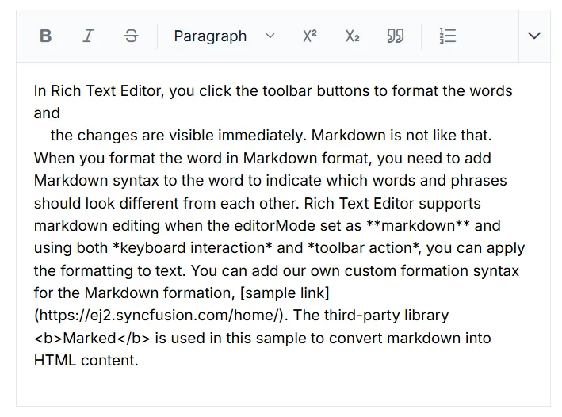
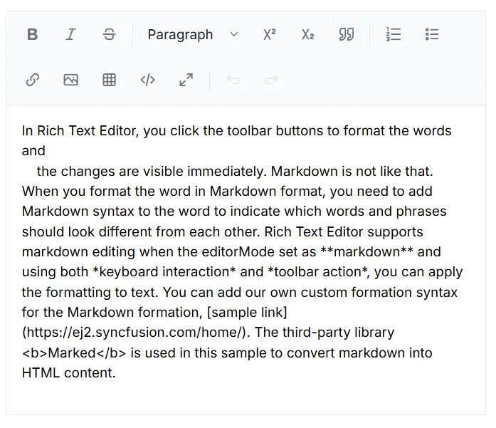
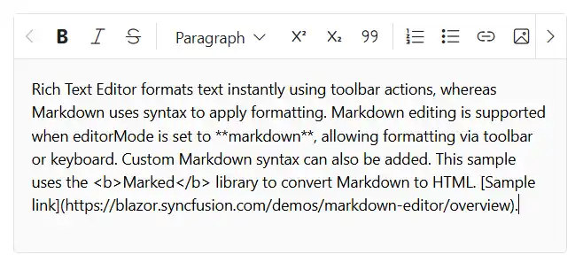
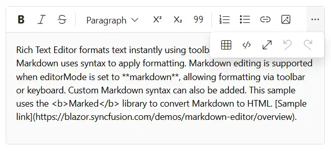
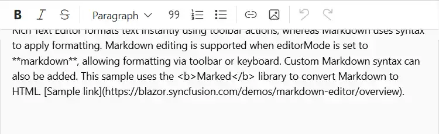
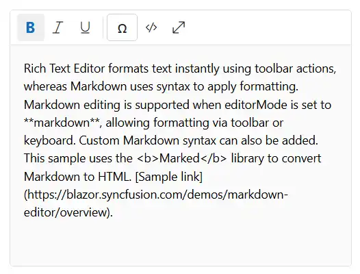

# Toolbar configuration in Markdown Editor Component

The Blazor Markdown Editor provides a flexible toolbar that enhances the editing experience. Users can choose from multiple toolbar layouts, enable sticky behavior, and add custom tools based on their application requirements. This guide explains the available toolbar types, configuration options, and customization techniques.

## Default toolbar items

By default, the Markdown Editor displays the following toolbar items:

> `Bold` , `Italic` , `|` , `Formats` , `Blockquote`, `OrderedList` , `UnorderedList` , `|` , `CreateLink` , `Image` , `|` , `SourceCode` , `Undo` , `Redo`

These default items provide essential text editing features, including text formatting, list creation, block quotes, media insertion, and undo/redo actions.

## Type of toolbar 

The Blazor Markdown Editor allows you to configure different type of toolbars using the [Type](https://help.syncfusion.com/cr/blazor/Syncfusion.Blazor.RichTextEditor.RichTextEditorToolbarSettings.html#Syncfusion_Blazor_RichTextEditor_RichTextEditorToolbarSettings_Type) property of the [RichTextEditorToolbarSettings](https://help.syncfusion.com/cr/blazor/Syncfusion.Blazor.RichTextEditor.RichTextEditorToolbarSettings.html#Syncfusion_Blazor_RichTextEditor_RichTextEditorToolbarSettings).

The available toolbar types are:

1. Expand
2. MultiRow
3. Scrollable
4. Popup

### Expand Toolbar Configuration

The expand toolbar allows to hide the overflowing items in the next line by using the [ToolbarType.Expand](https://help.syncfusion.com/cr/blazor/Syncfusion.Blazor.RichTextEditor.ToolbarType.html#Syncfusion_Blazor_RichTextEditor_ToolbarType_Expand) property. By clicking the expand arrow, you can view the overflowing toolbar items. The default mode of toolbar is `Expand`. 









### Multi-row Toolbar Setup

You can display the toolbar items in a row-wise format by using the [ToolbarType.MultiRow](https://help.syncfusion.com/cr/blazor/Syncfusion.Blazor.RichTextEditor.ToolbarType.html#Syncfusion_Blazor_RichTextEditor_ToolbarType_MultiRow) property. All toolbar items are visible always.









### Scrollable Toolbar Implementation

You can display the toolbar items in a single line with horizontal scrolling by using the [ToolbarType.Scrollable](https://help.syncfusion.com/cr/blazor/Syncfusion.Blazor.RichTextEditor.ToolbarType.html#Syncfusion_Blazor_RichTextEditor_ToolbarType_Scrollable) property. 









### Popup Toolbar Implementation

The [ToolbarType.Popup](https://help.syncfusion.com/cr/blazor/Syncfusion.Blazor.RichTextEditor.ToolbarType.html#Syncfusion_Blazor_RichTextEditor_ToolbarType_Popup) toolbar property displays items in a popup container, ideal for limited space or smaller screens.









### Sticky Toolbar Behavior

By default, toolbar is float at the top of the Rich Text Editor on scrolling. It can be customized by specifying the offset of the floating toolbar from documents top position using [FloatingToolbarOffset](https://help.syncfusion.com/cr/blazor/Syncfusion.Blazor.RichTextEditor.SfRichTextEditor.html#Syncfusion_Blazor_RichTextEditor_SfRichTextEditor_FloatingToolbarOffset).

You can enable or disable the floating toolbar using [RichTextEditorToolbarSettings.EnableFloating](https://help.syncfusion.com/cr/blazor/Syncfusion.Blazor.RichTextEditor.RichTextEditorToolbarSettings.html#Syncfusion_Blazor_RichTextEditor_RichTextEditorToolbarSettings_EnableFloating) property.









## Adding Custom Toolbar Items

The Rich Text Editor allows you to configure your own tools to its toolbar using the [RichTextEditorCustomToolbarItems](https://help.syncfusion.com/cr/blazor/Syncfusion.Blazor.RichTextEditor.RichTextEditorCustomToolbarItems.html) tag directive within a [RichTextEditorToolbarSettings](https://help.syncfusion.com/cr/blazor/Syncfusion.Blazor.RichTextEditor.RichTextEditorToolbarSettings.html). The tools can be plain text, icon, or HTML template. Also, define the order and group where the tool should be included.

This sample shows how to add your tools to the toolbar of the Rich Text Editor. The `Ω` command is added to insert special characters in the editor.

Refer to the following code sample for the custom tool with the tooltip text, which will be included in the [RichTextEditorToolbarSettings.Items](https://help.syncfusion.com/cr/blazor/Syncfusion.Blazor.RichTextEditor.RichTextEditorToolbarSettings.html#Syncfusion_Blazor_RichTextEditor_RichTextEditorToolbarSettings_Items) property.




@using Syncfusion.Blazor.Buttons
@using Syncfusion.Blazor.RichTextEditor

<SfRichTextEditor EditorMode="EditorMode.Markdown" Value="@MarkdownValue">
    <RichTextEditorToolbarSettings Items="@Tools">
        <RichTextEditorCustomToolbarItems>
            <RichTextEditorCustomToolbarItem Name="Symbol">
                <Template>
                    <SfButton @onclick="ClickHandler">Ω</SfButton>
                </Template>
            </RichTextEditorCustomToolbarItem>
        </RichTextEditorCustomToolbarItems>
    </RichTextEditorToolbarSettings>
</SfRichTextEditor>

@code {
    
    private string MarkdownValue { get; set; } = @"Rich Text Editor formats text instantly using toolbar actions, whereas Markdown uses syntax to apply formatting. Markdown editing is supported when editorMode is set to **markdown**, allowing formatting via toolbar or keyboard. Custom Markdown syntax can also be added. This sample uses the <b>Marked</b> library to convert Markdown to HTML. [Sample link](https://blazor.syncfusion.com/demos/markdown-editor/overview).";

    private List<ToolbarItemModel> Tools = new List<ToolbarItemModel>()
    {
        new ToolbarItemModel() { Command = ToolbarCommand.Bold },
        new ToolbarItemModel() { Command = ToolbarCommand.Italic },
        new ToolbarItemModel() { Command = ToolbarCommand.Underline },
        new ToolbarItemModel() { Command = ToolbarCommand.Separator },
        new ToolbarItemModel() { Name = "Symbol", TooltipText = "Insert Symbol" },
        new ToolbarItemModel() { Command = ToolbarCommand.SourceCode },
        new ToolbarItemModel() { Command = ToolbarCommand.FullScreen }
    };
    private void ClickHandler()
    {
        //Perform your action here
    }
}




