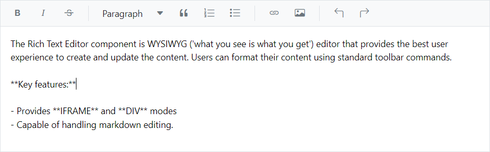
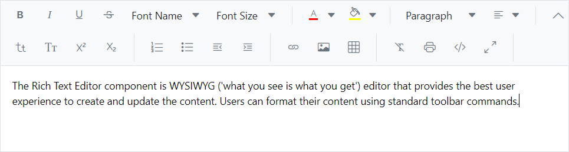

# Undo Redo Manager in Blazor Markdown Editor

The undo and redo tools allow you to edit the text by disregarding or cancelling the recently made changes and restoring it to its previous state. It is a useful tool for restoring a previously performed action that was accidentally changed. In the editor, you can undo or redo up to `30` actions by default.

To undo and redo operations, do one of the following:

* Press the undo/redo button on the toolbar
* Press the <kbd>Ctrl + Z</kbd>/ <kbd>Ctrl + Y</kbd> combination on the keyboard

Using the [UndoRedoSteps](https://help.syncfusion.com/cr/blazor/Syncfusion.Blazor.RichTextEditor.SfRichTextEditor.html) property, you can customise the undo/redo step count. Undo and redo actions are stored in the undo/redo manager in `300` milliseconds by default. The time interval can be customised by using the [UndoRedoTimer](https://help.syncfusion.com/cr/blazor/Syncfusion.Blazor.RichTextEditor.SfRichTextEditor.html#Syncfusion_Blazor_RichTextEditor_SfRichTextEditor_UndoRedoTimer) property.









## Disable undo redo

You can disable the undo and redo tools from the toolbar menu by using the [UndoRedoSteps](https://help.syncfusion.com/cr/blazor/Syncfusion.Blazor.RichTextEditor.SfRichTextEditor.html#Syncfusion_Blazor_RichTextEditor_SfRichTextEditor_UndoRedoSteps) property. If you set the `UndoRedoSteps` to `0`, the count of undo history will not be maintained in the UndoRedoManager. So, the undo/redo icons are disabled from the toolbar.









## Remove undo redo toolbar item

You can remove the undo and redo tools from the toolbar by using the [RichTextEditorToolbarSettings.Items](https://help.syncfusion.com/cr/blazor/Syncfusion.Blazor.RichTextEditor.RichTextEditorToolbarSettings.html#Syncfusion_Blazor_RichTextEditor_RichTextEditorToolbarSettings_Items) property.

In the following code example, remove the undo and redo tools from the toolbar.




<SfRichTextEditor EditorMode="EditorMode.Markdown">
    <RichTextEditorToolbarSettings Items="@Tools" />
The Rich Text Editor component is WYSIWYG ('what you see is what you get') editor that provides the best user experience to create and update the content. Users can format their content using standard toolbar commands.
</SfRichTextEditor>

@code {
    private List<ToolbarItemModel> Tools = new List<ToolbarItemModel>()
    {
        new ToolbarItemModel() { Command = ToolbarCommand.Bold },
        new ToolbarItemModel() { Command = ToolbarCommand.Italic },
        new ToolbarItemModel() { Command = ToolbarCommand.Underline },
        new ToolbarItemModel() { Command = ToolbarCommand.StrikeThrough },
        new ToolbarItemModel() { Command = ToolbarCommand.FontName },
        new ToolbarItemModel() { Command = ToolbarCommand.FontSize },
        new ToolbarItemModel() { Command = ToolbarCommand.Separator },
        new ToolbarItemModel() { Command = ToolbarCommand.FontColor },
        new ToolbarItemModel() { Command = ToolbarCommand.BackgroundColor },
        new ToolbarItemModel() { Command = ToolbarCommand.Separator },
        new ToolbarItemModel() { Command = ToolbarCommand.Formats },
        new ToolbarItemModel() { Command = ToolbarCommand.Alignments },
        new ToolbarItemModel() { Command = ToolbarCommand.Separator },
        new ToolbarItemModel() { Command = ToolbarCommand.LowerCase },
        new ToolbarItemModel() { Command = ToolbarCommand.UpperCase },
        new ToolbarItemModel() { Command = ToolbarCommand.SuperScript },
        new ToolbarItemModel() { Command = ToolbarCommand.SubScript },
        new ToolbarItemModel() { Command = ToolbarCommand.Separator },
        new ToolbarItemModel() { Command = ToolbarCommand.OrderedList },
        new ToolbarItemModel() { Command = ToolbarCommand.UnorderedList },
        new ToolbarItemModel() { Command = ToolbarCommand.Outdent },
        new ToolbarItemModel() { Command = ToolbarCommand.Indent },
        new ToolbarItemModel() { Command = ToolbarCommand.Separator },
        new ToolbarItemModel() { Command = ToolbarCommand.CreateLink },
        new ToolbarItemModel() { Command = ToolbarCommand.Image },
        new ToolbarItemModel() { Command = ToolbarCommand.CreateTable },
        new ToolbarItemModel() { Command = ToolbarCommand.Separator },
        new ToolbarItemModel() { Command = ToolbarCommand.ClearFormat },
        new ToolbarItemModel() { Command = ToolbarCommand.Print },
        new ToolbarItemModel() { Command = ToolbarCommand.SourceCode },
        new ToolbarItemModel() { Command = ToolbarCommand.FullScreen },
        new ToolbarItemModel() { Command = ToolbarCommand.Separator },
    };
}




