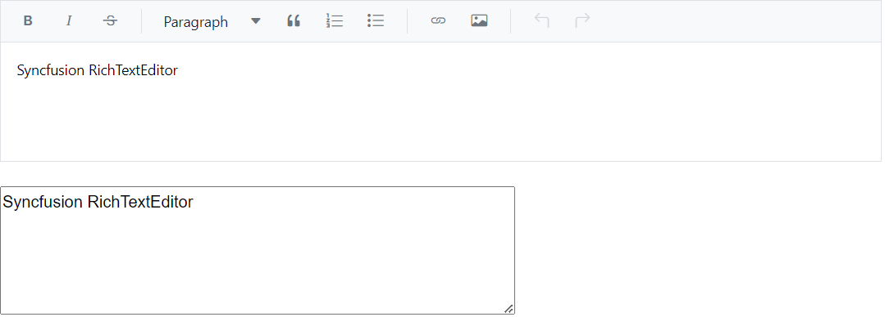

# Value Binding in Blazor RichTextEditor

You can bind the [Value](https://help.syncfusion.com/cr/blazor/Syncfusion.Blazor.RichTextEditor.SfRichTextEditor.html#Syncfusion_Blazor_RichTextEditor_SfRichTextEditor_Value) to the editor component, by using the `@bind-Value` attribute and it supports string type. If component value has been changed, it will affect all the places where you bind the variable for the **bind-Value** attribute.




@using Syncfusion.Blazor.RichTextEditor

<SfRichTextEditor @bind-Value="@Value" EditorMode="EditorMode.Markdown" />
 
<textarea rows="5" cols="60" @bind="@Value"></textarea>

@code {
    private string Value { get; set; } = "Syncfusion RichTextEditor";
}




## Auto save

The Markdown Editor saves its content automatically when you focus out the editor, and you can save its content automatically at regular intervals based on the [SaveInterval](https://help.syncfusion.com/cr/blazor/Syncfusion.Blazor.RichTextEditor.SfRichTextEditor.html#Syncfusion_Blazor_RichTextEditor_SfRichTextEditor_SaveInterval) and [AutoSaveOnIdle](https://help.syncfusion.com/cr/blazor/Syncfusion.Blazor.RichTextEditor.SfRichTextEditor.html#Syncfusion_Blazor_RichTextEditor_SfRichTextEditor_AutoSaveOnIdle) properties while editing.

* If `AutoSaveOnIdle` is set to true, the content is saved if the editor is idle for the number of milliseconds specified in the `SaveInterval` property.

* If `AutoSaveOnIdle` is set to false, the editor saves the content at the regular interval of milliseconds specified in the `SaveInterval` property.




@using Syncfusion.Blazor.RichTextEditor

<SfRichTextEditor ID="AutoSave" EditorMode="EditorMode.Markdown" SaveInterval="saveInterval" AutoSaveOnIdle="true" Value="@Value">
Type or edit the content to be saved automatically in the editor
    <RichTextEditorEvents ValueChange="UpdateStatus"/>
</SfRichTextEditor>

@code{
    private string Value { get; set; } = "Start to type a content to save";
    private int saveInterval { get; set; } = 5000;
    private void UpdateStatus(Syncfusion.Blazor.RichTextEditor.ChangeEventArgs args)
    {
        this.Value = args.Value;
    }
}




## Get editor content

You can get the Markdown Editor inside RichTextEditor's edited content by using the [ValueChange](https://help.syncfusion.com/cr/blazor/Syncfusion.Blazor.RichTextEditor.RichTextEditorEvents.html#Syncfusion_Blazor_RichTextEditor_RichTextEditorEvents_ValueChange) event.

When the user changes the content, the `ValueChange` event is invoked on every [SaveInterval](https://help.syncfusion.com/cr/blazor/Syncfusion.Blazor.RichTextEditor.SfRichTextEditor.html#Syncfusion_Blazor_RichTextEditor_SfRichTextEditor_SaveInterval) time or when the editor loses focus.




@using Syncfusion.Blazor.RichTextEditor

<SfRichTextEditor @bind-Value="@Value" EditorMode="EditorMode.Markdown" @ref="RteObj">
    <RichTextEditorEvents ValueChange="@ValueChangeHandler">
    </RichTextEditorEvents>
</SfRichTextEditor>

@code {
    SfRichTextEditor RteObj;
    private string Value { get; set; } = "Syncfusion RichTextEditor";
    public void ValueChangeHandler(Syncfusion.Blazor.RichTextEditor.ChangeEventArgs args)
    {
        //here you can can get the editor value using args.value
        this.Value = args.Value;
    }
}




N> You can refer to our [Blazor Rich Text Editor](https://www.syncfusion.com/blazor-components/blazor-wysiwyg-rich-text-editor) feature tour page for its groundbreaking feature representations. You can also explore our [Blazor Rich Text Editor](https://blazor.syncfusion.com/demos/rich-text-editor/overview?theme=bootstrap4) example to know how to render and configure the rich text editor tools.