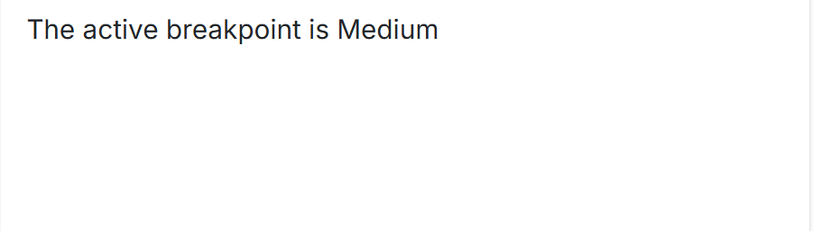
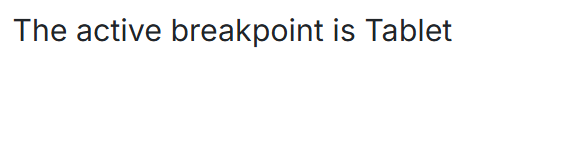

# Breakpoints in Blazor Media Query Component

The Blazor Media Query component utilizes breakpoints to create responsive and adaptive layouts. These breakpoints define specific screen sizes or characteristics where the layout and styling of a web application need to be adjusted to provide the best user experience.

## Built-in Breakpoints

The component provides a set of built-in breakpoints for common screen sizes. The [`ActiveBreakpoint`](https://help.syncfusion.com/cr/blazor/Syncfusion.Blazor.SfMediaQuery.html#Syncfusion_Blazor_SfMediaQuery_ActiveBreakpoint) property returns the name of the breakpoint that currently matches the user's screen dimensions.

The built-in breakpoint values of Media Query component are as follows:

* Small - browser width <= 768 pixels
* Medium - browser width between 768 and 1024 pixels
* Large - browser width >= 1024 pixels

### Modifying Built-in Breakpoints

The media queries for these built-in breakpoints can be customized using the [`MediaQuery`](https://help.syncfusion.com/cr/blazor/Syncfusion.Blazor.MediaBreakpoint.html#Syncfusion_Blazor_MediaBreakpoint_MediaQuery) property of the associated [MediaBreakpoint](https://help.syncfusion.com/cr/blazor/Syncfusion.Blazor.MediaBreakpoint.html) in `SfMediaQuery`.

```cshtml

@using Syncfusion.Blazor

<SfMediaQuery @bind-ActiveBreakpoint="@activeBreakpoint"></SfMediaQuery>

<h3>The active breakpoint is @activeBreakpoint</h3>

@code {
    private string activeBreakpoint;

    protected override void OnInitialized()
    {
        SfMediaQuery.Small.MediaQuery = "(max-width: 500px)";
        SfMediaQuery.Medium.MediaQuery = "(min-width: 500px)";
        SfMediaQuery.Large.MediaQuery = "(min-width: 1600px)";
        base.OnInitialized();
    }
}

```


## Custom Media Breakpoints

The Blazor Media Query component allows defining entirely custom media breakpoints using the [`MediaBreakpoints`](https://help.syncfusion.com/cr/blazor/Syncfusion.Blazor.SfMediaQuery.html#Syncfusion_Blazor_SfMediaQuery_MediaBreakpoints) property. This provides fine-grained control over how the web application's appearance adapts to specific screen conditions.

```cshtml

@using Syncfusion.Blazor

<SfMediaQuery MediaBreakpoints="@mediaBreakPoint" @bind-ActiveBreakpoint="@activeBreakpoint"></SfMediaQuery>

<h3>The active breakpoint is @activeBreakpoint</h3>

@code {
    private string activeBreakpoint;
    private List<MediaBreakpoint> mediaBreakPoint = new List<MediaBreakpoint>();
    protected override void OnInitialized()
    {
        mediaBreakPoint = new List<MediaBreakpoint>() 
        {
            new MediaBreakpoint() { Breakpoint = "Mobile", MediaQuery = "(max-width: 600px)" },
            new MediaBreakpoint() { Breakpoint = "Tablet", MediaQuery = "(min-width: 600px) and (max-width: 999px)" },
            new MediaBreakpoint() { Breakpoint = "Laptop", MediaQuery = "(min-width: 1000px) and (max-width: 1199px)" },
            new MediaBreakpoint() { Breakpoint = "Desktop", MediaQuery = "(min-width: 1200px)" }
        };
        base.OnInitialized();
    }
}

```


