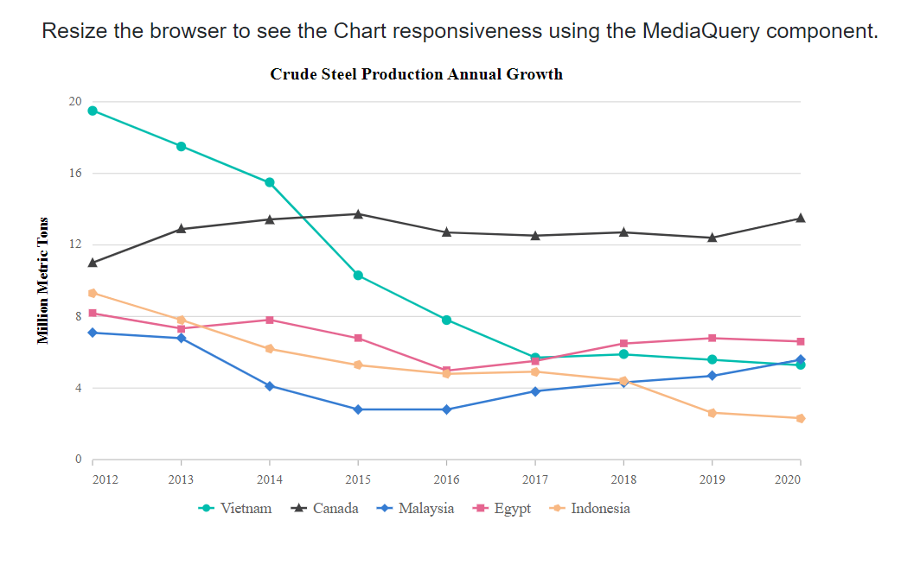

# Integrate Media Query with other components

The `Media Query` can be integrated with other components such as the Chart, Grid, Stepper and others. The Media Query component is used to enhance the responsiveness of the components placed inside.

## Media Query integration in Chart

By integrating the `Media Query` component with a `Chart`, you can dynamically adjust the chart's appearance in response to changes in the browser size. This ensures an optimal viewing experience across various devices and screen dimensions.

The built-in breakpoint values of Media Query component are as follows:

```cshtml

@using Syncfusion.Blazor
@using Syncfusion.Blazor.Charts

<h5 style="text-align:center;">Resize the browser to see the Chart responsiveness using the MediaQuery component.</h5>
<SfMediaQuery></SfMediaQuery>
<SfChart @ref="chart" Title="Crude Steel Production Annual Growth" Width="@Width" Theme="@Theme">        
    <ChartArea><ChartAreaBorder Width="0"></ChartAreaBorder></ChartArea>
    <ChartPrimaryXAxis ValueType="Syncfusion.Blazor.Charts.ValueType.DateTime" EdgeLabelPlacement="EdgeLabelPlacement.Shift">
        <ChartAxisMajorGridLines Width="0"></ChartAxisMajorGridLines>
    </ChartPrimaryXAxis>
    <ChartPrimaryYAxis Title="Million Metric Tons" Minimum="0" Maximum="20" Interval="4">
        <ChartAxisLineStyle Width="0"></ChartAxisLineStyle>
        <ChartAxisMajorTickLines Width="0"></ChartAxisMajorTickLines>
    </ChartPrimaryYAxis>
    <ChartTooltipSettings Enable="true"></ChartTooltipSettings>
    <ChartSeriesCollection>
        <ChartSeries DataSource="@ChartData" Name="Vietnam" XName="Period" Width="2" Opacity="1" YName="Viet_Growth" Type="ChartSeriesType.Line">
            <ChartMarker Visible="true" Width="7" Height="7" IsFilled="true" Shape="ChartShape.Circle"></ChartMarker>
        </ChartSeries>
        <ChartSeries DataSource="@ChartData" Name="Canada" XName="Period" Width="2" Opacity="1" YName="Can_Growth" Type="ChartSeriesType.Line">
            <ChartMarker Visible="true" Width="6" IsFilled="true" Height="6" Shape="ChartShape.Triangle"></ChartMarker>
        </ChartSeries>
        <ChartSeries DataSource="@ChartData" Name="Malaysia" XName="Period" Width="2" Opacity="1" YName="Mal_Growth" Type="ChartSeriesType.Line">
            <ChartMarker Visible="true" Width="7" IsFilled="true" Height="7" Shape="ChartShape.Diamond"></ChartMarker>
        </ChartSeries>
        <ChartSeries DataSource="@ChartData" Name="Egypt" XName="Period" Width="2" Opacity="1" YName="Egy_Growth" Type="ChartSeriesType.Line">
            <ChartMarker Visible="true" Width="5" IsFilled="true"  Height="5" Shape="ChartShape.Rectangle"></ChartMarker>
        </ChartSeries>
        <ChartSeries DataSource="@ChartData" Name="Indonesia" XName="Period" Width="2" Opacity="1" YName="Ind_Growth" Type="ChartSeriesType.Line">
            <ChartMarker Visible="true" Width="7" IsFilled="true" Height="7" Shape="ChartShape.Pentagon"></ChartMarker>
        </ChartSeries>
    </ChartSeriesCollection>
    <ChartLegendSettings EnableHighlight="true"></ChartLegendSettings>
</SfChart>

@code {
    private Theme Theme { get; set; }
    public string Width { get; set; } = "90%";
    private SfChart chart;

    public class LineChartData
    {
        public DateTime Period { get; set; }
        public double Can_Growth { get; set; }
        public double Viet_Growth { get; set; }
        public double Mal_Growth { get; set; }
        public double Egy_Growth { get; set; }
        public double Ind_Growth { get; set; }
    }


    public List<LineChartData> ChartData = new List<LineChartData>
    {
        new LineChartData { Period = new DateTime(2012, 01, 01), Can_Growth = 11.0, Viet_Growth = 19.5, Mal_Growth = 7.1, Egy_Growth = 8.2, Ind_Growth = 9.3 },
        new LineChartData { Period = new DateTime(2013, 01, 01), Can_Growth = 12.9, Viet_Growth = 17.5, Mal_Growth = 6.8, Egy_Growth = 7.3, Ind_Growth = 7.8 },
        new LineChartData { Period = new DateTime(2014, 01, 01), Can_Growth = 13.4, Viet_Growth = 15.5, Mal_Growth = 4.1, Egy_Growth = 7.8, Ind_Growth = 6.2  },
        new LineChartData { Period = new DateTime(2015, 01, 01), Can_Growth = 13.7, Viet_Growth = 10.3, Mal_Growth = 2.8, Egy_Growth = 6.8, Ind_Growth = 5.3 },
        new LineChartData { Period = new DateTime(2016, 01, 01), Can_Growth = 12.7, Viet_Growth = 7.8, Mal_Growth = 2.8, Egy_Growth = 5.0, Ind_Growth = 4.8 },
        new LineChartData { Period = new DateTime(2017, 01, 01), Can_Growth = 12.5, Viet_Growth = 5.7, Mal_Growth = 3.8, Egy_Growth = 5.5, Ind_Growth = 4.9 },
        new LineChartData { Period = new DateTime(2018, 01, 01), Can_Growth = 12.7, Viet_Growth = 5.9, Mal_Growth = 4.3, Egy_Growth = 6.5, Ind_Growth = 4.4 },
        new LineChartData { Period = new DateTime(2019, 01, 01), Can_Growth = 12.4, Viet_Growth = 5.6, Mal_Growth = 4.7, Egy_Growth = 6.8, Ind_Growth = 2.6 },
        new LineChartData { Period = new DateTime(2020, 01, 01), Can_Growth = 13.5, Viet_Growth = 5.3, Mal_Growth = 5.6, Egy_Growth = 6.6, Ind_Growth = 2.3 }
    };
}

```

