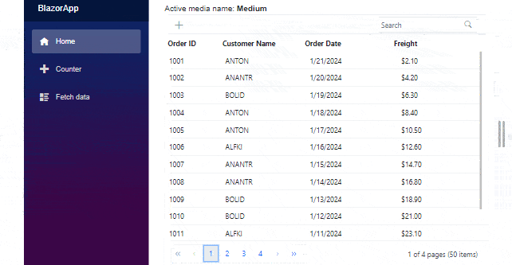

# Media Query with other components

You can use components like charts and grids along with `Media Query` component to make the website adaptable to different screen sizes. In the  below example, the Grid component is used and upon browser resizing the `RowRenderingMode` Grid property is updated based on the `activeBreakpoint` values.

```cshtml

@using Syncfusion.Blazor
@using Syncfusion.Blazor.Grids

@{
    var RenderingMode = RowDirection.Horizontal;
    if (activeBreakPoint == "Small")
    {
        RenderingMode = RowDirection.Vertical;
        enableAdaptiveUI = true;
    }
    else if (activeBreakPoint == "Medium")
    {
        RenderingMode = RowDirection.Horizontal;
        enableAdaptiveUI = true;
    }
    else
    {
        RenderingMode = RowDirection.Horizontal;
        enableAdaptiveUI = false;
    }
}

Active media name: <b>@activeBreakPoint</b><br/>

<SfMediaQuery @bind-ActiveBreakpoint="activeBreakPoint"></SfMediaQuery>
<div style="height: 650px; overflow-y: auto;">
    <SfGrid DataSource="@Orders" EnableAdaptiveUI="@enableAdaptiveUI" RowRenderingMode="@RenderingMode" Toolbar="@(new List<string>() { "Add", "Edit", "Delete", "Cancel", "Update", "Search" })" Height="100%" Width="100%" AllowPaging=true>
        <GridPageSettings PageSize="15"></GridPageSettings>
        <GridColumns>
            <GridColumn Field=@nameof(Order.OrderID) HeaderText="Order ID" IsPrimaryKey="true" Width="80" ValidationRules="@(new ValidationRules{ Required= true })"></GridColumn>
            <GridColumn Field=@nameof(Order.CustomerID) HeaderText="Customer Name" Width="120"></GridColumn>
            <GridColumn Field=@nameof(Order.OrderDate) HeaderText=" Order Date" Format="d" Type="ColumnType.Date" Width="130"></GridColumn>
            <GridColumn Field=@nameof(Order.Freight) HeaderText="Freight" Format="C2" Width="120"></GridColumn>
        </GridColumns>
    </SfGrid>
</div>

@code{
    private string activeBreakPoint { get; set; }
    private bool enableAdaptiveUI { get; set; }
    public List<Order> Orders { get; set; }

    protected override void OnInitialized()
    {
        Orders = Enumerable.Range(1, 50).Select(x => new Order()
        {
            OrderID = 1000 + x,
            CustomerID = (new string[] { "ALFKI", "ANANTR", "ANTON", "BLONP", "BOLID" })[new Random().Next(5)],
            Freight = 2.1 * x,
            OrderDate = DateTime.Now.AddDays(-x),
        }).ToList();
    }

    public class Order
    {
        public int? OrderID { get; set; }
        public string CustomerID { get; set; }
        public DateTime? OrderDate { get; set; }
        public double? Freight { get; set; }
    }
}

```

