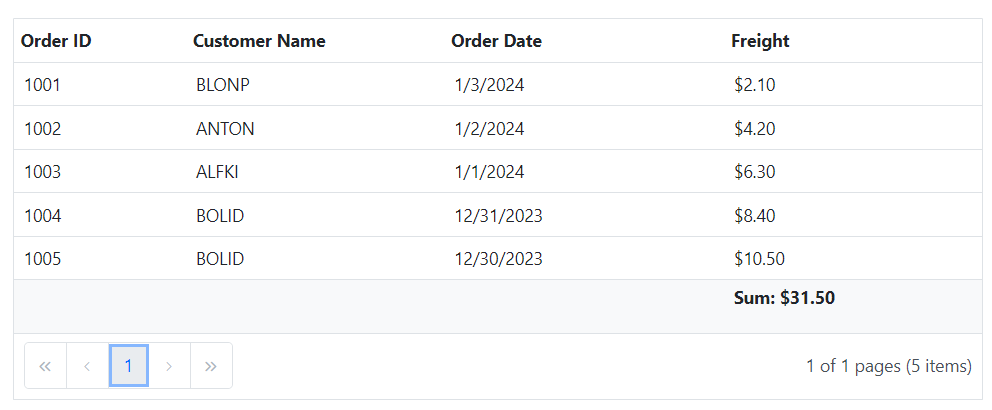

# Integrate Media Query with other components

You can integrate any component inside the `Media Query` such as the Chart, Grid, etc. In the example below, the Grid component is placed along with the Media Query to showcase the grid's responsiveness by changing the `RowRenderingMode` property of the Grid component based on `activeBreakpoint` when the browser size is changed.

```cshtml

@using Syncfusion.Blazor
@using Syncfusion.Blazor.Grids

@{
    var RenderingMode = RowDirection.Horizontal;
    if (activeBreakPoint == "Small" || activeBreakPoint == "Medium")
    {
        RenderingMode = RowDirection.Vertical;
    }
    else
    {
        RenderingMode = RowDirection.Horizontal;
    }
}
<SfMediaQuery @bind-ActiveBreakpoint="activeBreakPoint"></SfMediaQuery>
<div style="position:relative; min-height: 500px;">
    <SfGrid DataSource="@Orders" RowRenderingMode="@RenderingMode" EnableAdaptiveUI=true Height="100%" Width="100%" AllowPaging="true">
        <GridFilterSettings Type="@FilterType.Excel"></GridFilterSettings>
         <GridAggregates>
            <GridAggregate>
                <GridAggregateColumns>
                    <GridAggregateColumn Field=@nameof(Order.Freight) Type="AggregateType.Sum" Format="C2">
                        <FooterTemplate>
                            @{
                                var aggregate = (context as AggregateTemplateContext);
                                <div>
                                    <p>Sum: @aggregate.Sum</p>
                                </div>
                            }
                        </FooterTemplate>
                    </GridAggregateColumn>
                </GridAggregateColumns>
            </GridAggregate>
        </GridAggregates>
        <GridColumns>
            <GridColumn Field=@nameof(Order.OrderID) HeaderText="Order ID" IsPrimaryKey="true" Width="80"></GridColumn>
            <GridColumn Field=@nameof(Order.CustomerID) HeaderText="Customer Name" Width="120"></GridColumn>
            <GridColumn Field=@nameof(Order.OrderDate) HeaderText=" Order Date" Format="d" Type="ColumnType.Date" Width="130"></GridColumn>
            <GridColumn Field=@nameof(Order.Freight) HeaderText="Freight" Format="C2" Width="120"></GridColumn>
        </GridColumns>
    </SfGrid>
</div>

@code{
    private string activeBreakPoint { get; set; }
    public List<Order> Orders { get; set; }

    protected override void OnInitialized()
    {
        Orders = Enumerable.Range(1, 5).Select(x => new Order()
        {
            OrderID = 1000 + x,
            CustomerID = (new string[] { "ALFKI", "ANANTR", "ANTON", "BLONP", "BOLID" })[new Random().Next(5)],
            Freight = 2.1 * x,
            OrderDate = DateTime.Now.AddDays(-x),
        }).ToList();
    }

    public class Order
    {
        public int? OrderID { get; set; }
        public string CustomerID { get; set; }
        public DateTime? OrderDate { get; set; }
        public double? Freight { get; set; }
    }
}

```

