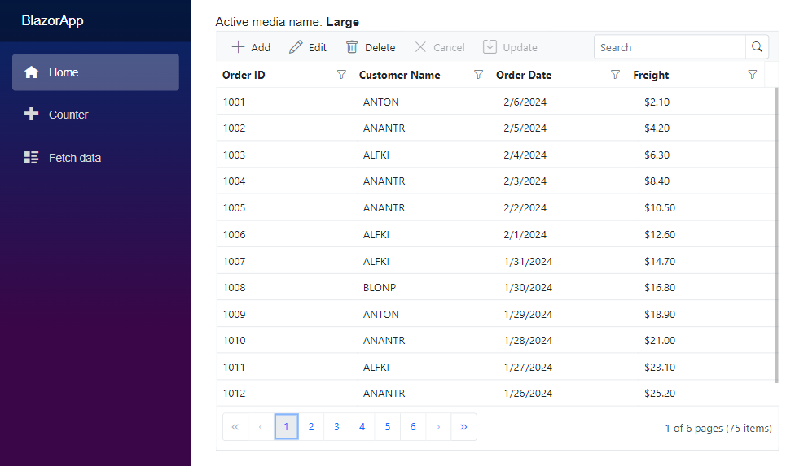
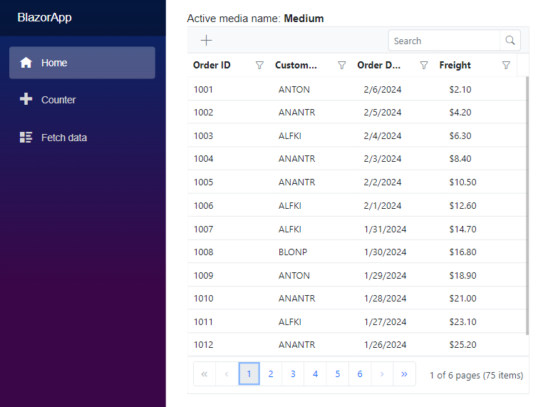
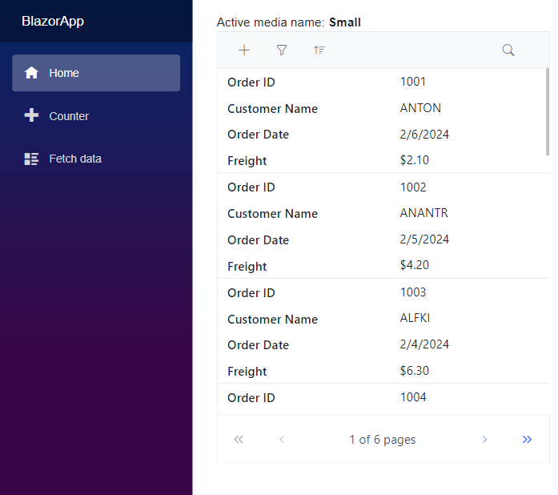

# Blazor Media Query with other component integration

The Blazor Media Query component enhances the responsiveness of web application, allowing you to perform conditional rendering or styling to achieve a dynamic UI adaptable for various screen sizes.

In the following code example, showcasing the Data Grid to demonstrate the dynamic updating of adaptive functionalities based on the matched media breakpoint using [ActiveBreakpoint](https://help.syncfusion.com/cr/blazor/Syncfusion.Blazor.SfMediaQuery.html#Syncfusion_Blazor_SfMediaQuery_ActiveBreakpoint) property.

```cshtml

@using Syncfusion.Blazor
@using Syncfusion.Blazor.Grids

<SfMediaQuery @bind-ActiveBreakPoint="activeBreakpoint"></SfMediaQuery>

Active media name: <b>@activeBreakpoint</b>

@{
    var renderingMode = RowDirection.Horizontal;
    var enableAdaptiveUIMode = false;
    var containerHeight = "100%";

    if (activeBreakpoint == "Small")
    {
        enableAdaptiveUIMode = true;
        renderingMode = RowDirection.Vertical;
        containerHeight = "600px";
    }
    else if (activeBreakpoint == "Medium")
    {
        enableAdaptiveUIMode = true;
    }
    else
    {
        enableAdaptiveUIMode = false;
    }
}

<div style="position:relative; height: @containerHeight;">
    <SfGrid DataSource="@orders" EnableAdaptiveUI="@enableAdaptiveUIMode" RowRenderingMode="@renderingMode" AllowSorting="true" AllowFiltering="true" AllowPaging="true" Toolbar="@(new List<string>() { "Add", "Edit", "Delete", "Cancel", "Update", "Search" })" Height="100%" Width="100%">
        <GridFilterSettings Type="@FilterType.Excel"></GridFilterSettings>
        <GridEditSettings AllowAdding="true" AllowEditing="true" AllowDeleting="true" Mode="EditMode.Dialog"></GridEditSettings>
        <GridColumns>
            <GridColumn Field=@nameof(Order.OrderID) HeaderText="Order ID" IsPrimaryKey="true"></GridColumn>
            <GridColumn Field=@nameof(Order.CustomerID) HeaderText="Customer Name"></GridColumn>
            <GridColumn Field=@nameof(Order.OrderDate) HeaderText=" Order Date" Format="d" Type="ColumnType.Date"></GridColumn>
            <GridColumn Field=@nameof(Order.Freight) HeaderText="Freight" Format="C2"></GridColumn>
        </GridColumns>
    </SfGrid>
</div>

@code {
    private string activeBreakpoint { get; set; }
    private List<Order> orders { get; set; }

    protected override void OnInitialized()
    {
        orders = Enumerable.Range(1, 75).Select(x => new Order()
        {
            OrderID = 1000 + x,
            CustomerID = (new string[] { "ALFKI", "ANANTR", "ANTON", "BLONP", "BOLID" })[new Random().Next(5)],
            Freight = 2.1 * x,
            OrderDate = DateTime.Now.AddDays(-x),
        }).ToList();
    }

    public class Order
    {
        public int? OrderID { get; set; }
        public string CustomerID { get; set; }
        public DateTime? OrderDate { get; set; }
        public double? Freight { get; set; }
    }
}

```

ActiveBreakPoint as `Large`:



ActiveBreakPoint as `Medium`:



ActiveBreakPoint as `Small`:


