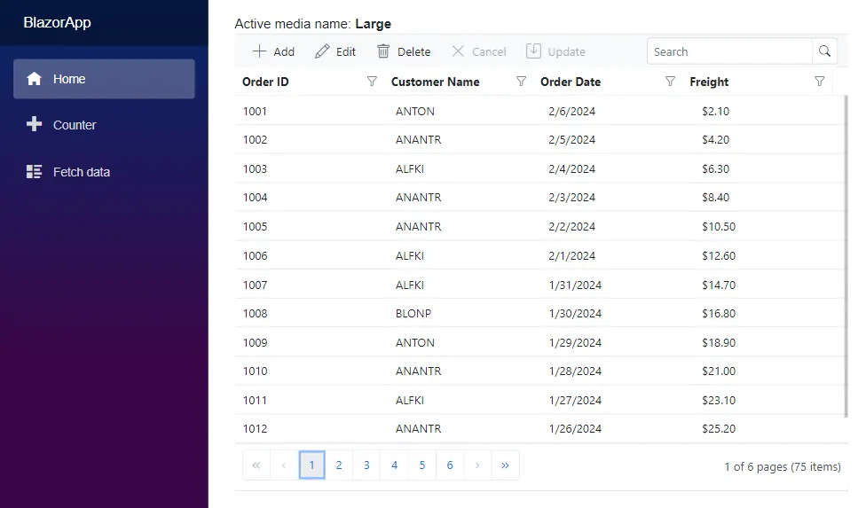
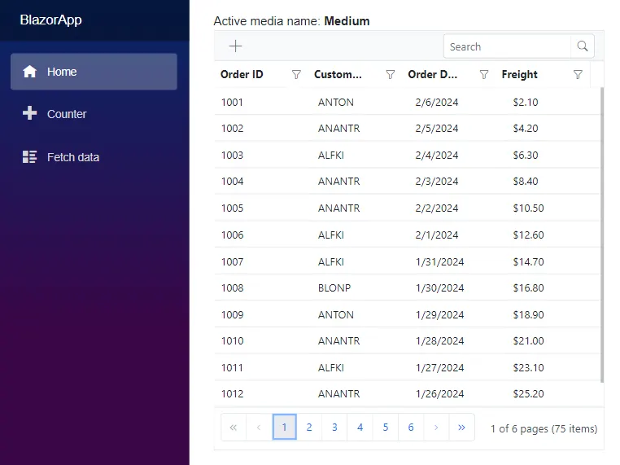
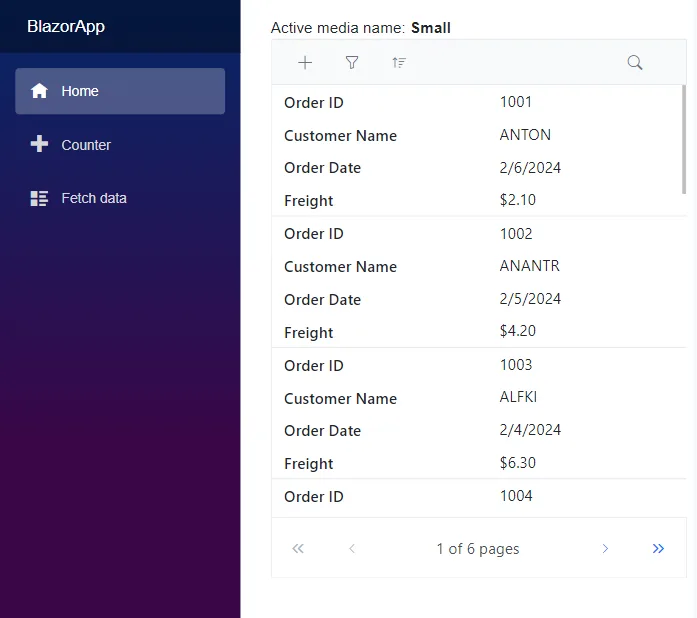

# Integrating the Blazor Media Query with other components

The Blazor Media Query component enhances the responsiveness of the web application by enabling conditional rendering or styling for a dynamic UI that adapts to various screen sizes.

The following example uses the Data Grid to demonstrate dynamic adaptive UI updates based on the matched media breakpoint through the [ActiveBreakPoint](https://help.syncfusion.com/cr/blazor/Syncfusion.Blazor.SfMediaQuery.html#Syncfusion_Blazor_SfMediaQuery_ActiveBreakPoint) property.




@using Syncfusion.Blazor
@using Syncfusion.Blazor.Grids

<SfMediaQuery @bind-ActiveBreakPoint="activeBreakpoint"></SfMediaQuery>

Active media name: <b>@activeBreakpoint</b>

@{
    var renderingMode = RowDirection.Horizontal;
    var enableAdaptiveUIMode = false;
    var containerHeight = "100%";

    if (activeBreakpoint == "Small")
    {
        enableAdaptiveUIMode = true;
        renderingMode = RowDirection.Vertical;
        containerHeight = "600px";
    }
    else if (activeBreakpoint == "Medium")
    {
        enableAdaptiveUIMode = true;
    }
}

    <SfGrid DataSource="@orders" EnableAdaptiveUI="@enableAdaptiveUIMode" RowRenderingMode="@renderingMode" AllowSorting="true" AllowFiltering="true" AllowPaging="true" Toolbar="@(new List<string>() { "Add", "Edit", "Delete", "Cancel", "Update", "Search" })" Height="100%" Width="100%">
        <GridFilterSettings Type="@FilterType.Excel"></GridFilterSettings>
        <GridEditSettings AllowAdding="true" AllowEditing="true" AllowDeleting="true" Mode="EditMode.Dialog"></GridEditSettings>
        <GridColumns>
            <GridColumn Field=@nameof(Order.OrderID) HeaderText="Order ID" IsPrimaryKey="true"></GridColumn>
            <GridColumn Field=@nameof(Order.CustomerID) HeaderText="Customer Name"></GridColumn>
            <GridColumn Field=@nameof(Order.OrderDate) HeaderText="Order Date" Format="d" Type="ColumnType.Date"></GridColumn>
            <GridColumn Field=@nameof(Order.Freight) HeaderText="Freight" Format="C2"></GridColumn>
        </GridColumns>
    </SfGrid>

@code {
    private string activeBreakpoint { get; set; }
    private List<Order> orders { get; set; }

    protected override void OnInitialized()
    {
        string[] customerIds = new string[] { "ALFKI", "ANANTR", "ANTON", "BLONP", "BOLID" };
        orders = Enumerable.Range(1, 75).Select(x => new Order()
        {
            OrderID = 1000 + x,
            CustomerID = customerIds[x % customerIds.Length],
            Freight = 2.1 * x,
            OrderDate = DateTime.Now.AddDays(-x),
        }).ToList();
    }
}




public class Order
{
    public int OrderID { get; set; }
    public string CustomerID { get; set; }
    public DateTime OrderDate { get; set; }
    public double Freight { get; set; }
}




The Data Grid layout adapts to the matched media breakpoint, as shown in the following images.

**ActiveBreakPoint as `Large`**

**ActiveBreakPoint as `Medium`**

**ActiveBreakPoint as `Small`**

