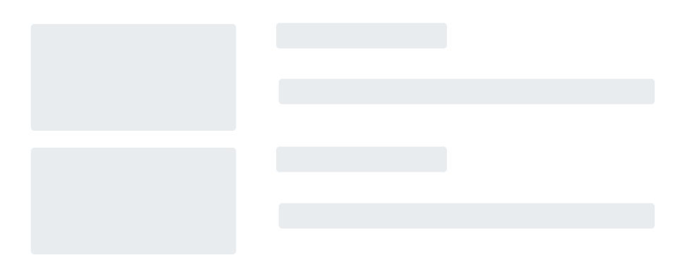

# Global level reuse of Blazor Media Query component

You can achieve global reusability of the `Media Query` component across different sections of your applications, ensuring a consistent and adaptive design.

To globally reuse the Syncfusion `Media Query` component, you can define it in the `MainLayout.razor` file:

1. Click on the **~/Shared** folder in Visual Studio and select **MainLayout.razor** to define the `Media Query` component globally.

2. Place the `Media Query` component within a `CascadingValue` component, and create a public variable named `activeBreakPoint` by using the parameters.




@inherits LayoutComponentBase

<PageTitle>BlazorValue</PageTitle>

    

        <NavMenu />
    

    <main>
        

            <a href="https://docs.microsoft.com/aspnet/" target="_blank">About</a>
        

        <article class="content px-4">
            <CascadingValue Value="@this">
                <SfMediaQuery @bind-ActiveBreakPoint="activeBreakPoint"></SfMediaQuery>
                @Body
            </CascadingValue>
        </article>
    </main>

@code {
    [Parameter]
    public string activeBreakPoint { get; set; }
}




3. Inherit the `MainLayout` component in the view page, such as **~/Pages/Home.razor or Index.razor**, and run the application.




@using Syncfusion.Blazor
@inherits MainLayout

The active breakpoint is @mainLayoutObj.activeBreakPoint

@code {
    [CascadingParameter]
    public MainLayout mainLayoutObj { get; set; }
}




