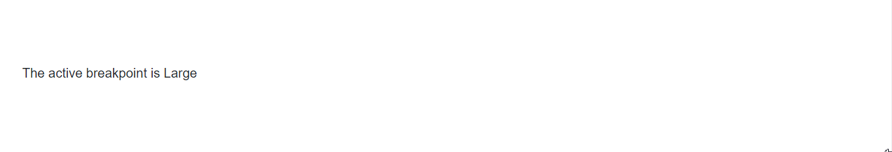

# Global level reuse of Blazor Media Query component

You can globally reuse the Media Query component in any `razor` pages within web application to achieve a more flexible and responsive layout design. 

Define the Media Query component along with layout `Body` property within the `CascadingValue` component in **MainLayout.razor** page.




@inherits LayoutComponentBase

<div class="page">
    <div class="sidebar">
        <NavMenu />
    </div>
    <main>
        <div class="top-row px-4">
            <a href="https://docs.microsoft.com/aspnet/" target="_blank">About</a>
        </div>
        <article class="content px-4">
            <CascadingValue Value="@activeBreakPoint">
                <SfMediaQuery @bind-ActiveBreakPoint="activeBreakPoint"></SfMediaQuery>
                @Body
            </CascadingValue>
        </article>
    </main>
</div>

@code {
    [Parameter]
    public string activeBreakPoint { get; set; }
}




If you are using .NET 9 or .NET 8, configure the `@rendermode` in the `<body>` section of the **~/Components/App.razor** file, as shown below:

```html
<body>
    ....
    <Routes @rendermode="InteractiveServer" />
</body>
```

In the below example, the `activeBreakPoint` was accessed in the **Home.razor** and **Counter.razor** files.




The active breakpoint is @activeBreakPoint
<br/><br/>
<h5>Home Page</h5>

@code {
    [CascadingParameter]
    public string activeBreakPoint { get; set; }
}
....




The active breakpoint is @activeBreakPoint
<br /><br />
<h5>Counter Page</h5>

@code {
    [CascadingParameter]
    public string activeBreakPoint { get; set; }
}
....




