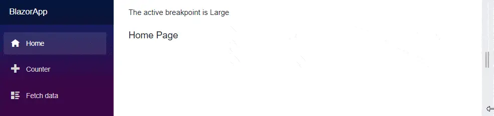

# Global-level reuse of Blazor Media Query component

You can globally reuse the Media Query component across any `.razor` page in the web application to achieve a flexible and responsive layout design.

Place the Media Query component along with the layout's `@Body` parameter inside a `CascadingValue` component in **MainLayout.razor**. The current `ActiveBreakPoint` value is then cascaded to every page rendered by the layout.




@inherits LayoutComponentBase
@using Syncfusion.Blazor

<div class="page">
    <div class="sidebar">
        <NavMenu />
    </div>
    <main>
        <div class="top-row px-4">
            <a href="https://learn.microsoft.com/en-gb/aspnet/core/?view=aspnetcore-10.0" target="_blank">About</a>
        </div>
        <article class="content px-4">
            <CascadingValue Value="@activeBreakPoint">
                <SfMediaQuery @bind-ActiveBreakPoint="activeBreakPoint"></SfMediaQuery>
                @Body
            </CascadingValue>
        </article>
    </main>
</div>

@code {
    [Parameter]
    public string activeBreakPoint { get; set; }
}




If you are using .NET 10, .NET 9 or .NET 8, configure the `@rendermode` in the `<body>` section of the **~/Components/App.razor** file, as shown below:

```html
<body>
    ....
    <Routes @rendermode="InteractiveServer" />
</body>
```

The following example shows how `activeBreakPoint` is accessed in the **Home.razor** and **Counter.razor** files. The child page declares a `[CascadingParameter]` with the same `Name` used in `MainLayout.razor` to receive the cascaded value.




The active breakpoint is @activeBreakPoint
<br/><br/>
<h5>Home Page</h5>

@code {
    [CascadingParameter]
    public string activeBreakPoint { get; set; }
}
....




The active breakpoint is @activeBreakPoint
<br /><br />
<h5>Counter Page</h5>

@code {
    [CascadingParameter]
    public string activeBreakPoint { get; set; }
}
....






## See also

* [Breakpoints in Blazor Media Query component](break-points.md)
* [Integrating the Blazor Media Query with other components](media-query-integration.md)
* [Getting Started with Blazor Media Query](getting-started.md)