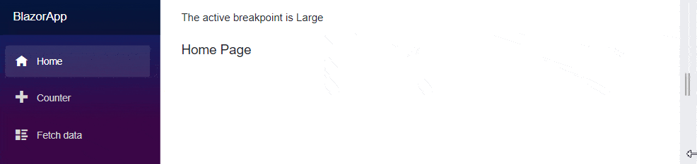

# Global level reuse of Blazor Media Query component

You can globally reuse the Media Query component in any `razor` pages within web application to achieve a more flexible and responsive layout design. 

Refer the following steps to reuse the Media Query in any `razor` pages.

1. Define the Media Query component along with layout `Body` property within the `CascadingValue` component in **MainLayout.razor** page.




@inherits LayoutComponentBase

<div class="page">
    <div class="sidebar">
        <NavMenu />
    </div>
    <main>
        <div class="top-row px-4">
            <a href="https://docs.microsoft.com/aspnet/" target="_blank">About</a>
        </div>
        <article class="content px-4">
            <CascadingValue Value="@activeBreakPoint">
                <SfMediaQuery @bind-ActiveBreakPoint="activeBreakPoint"></SfMediaQuery>
                @Body
            </CascadingValue>
        </article>
    </main>
</div>

@code {
    [Parameter]
    public string activeBreakPoint { get; set; }
}




2. Inherit the `MainLayout` component in your razor pages to access the `activeBreakPoint` and run the application.

If you are using .NET 8, then you need add `@rendermode` in the `<body>` section in the **~/Components/App.razor** file, as shown below:

```html
<body>
    <Routes @rendermode="InteractiveServer" />
</body>
```

In the below example, the `MainLayout` component is inherited in the **Index.razor** file.




@inherits MainLayout

The active breakpoint is @activeValue
<br/><br/>
<h5>Home Page</h5>

@code {
    [CascadingParameter]
    public string activeValue { get; set; }
}
....




@inherits BlazorApp.Components.Layout.MainLayout

The active breakpoint is @activeValue
<br /><br />
<h5>Home Page</h5>

@code {
    [CascadingParameter]
    public string activeValue { get; set; }
}
....




In the below example, the `MainLayout` component is inherited in the **Counter.razor** file.




@inherits MainLayout

The active breakpoint is @activeValue
<br/><br/>
<h5>Counter Page</h5>

@code {
    [CascadingParameter]
    public string activeValue { get; set; }
}
....




@inherits BlazorApp.Components.Layout.MainLayout

The active breakpoint is @activeValue
<br /><br />
<h5>Counter Page</h5>

@code {
    [CascadingParameter]
    public string activeValue { get; set; }
}
....




