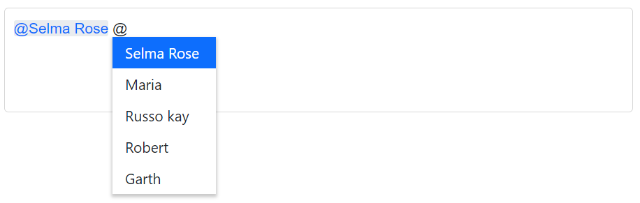
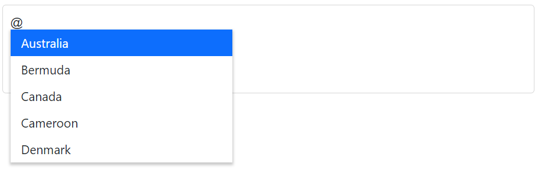
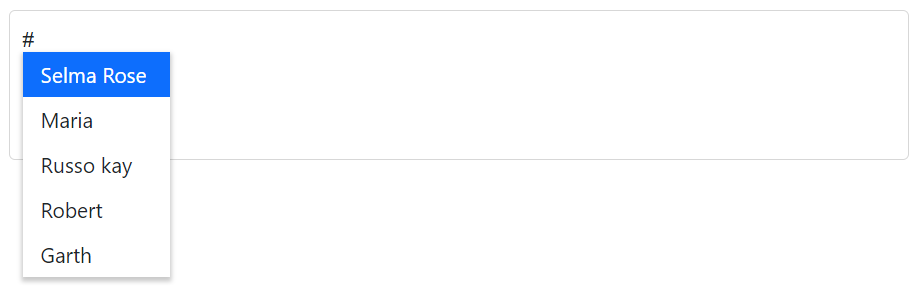
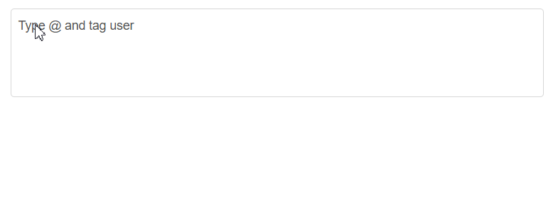

# Customization in Blazor Mention Component

This page covers common customization options for the Blazor Mention component, including displaying the mention character, appending suffix text, configuring the popup list size, changing the trigger character, and controlling leading space behavior.

## Show or hide mention character

To display the mention character alongside the selected item in the target element, set the [ShowMentionChar](https://help.syncfusion.com/cr/blazor/Syncfusion.Blazor.DropDowns.SfMention-1.html#Syncfusion_Blazor_DropDowns_SfMention_1_ShowMentionChar) property to `true`. This helps distinguish the selected mention from surrounding text. The default value is `false`.







## Adding the suffix character after selection

The [SuffixText](https://help.syncfusion.com/cr/blazor/Syncfusion.Blazor.DropDowns.SfMention-1.html#Syncfusion_Blazor_DropDowns_SfMention_1_SuffixText) property in the Mention component allows you to specify a string that should be appended to the end of the selected mention item when it is inserted into the input field. You can use this property to add a `space` or a `new line` after the mention, or any other string that you want to include.







## Configure the popup list

Customize the suggestion list size using the [PopupHeight](https://help.syncfusion.com/cr/blazor/Syncfusion.Blazor.DropDowns.SfMention-1.html#Syncfusion_Blazor_DropDowns_SfMention_1_PopupHeight) and [PopupWidth](https://help.syncfusion.com/cr/blazor/Syncfusion.Blazor.DropDowns.SfMention-1.html#Syncfusion_Blazor_DropDowns_SfMention_1_PopupWidth) properties. Values can be provided as:
- A string with CSS units (for example, `"300px"`, `"50%"`)
- A number (interpreted as pixels)

Defaults:
- `PopupWidth`: `auto` (adjusts based on content)
- `PopupHeight`: `300px`







## Trigger character

Change the character that triggers the suggestion list using the [MentionChar](https://help.syncfusion.com/cr/blazor/Syncfusion.Blazor.DropDowns.SfMention-1.html#Syncfusion_Blazor_DropDowns_SfMention_1_MentionChar) property. By default, the trigger character is `@`, but it can be set to any character.







## Leading Space Requirement

Control whether a space is required before the mention character using the [RequireLeadingSpace](https://help.syncfusion.com/cr/blazor/Syncfusion.Blazor.DropDowns.SfMention-1.html#properties) property in the Mention component. When set to `true` , a space must precede the mention character to trigger the suggestion popup. When set to `false`, the mention character can trigger suggestions without requiring a leading space.







