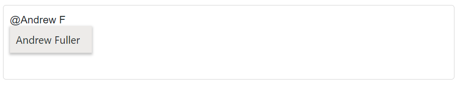
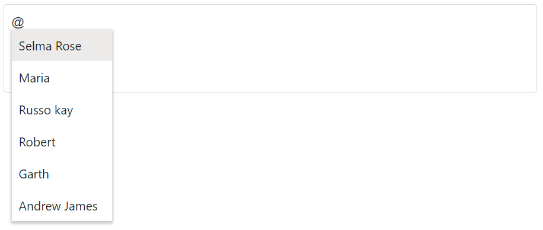

# Filtering data in Blazor Mention Component

The Mention component includes built-in filtering to narrow the suggestion list based on user input. Filtering begins when the user types after the mention character and matches items from the data source against the entered text.

## Limit the minimum filter character

The [MinLength](https://help.syncfusion.com/cr/blazor/Syncfusion.Blazor.DropDowns.SfMention-1.html#Syncfusion_Blazor_DropDowns_SfMention_1_MinLength) property allows controlling the minimum number of characters required to start searching. By default, `MinLength` is `0`, which opens the suggestion list as soon as the mention character is entered.

For example, when `MinLength` is set to `3`, suggestions appear only after at least three characters are typed.

In the following example, the remote request does not fetch data until the search key contains three characters.







## Change the filter type

The [FilterType](https://help.syncfusion.com/cr/blazor/Syncfusion.Blazor.DropDowns.SfMention-1.html#Syncfusion_Blazor_DropDowns_SfMention_1_FilterType) property specifies the type of string comparison for filtering. By default, `FilterType` is `Contains`, which finds items containing the search text. The component supports the following filter types (see the [FilterType enum](https://help.syncfusion.com/cr/blazor/Syncfusion.Blazor.DropDowns.FilterType.html)):

* `StartsWith` - Finds items that start with the entered characters.
* `Contains` - Finds items that contain the entered characters as a substring.
* `EndsWith` - Finds items that end with the entered characters.







## Allow spacing between search

The [AllowSpaces](https://help.syncfusion.com/cr/blazor/Syncfusion.Blazor.DropDowns.SfMention-1.html#Syncfusion_Blazor_DropDowns_SfMention_1_AllowSpaces) property controls whether spaces are allowed within the search term after the mention character.
- When `true`, typing a space continues filtering (for example, “John Sm” matches “John Smith”).
- When `false` (default), pressing space ends the mention search and the list is not filtered on space key press.







## Customize the suggestion item count

The [SuggestionCount](https://help.syncfusion.com/cr/blazor/Syncfusion.Blazor.DropDowns.SfMention-1.html#Syncfusion_Blazor_DropDowns_SfMention_1_SuggestionCount) property sets the maximum number of items displayed in the suggestion list. By default, `SuggestionCount` is `25`. Set it to any integer value to increase or reduce the number of visible suggestions.







## See also

* [Templates](./templates)
