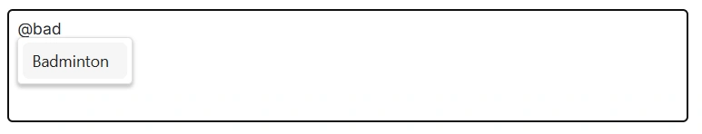
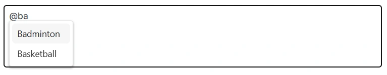
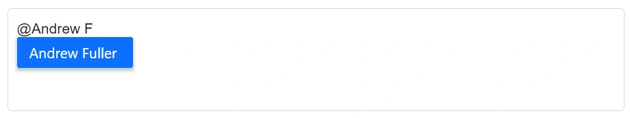
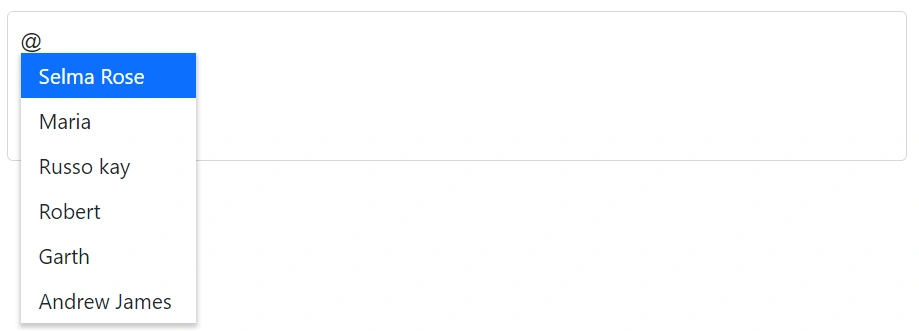

# Filtering Data in Blazor Mention

The [Blazor Mention](https://blazor.syncfusion.com/documentation/mention/getting-started) component provides built-in support for filtering suggestion data as users type, enabling efficient search and selection from large or remote data sources. Filtering is triggered automatically as soon as the user types after the mention character (e.g., `@@`).

## Limit the minimum filter character

The [`MinLength`](https://help.syncfusion.com/cr/blazor/Syncfusion.Blazor.DropDowns.SfMention-1.html#Syncfusion_Blazor_DropDowns_SfMention_1_MinLength) property specifies the minimum number of characters a user must type after the mention character before filtering and suggestions begin. By default, [`MinLength`](https://help.syncfusion.com/cr/blazor/Syncfusion.Blazor.DropDowns.SfMention-1.html#Syncfusion_Blazor_DropDowns_SfMention_1_MinLength) is `0`, so suggestions appear immediately after typing the mention character.

**Example:** Set [`MinLength`](https://help.syncfusion.com/cr/blazor/Syncfusion.Blazor.DropDowns.SfMention-1.html#Syncfusion_Blazor_DropDowns_SfMention_1_MinLength) to `3` to require at least three characters before suggestions are shown. This is useful when working with larger data sources to avoid showing an unwieldy popup while the user types only one or two characters.

```razor

```



> [`MinLength`](https://help.syncfusion.com/cr/blazor/Syncfusion.Blazor.DropDowns.SfMention-1.html#Syncfusion_Blazor_DropDowns_SfMention_1_MinLength) works for both local and remote data sources. For remote data, the request to fetch the search data is deferred until the input contains the configured number of characters, which reduces server calls. For local data, the suggestion popup is simply not opened until the threshold is reached.

## Change the filter type

The [`FilterType`](https://help.syncfusion.com/cr/blazor/Syncfusion.Blazor.DropDowns.SfMention-1.html#Syncfusion_Blazor_DropDowns_SfMention_1_FilterType) property allows you to specify how the search text is matched against the suggestion data. By default, the `FilterType` property is set to `Contains`, which means the Blazor Mention component will search for items that contain the entered search string as a substring. The value is one of the [`FilterType`](https://help.syncfusion.com/cr/blazor/Syncfusion.Blazor.DropDowns.FilterType.html) enumeration members.

For Blazor Mention, the [`FilterType`](https://help.syncfusion.com/cr/blazor/Syncfusion.Blazor.DropDowns.FilterType.html) enumeration supports the following three values:

* [`StartsWith`](https://help.syncfusion.com/cr/blazor/Syncfusion.Blazor.DropDowns.FilterType.html#Syncfusion_Blazor_DropDowns_FilterType_StartsWith) - Searches for items that start with the entered characters.
* [`Contains`](https://help.syncfusion.com/cr/blazor/Syncfusion.Blazor.DropDowns.FilterType.html#Syncfusion_Blazor_DropDowns_FilterType_Contains) - Searches for items that contain the entered characters as a substring.
* [`EndsWith`](https://help.syncfusion.com/cr/blazor/Syncfusion.Blazor.DropDowns.FilterType.html#Syncfusion_Blazor_DropDowns_FilterType_EndsWith) - Searches for items that end with the entered characters.

```razor

```



> These are the only `FilterType` values supported by `SfMention`. Other `FilterType` values used by other dropdown components (such as `Equals`, `LessThan`, or `GreaterThan`) are not applicable to Mention because Mention filtering operates on string fields.

## Control case sensitivity and accent handling

Filtering in Blazor Mention is **case-insensitive by default**. This is controlled by the [`IgnoreCase`](https://help.syncfusion.com/cr/blazor/Syncfusion.Blazor.DropDowns.SfDropDownBase-1.html#Syncfusion_Blazor_DropDowns_SfDropDownBase_1_IgnoreCase) property (inherited from [`SfDropDownBase`](https://help.syncfusion.com/cr/blazor/Syncfusion.Blazor.DropDowns.SfDropDownBase-1.html)), which defaults to `true`. With `IgnoreCase="true"`, typing `and` matches `Andrew`, `andrew`, and `ANDREW`. To require exact case matches, set `IgnoreCase="false"`.

> The companion property [`IgnoreAccent`](https://help.syncfusion.com/cr/blazor/Syncfusion.Blazor.DropDowns.SfDropDownBase-1.html#Syncfusion_Blazor_DropDowns_SfDropDownBase_1_IgnoreAccent) (also inherited from `SfDropDownBase`) controls whether diacritical marks such as accents are ignored during filtering. It defaults to `false`; set it to `true` to make `Jose` match `José`.

> These two properties are independent of [`FilterType`](https://help.syncfusion.com/cr/blazor/Syncfusion.Blazor.DropDowns.FilterType.html) and apply to all three `FilterType` values (`StartsWith`, `Contains`, and `EndsWith`).

## Allow spacing between search

The [`AllowSpaces`](https://help.syncfusion.com/cr/blazor/Syncfusion.Blazor.DropDowns.SfMention-1.html#Syncfusion_Blazor_DropDowns_SfMention_1_AllowSpaces) property is used to control whether spaces are allowed in the middle of the mention or not. If `AllowSpaces` is set to `true`, the Blazor Mention component will allow spaces in the middle of the mention and the data source will be filtered accordingly. If `AllowSpaces` is set to `false`, the Blazor Mention component will not allow spaces in the middle of the mention and the data source will not be filtered on space key press. The sample below maps fields to suggestion items using the [`MentionFieldSettings`](https://help.syncfusion.com/cr/blazor/Syncfusion.Blazor.DropDowns.MentionFieldSettings.html) component.

> By default, the `AllowSpaces` property is disabled, and the space ends the Blazor Mention component search.









## Customize the suggestion item count

The [`SuggestionCount`](https://help.syncfusion.com/cr/blazor/Syncfusion.Blazor.DropDowns.SfMention-1.html#Syncfusion_Blazor_DropDowns_SfMention_1_SuggestionCount) property allows you to specify the number of list items that should be displayed in the suggestion list. By default, the `SuggestionCount` property is set to `25`, which means that the Blazor Mention component will display up to `25` list items in the suggestion list. The `SuggestionCount` property can be set to any integer value. The sample below also maps fields to suggestion items using the [`MentionFieldSettings`](https://help.syncfusion.com/cr/blazor/Syncfusion.Blazor.DropDowns.MentionFieldSettings.html) component.

> The default `SuggestionCount` is `25`. The sample in this section uses `SuggestionCount="6"` only to keep the demo output compact — your production data should use the default (or a value appropriate for the size of your list).









## See also

* [Templates](./templates)
