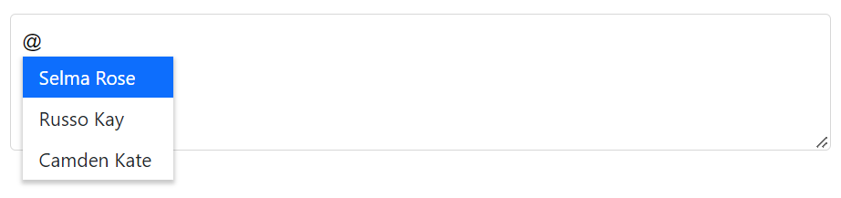

# Getting Started with Blazor Mention Component

This section briefly explains about how to include `Blazor Mention` component in your Blazor Server App and Blazor WebAssembly App using Visual Studio.

To get started quickly with Blazor Mention, check on the following video:



## Prerequisites

* [System requirements for Blazor components](https://blazor.syncfusion.com/documentation/system-requirements)

## Create a new Blazor App in Visual Studio

You can create **Blazor Server App** or **Blazor WebAssembly App** using Visual Studio in one of the following ways,

* [Create a Project using Microsoft Templates](https://docs.microsoft.com/en-us/aspnet/core/blazor/tooling?pivots=windows)

* [Create a Project using Syncfusion Blazor Extension](https://blazor.syncfusion.com/documentation/visual-studio-code-integration/create-project)

## Install Syncfusion Blazor DropDowns NuGet in the App

Syncfusion Blazor components are available in [nuget.org](https://www.nuget.org/packages?q=syncfusion.blazor). In order to use Syncfusion Blazor components in the application, add reference to the corresponding NuGet. Refer to [NuGet packages topic](https://blazor.syncfusion.com/documentation/nuget-packages) for available NuGet packages list with component details and [Benefits of using individual NuGet packages](https://blazor.syncfusion.com/documentation/nuget-packages#benefits-of-using-individual-nuget-packages). 

To add Blazor Mention component in the app, open the NuGet package manager in Visual Studio (*Tools → NuGet Package Manager → Manage NuGet Packages for Solution*), search for [Syncfusion.Blazor.DropDowns](https://www.nuget.org/packages/Syncfusion.Blazor.DropDowns) and then install it.

## Register Syncfusion Blazor Service

Open **~/_Imports.razor** file and import the `Syncfusion.Blazor` namespace.




@using Syncfusion.Blazor




Now, register the Syncfusion Blazor Service in the Blazor Server App or Blazor WebAssembly App. Here, Syncfusion Blazor Service is registered by setting [IgnoreScriptIsolation](https://help.syncfusion.com/cr/blazor/Syncfusion.Blazor.GlobalOptions.html#Syncfusion_Blazor_GlobalOptions_IgnoreScriptIsolation) property as `true` to load the scripts externally in the [next steps](#add-script-reference).

### Blazor Server App

* For **.NET 6 and .NET 7** app, open the **~/Program.cs** file and register the Syncfusion Blazor Service.

* For **.NET 5 and .NET 3.X** app, open the **~/Startup.cs** file and register the Syncfusion Blazor Service.




using Microsoft.AspNetCore.Components;
using Microsoft.AspNetCore.Components.Web;
using Syncfusion.Blazor;

var builder = WebApplication.CreateBuilder(args);

// Add services to the container.
builder.Services.AddRazorPages();
builder.Services.AddServerSideBlazor();
builder.Services.AddSyncfusionBlazor();

var app = builder.Build();
....





using Syncfusion.Blazor;

namespace BlazorApplication
{
    public class Startup
    {
        ...
        public void ConfigureServices(IServiceCollection services)
        {
            services.AddRazorPages();
            services.AddServerSideBlazor();
            services.AddSyncfusionBlazor();
        }
        ...
    }
}




### Blazor WebAssembly App

Open **~/Program.cs** file and register the Syncfusion Blazor Service in the client web app.




using Microsoft.AspNetCore.Components.Web;
using Microsoft.AspNetCore.Components.WebAssembly.Hosting;
using Syncfusion.Blazor;

var builder = WebAssemblyHostBuilder.CreateDefault(args);
builder.RootComponents.Add<App>("#app");
builder.RootComponents.Add<HeadOutlet>("head::after");

builder.Services.AddScoped(serviceProvider => new HttpClient { BaseAddress = new Uri(builder.HostEnvironment.BaseAddress) });

builder.Services.AddSyncfusionBlazor();
await builder.Build().RunAsync();
....





using Syncfusion.Blazor;

namespace WebApplication1
{
    public class Program
    {
        public static async Task Main(string[] args)
        {
            ....
            builder.Services.AddSyncfusionBlazor();
            await builder.Build().RunAsync();
        }
    }
}



## Add style sheet

Checkout the [Blazor Themes topic](https://blazor.syncfusion.com/documentation/appearance/themes) to learn different ways ([Static Web Assets](https://blazor.syncfusion.com/documentation/appearance/themes#static-web-assets), [CDN](https://blazor.syncfusion.com/documentation/appearance/themes#cdn-reference) and [CRG](https://blazor.syncfusion.com/documentation/common/custom-resource-generator)) to refer themes in Blazor application, and to have the expected appearance for Syncfusion Blazor components. Here, the theme is referred using [Static Web Assets](https://blazor.syncfusion.com/documentation/appearance/themes#static-web-assets). Refer to [Enable static web assets usage](https://blazor.syncfusion.com/documentation/appearance/themes#enable-static-web-assets-usage) topic to use static assets in your project.

To add theme to the app, open the NuGet package manager in Visual Studio (*Tools → NuGet Package Manager → Manage NuGet Packages for Solution*), search for [Syncfusion.Blazor.Themes](https://www.nuget.org/packages/Syncfusion.Blazor.Themes/) and then install it. Then, the theme style sheet from NuGet can be referred as follows,

> If you are using [Syncfusion.Blazor](https://www.nuget.org/packages/Syncfusion.Blazor/) single NuGet, you don't have to refer [Syncfusion.Blazor.Themes](https://www.nuget.org/packages/Syncfusion.Blazor.Themes/) NuGet. Since style sheets already inside the assets of `Syncfusion.Blazor` NuGet. 

### Blazor Server App

* For **.NET 6** app, add the Syncfusion bootstrap5 theme in the `<head>` of the **~/Pages/_Layout.cshtml** file.

* For **.NET 3.X, .NET 5 and .NET 7** app, add the Syncfusion bootstrap5 theme in the `<head>` of the **~/Pages/_Host.cshtml** file.




<head>
    ...
    <link href="_content/Syncfusion.Blazor.Themes/bootstrap5.css" rel="stylesheet" />
    <!--Refer theme style sheet as below if you are using Syncfusion.Blazor Single NuGet-->
    <!--<link href="_content/Syncfusion.Blazor/styles/bootstrap5.css" rel="stylesheet" />-->
</head>





<head>
    ...
    <link href="_content/Syncfusion.Blazor.Themes/bootstrap5.css" rel="stylesheet" />
    <!--Refer theme style sheet as below if you are using Syncfusion.Blazor Single NuGet-->
    <!--<link href="_content/Syncfusion.Blazor/styles/bootstrap5.css" rel="stylesheet" />-->
</head>




### Blazor WebAssembly App

For Blazor WebAssembly App, refer the theme style sheet from NuGet in the `<head>` of **wwwroot/index.html** file in the client web app.




<head>
    ...
    <link href="_content/Syncfusion.Blazor.Themes/bootstrap5.css" rel="stylesheet" />
    <!--Refer theme style sheet as below if you are using Syncfusion.Blazor Single NuGet-->
    <!--<link href="_content/Syncfusion.Blazor/styles/bootstrap5.css" rel="stylesheet" />-->
</head>




## Add script reference

Checkout [Adding Script Reference topic](https://blazor.syncfusion.com/documentation/common/adding-script-references) to learn different ways to add script reference in Blazor Application. In this getting started walk-through, the required scripts are referred using [Static Web Assets](https://blazor.syncfusion.com/documentation/common/adding-script-references#static-web-assets) externally inside the `<head>` as follows. Refer to [Enable static web assets usage](https://blazor.syncfusion.com/documentation/common/adding-script-references#enable-static-web-assets-usage) topic to use static assets in your project.

### Blazor Server App

* For **.NET 6** app, refer script in the `<head>` of the **~/Pages/_Layout.cshtml** file.

* For **.NET 3.X, .NET 5 and .NET 7** app, refer script in the `<head>` of the **~/Pages/_Host.cshtml** file.




<head>
    ....
    <link href="_content/Syncfusion.Blazor.Themes/bootstrap5.css" rel="stylesheet" />
    
    <!--Use below script reference if you are using Syncfusion.Blazor Single NuGet-->
    <!---->
</head>





<head>
    ....
    <link href="_content/Syncfusion.Blazor.Themes/bootstrap5.css" rel="stylesheet" />
    
    <!--Use below script reference if you are using Syncfusion.Blazor Single NuGet-->
    <!---->
</head>




### Blazor WebAssembly App

For Blazor WebAssembly App, refer script in the `<head>` of the **~/index.html** file.




<head>
    ....
    <link href="_content/Syncfusion.Blazor.Themes/bootstrap5.css" rel="stylesheet" />
    
    <!--Use below script reference if you are using Syncfusion.Blazor Single NuGet-->
    <!---->
</head>




> Syncfusion recommends to reference scripts using [Static Web Assets](https://blazor.syncfusion.com/documentation/common/adding-script-references#static-web-assets), [CDN](https://blazor.syncfusion.com/documentation/common/adding-script-references#cdn-reference) and [CRG](https://blazor.syncfusion.com/documentation/common/custom-resource-generator) by [disabling JavaScript isolation](https://blazor.syncfusion.com/documentation/common/adding-script-references#disable-javascript-isolation) for better loading performance of the Blazor application.

## Add Syncfusion Blazor Mention component

* Open **~/_Imports.razor** file or any razor page under the `~/Pages` folder where the component is to be added and import the `Syncfusion.Blazor.DropDowns` namespace.




@using Syncfusion.Blazor
@using Syncfusion.Blazor.DropDowns




* Now, add the Syncfusion Mention component in razor file. Here, the Mention component is added in the **~/Pages/Index.razor** page under the `~/Pages` folder.




<SfMention TItem="PersonData" DataSource="@EmailData">
    <TargetComponent>
        

    </TargetComponent>
    <ChildContent>
        <MentionFieldSettings Text="Name"></MentionFieldSettings>
    </ChildContent>
</SfMention>

@code {
    public class PersonData
    {
        public string Name { get; set; }
        public string EmailId { get; set; }
        public string EmployeeImage { get; set; }
    }
    List<PersonData> EmailData = new List<PersonData> {
    new PersonData() { Name="Selma Rose", EmployeeImage="7", EmailId="selma@gmail.com" },
    new PersonData() { Name="Russo Kay", EmployeeImage="8", EmailId="russo@gmail.com" },
    new PersonData() { Name="Camden Kate", EmployeeImage="9", EmailId="camden@gmail.com" }
  };
}




* Press <kbd>ctrl</kbd>+<kbd>F5</kbd> or <kbd>⌘</kbd>+<kbd>F5</kbd> (macOS) to run the application. Then, the Syncfusion Blazor Mention component will be rendered in the default web browser.

## Mention target

The `Target` property of the Mention component allows you to specify an element on the page to which the mention element should be attached. This can be useful when you want to display the mention element in a specific location on the page. For example, you might use the `Target` property to attach the mention element to a specific div element or to a specific input field or to a specific textarea field. To specify the target element, you can pass a CSS selector, a DOM element.

In the bellow example, the `Target` property of the Mention component is set to the CSS selector `#mentionTarget`, which matches the textarea element with an id of `mentionTarget`. The mention element will be appended to the textarea element as a child element, allowing the user to select or mention a specific entity within the textarea.



<textarea id="mentionTarget" placeHolder="Type @@ and tag user"></textarea>

<SfMention TItem="PersonData" Target="#mentionTarget" DataSource="@EmailData">
    <ChildContent>
        <MentionFieldSettings Text="Name"></MentionFieldSettings>
    </ChildContent>
</SfMention>

@code {
    public class PersonData
    {
        public string Name { get; set; }
        public string EmailId { get; set; }
        public string EmployeeImage { get; set; }
    }
    List<PersonData> EmailData = new List<PersonData> {
    new PersonData() { Name="Selma Rose", EmployeeImage="7", EmailId="selma@gmail.com" },
    new PersonData() { Name="Russo Kay", EmployeeImage="8", EmailId="russo@gmail.com" },
    new PersonData() { Name="Camden Kate", EmployeeImage="9", EmailId="camden@gmail.com" }
  };
}



## See also

* [Getting Started with Syncfusion Blazor for Client-Side in .NET Core CLI](https://blazor.syncfusion.com/documentation/getting-started/blazor-webassembly-dotnet-cli)
* [Getting Started with Syncfusion Blazor for Server-side in Visual Studio](https://blazor.syncfusion.com/documentation/getting-started/blazor-server-side-visual-studio)
* [Getting Started with Syncfusion Blazor for Server-Side in .NET Core CLI](https://blazor.syncfusion.com/documentation/getting-started/blazor-server-side-dotnet-cli)
