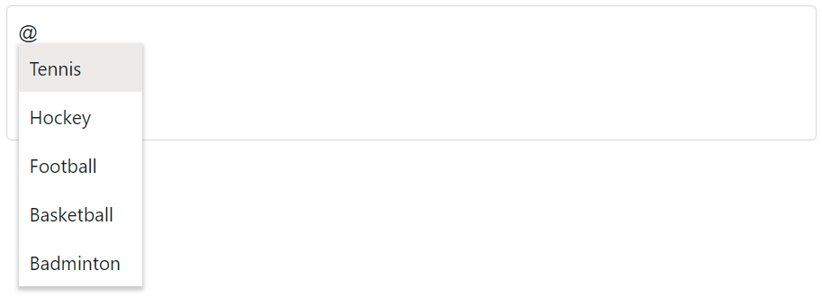

# Sorting in Blazor Mention Component

The [SortOrder](https://help.syncfusion.com/cr/blazor/Syncfusion.Blazor.DropDowns.SfDropDownBase-1.html#Syncfusion_Blazor_DropDowns_SfDropDownBase_1_SortOrder) property of the Mention component controls the order of items in the suggestion list. Sorting is applied on the loaded data by the display text configured via `MentionFieldSettings.Text`. By default, `SortOrder` is `None`, so items appear in their original data order. Valid values are defined by the [SortOrder enum](https://help.syncfusion.com/cr/blazor/Syncfusion.Blazor.DropDowns.SortOrder.html).

SortOrder     | Description
------------  | -------------
  `Ascending` | Suggestion list items are sorted in ascending order (A–Z/lowest to highest).
  `Descending`| Suggestion list items are sorted in descending order (Z–A/highest to lowest).
  `None`      | Items are not sorted and are shown in their original order.

For custom or complex sorting logic, pre-sort the `DataSource` before binding.







