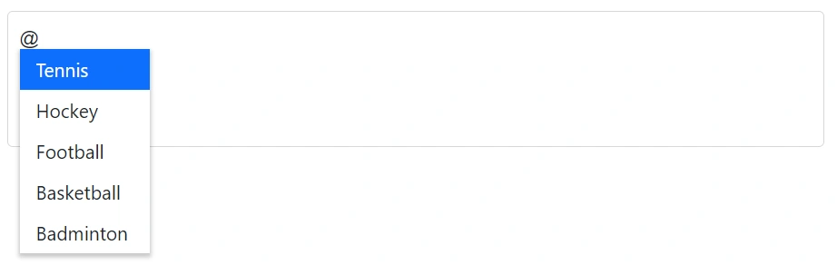
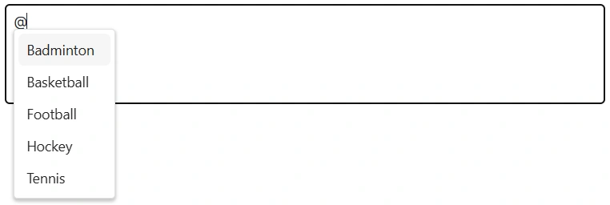
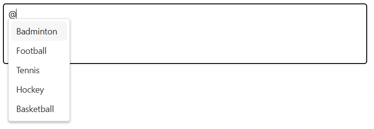

# Sorting in Blazor Mention

The [SfMention](https://help.syncfusion.com/cr/blazor/Syncfusion.Blazor.DropDowns.SfMention-1.html) component supports sorting its suggestion list using the [`SortOrder`](https://help.syncfusion.com/cr/blazor/Syncfusion.Blazor.DropDowns.SfDropDownBase-1.html#Syncfusion_Blazor_DropDowns_SfDropDownBase_1_SortOrder) property (inherited from [SfDropDownBase](https://help.syncfusion.com/cr/blazor/Syncfusion.Blazor.DropDowns.SfDropDownBase-1.html)).

The [`SortOrder`](https://help.syncfusion.com/cr/blazor/Syncfusion.Blazor.DropDowns.SortOrder.html) enum determines the order in which suggestion list items are displayed:

SortOrder     | Description
------------  | -------------
  [`Ascending`](https://help.syncfusion.com/cr/blazor/Syncfusion.Blazor.DropDowns.SortOrder.html) | The suggestion list items will be sorted in ascending (A→Z) order, alphabetically by the Text field.
  [`Descending`](https://help.syncfusion.com/cr/blazor/Syncfusion.Blazor.DropDowns.SortOrder.html) | The suggestion list items will be sorted in descending (Z→A) order, alphabetically by the Text field.
  [`None`](https://help.syncfusion.com/cr/blazor/Syncfusion.Blazor.DropDowns.SortOrder.html)      | The suggestion list items will not be sorted and will appear in the same order as provided in the DataSource.

> **Note:**
> - `SortOrder` sorts items based on the Text field specified in [`MentionFieldSettings`](https://help.syncfusion.com/cr/blazor/Syncfusion.Blazor.DropDowns.MentionFieldSettings.html). String values are sorted alphabetically.
> - For remote data, `SortOrder` sorts only the items already fetched (up to `SuggestionCount`). For server-side sorting, configure the sort order on the remote endpoint.
> - When `SortOrder` is `None`, items appear in the same order as in the DataSource.

See the [SfMention API reference](https://help.syncfusion.com/cr/blazor/Syncfusion.Blazor.DropDowns.SfMention-1.html) for all available properties.

## Examples

### Descending order
```razor

```


### Ascending order
```razor

```


### None (default)
```razor

```


SortOrder     | Description
------------  | -------------
  `Ascending` | The suggestion list items will be sorted in ascending order, from lowest to highest.
  `Descending`| The suggestion list items will be sorted in descending order, from highest to lowest.
  `None`      | The suggestion list items will not be sorted at all and will be displayed in their original order.
  


## See Also

- [Filtering Data](./filtering-data)
- [Working with Data](./working-with-data)
- [Templates](./templates)

