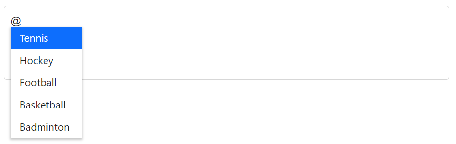

# Sorting in Mention

You can display the suggestion list items in a specific order. It has possible types of `Ascending` or `Descending` and `None` in the `SortOrder` property.

The available type of sort orders are:

SortOrder     | Description
------------  | -------------
  `None`      | The data source is not sorted..
  `Ascending` | The data source is sorting in ascending order.
  `Descending`| The data source is sorted in descending order.







