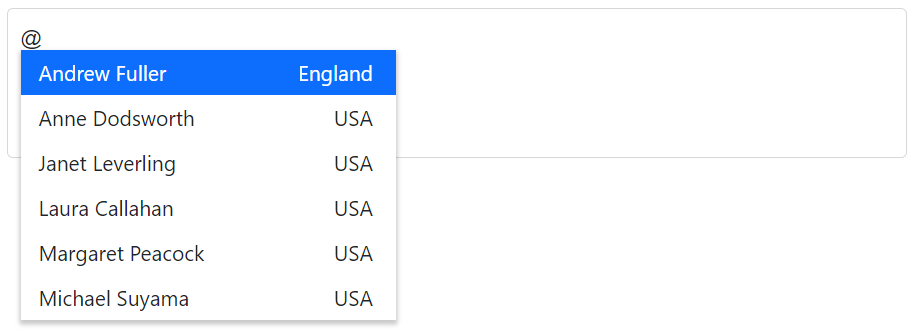
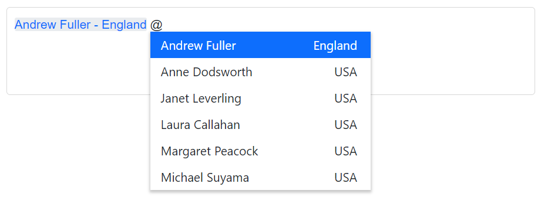
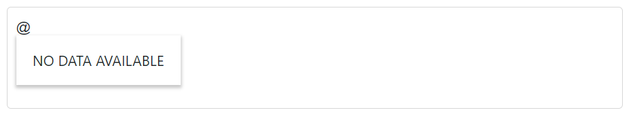
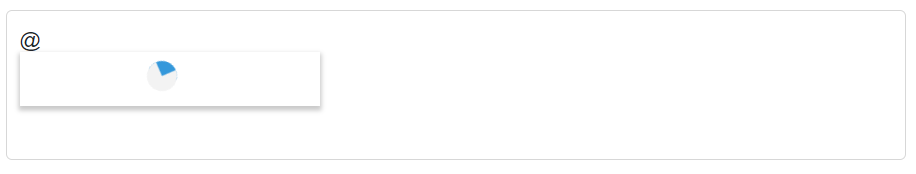

# Templates in Blazor Mention Component

The Mention is a templated blazor component, that allow you to customize various part of the UI using template parameters. It allows you to render custom components or content based on your own logic. The Mention has been provided with several options to customize each suggestion list items.

To get started quickly with templates in Blazor Mention Component, you can check the video below.



## Template context

The templates used by the Mention component are of type `RenderFragment`, which is a special type of delegate that represents a block of Razor code that can be rendered as part of a component's user interface. The templates used by the Mention component are passed parameters that can be accessed using an implicit parameter named `context`.

## Item template

The [ItemTemplate](https://help.syncfusion.com/cr/blazor/Syncfusion.Blazor.DropDowns.SfDropDownBase-1.html#Syncfusion_Blazor_DropDowns_SfDropDownBase_1_ItemTemplate) property allows you to specify a custom template for each individual suggestion list item in the Mention component. The `ItemTemplate` template is passed a parameter called `context`, which contains information about the current item being rendered. You can use this `context` parameter to access the data for the current item and use it to customize the content and appearance of the list item.

In the following sample, each list item is split into two columns to display relevant data using `ItemTemplate`.







## Display template

The [DisplayTemplate](https://help.syncfusion.com/cr/blazor/Syncfusion.Blazor.DropDowns.SfMention-1.html#Syncfusion_Blazor_DropDowns_SfMention_1_DisplayTemplate) property allows you to specify a template that defines how the mentioned value should be displayed in the Mention component. The `DisplayTemplate` template is passed a parameter called `context`, which contains information about the current item being rendered. You can use this `context` parameter to access the data for the current item and use it to customize the appearance of the mentioned value, such as by adding an avatar or displaying additional information about the mentioned value.

In the following sample, the selected value is displayed as a combined text of both `FirstName` and `Country` in the Mention element, which is separated by a hyphen.







## No records template

The [NoRecordsTemplate](https://help.syncfusion.com/cr/blazor/Syncfusion.Blazor.DropDowns.SfDropDownBase-1.html#Syncfusion_Blazor_DropDowns_SfDropDownBase_1_NoRecordsTemplate) property in Mention allows you to specify a custom template to be displayed when no data or matches are found during a search. This can be useful in certain situations, such as when you want to display a message or other content to the user to indicate that no matches were found.







## Spinner template

The [SpinnerTemplate](https://help.syncfusion.com/cr/blazor/Syncfusion.Blazor.DropDowns.SfMention-1.html#Syncfusion_Blazor_DropDowns_SfMention_1_SpinnerTemplate) property in Mention allows you to specify a custom template to be displayed when data is being fetched and the suggestion list is in the process of loading. This can be useful in certain situations, such as when you want to display a waiting spinner or other visual indicator to the user to indicate that data is being fetched.







## See also

* [How to achieve filtering](./filtering-data)
