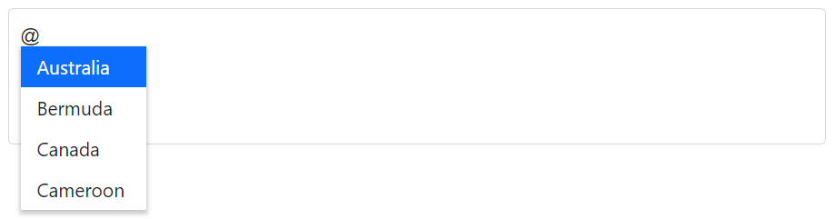
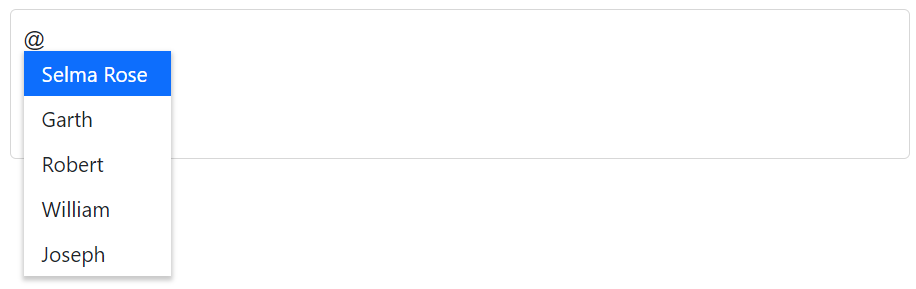
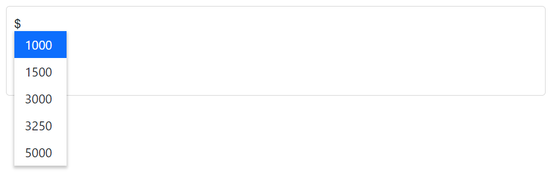
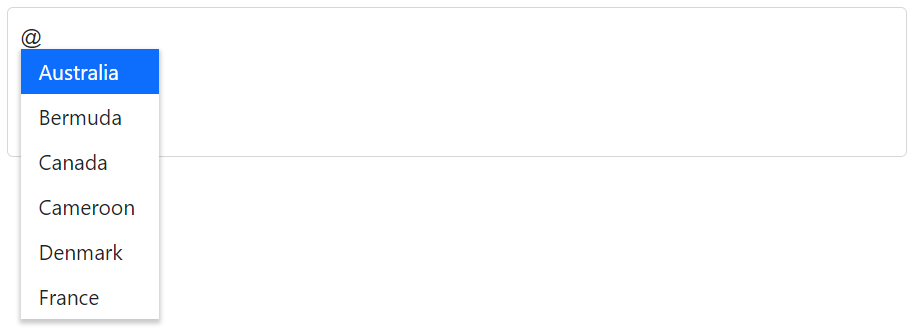
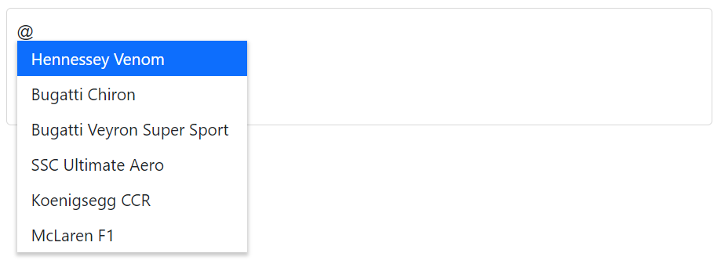
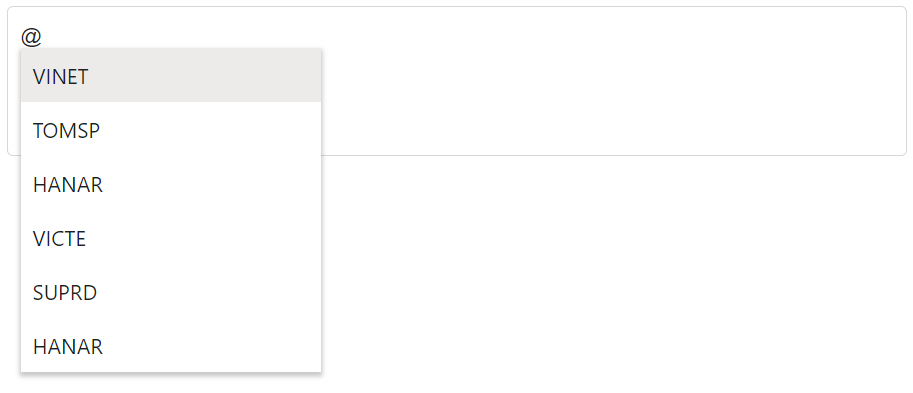
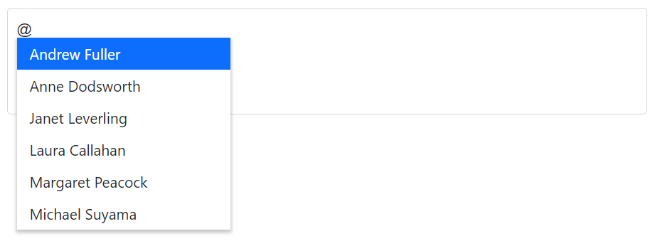
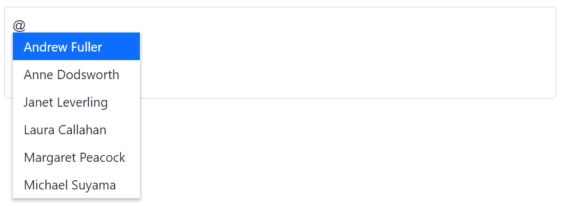

# Working with Data in Blazor Mention Component

The Mention allows you to bind data either from a local source or a remote data service using the [DataSource](https://help.syncfusion.com/cr/blazor/Syncfusion.Blazor.DropDowns.SfDropDownBase-1.html#Syncfusion_Blazor_DropDowns_SfDropDownBase_1_DataSource) property. If you want to bind data from a local source, you can simply assign an enumerable list of data items to the `DataSource` property. If you want to bind data from a remote data service, you can use the [DataManager](https://help.syncfusion.com/cr/blazor/Syncfusion.Blazor.DataManager.html) component to fetch and bind the data to the `Mention` component.

* **TItem** - Specifies the type of the `DataSource` of the Mention component.

## Binding local data

The Mention component typically loads its data from a local data source, such as a simple collection of primitive data or bind the model in your application.

The `DataSource` property of the Mention component specifies the data that will be used to populate the list of options that users can choose from when mentioning the item. The `DataSource` property supports several different data types, including:

* `Array of primitive type`: This is an array of simple data types, such as strings or numbers.
* `List of primitive type`: This is a list (a type of collection) of simple data types, such as strings or numbers.
* `IEnumerable<TItem>`: This is a sequence of items that can be enumerated.
* `ExpandoObject`: This is a type of object that allows new properties to be added dynamically at runtime.







### Primitive type

The Mention allows you to bind data to the Mention component as an array or list of various types, including `string`, `int`, `double` and `bool`. To bind data to the Mention component, you can use the `DataSource` property and specify the data as a `List<T>` or an array of the desired type.

The following code demonstrates array of string values to the Mention component.







The following code demonstrates array of integer values to the Mention component.







### Complex data type

The Mention component allows you to bind data to the component as an array or list of complex data types, such as objects with multiple properties. To bind complex data to the Mention, you can use the `DataSource` property and specify the data as a `List<T>` or an array of the desired type. You can then use the [MentionFieldSettings](https://help.syncfusion.com/cr/blazor/Syncfusion.Blazor.DropDowns.MentionFieldSettings.html) property to specify which properties of the complex data should be used to generate the suggestion list items.

In the following example, the `CodeFormat.ID` column and `Country.CountryName` column from complex data have been mapped to the [MentionFieldSettings.Value](https://help.syncfusion.com/cr/blazor/Syncfusion.Blazor.DropDowns.MentionFieldSettings.html#Syncfusion_Blazor_DropDowns_MentionFieldSettings_Value) and  [MentionFieldSettings.Text](https://help.syncfusion.com/cr/blazor/Syncfusion.Blazor.DropDowns.MentionFieldSettings.html#Syncfusion_Blazor_DropDowns_MentionFieldSettings_Text) respectively.







### Expando object binding

The [ExpandoObject](https://learn.microsoft.com/en-us/dotnet/api/system.dynamic.expandoobject?view=net-8.0) is a dynamic object type that allows you to add and delete properties and methods at runtime. This can be a useful feature in certain situations, such as when you want to bind data to a component in a flexible and dynamic way. You can bind the data in an `ExpandoObject` to the Mention component by passing the object as the value for the `DataSource` property.

In the following example, the `ExpandoObject` is bound to the collection of vehicles data.







### Enum data binding

The Mention allows you to bind data from an enumeration (enum) to the component. To bind an enum to the Mention component, you can use the `DataSource` property and specify the enum as the data source. The Mention component will then generate the suggestion list items based on the values of the enum.







## Binding remote data

The Mention component allows you to load data from remote data services using the `DataManager` property. The `DataManager` property allows you to fetch data from a remote service and bind it to Mention component.

To use the `DataManager` property with the Mention component, you can create an instance of the `DataManager` component and specify the `URL` of the remote data service as the value of the Url property. You can then pass this instance to the `DataManager` property of the Mention component.

* [DataManager.Url](https://help.syncfusion.com/cr/blazor/Syncfusion.Blazor.DataManager.html#Syncfusion_Blazor_DataManager_Url) - Defines the service endpoint to fetch data.
* [DataManager.Adaptor](https://help.syncfusion.com/cr/blazor/Syncfusion.Blazor.DataManager.html#Syncfusion_Blazor_DataManager_Adaptor) - Defines the adaptor option. By default, the [ODataAdaptor](https://blazor.syncfusion.com/documentation/data/adaptors#odata-adaptor) is used for remote binding. The adaptor is responsible for processing responses and requests from or to the service endpoint. 
* [Syncfusion.Blazor.Data](https://www.nuget.org/packages/Syncfusion.Blazor.Data/) package provides some predefined adaptors that are designed to interact with particular service endpoints.

### OData v4 adaptor - Binding OData v4 service

The [OData v4 Adaptor](https://blazor.syncfusion.com/documentation/data/adaptors#odatav4-adaptor) is an improved version of OData protocols, and the `DataManager` can also retrieve and consume OData v4 services.

The following sample displays the first 6 contacts from `Customers` table of the `Northwind` Data Service.







### Web API adaptor

The [Web Api Adaptor](https://blazor.syncfusion.com/documentation/data/adaptors#web-api-adaptor) is used to interact with Web API created under OData standards. The `WebApiAdaptor` is extended from the [ODataAdaptor](https://blazor.syncfusion.com/documentation/data/adaptors#odata-adaptor). Hence to use the `WebApiAdaptor`, the endpoint should understand the OData formatted queries sent along with the request. 







### Offline mode

The `Offline` property of `DataManager` allows you to specify whether the data should be loaded from the server or from the local cache. If `Offline` is set to `true`, the `DataManager` will try to load data from the local cache first, and if that is not possible, it will try to load it from the server. This can be useful in situations where you want to minimise the number of requests to the server and improve its performance.

The following example is for remote data binding and enabled `Offline` mode.







## Events

### OnActionBegin event

The [OnActionBegin](https://help.syncfusion.com/cr/blazor/Syncfusion.Blazor.DropDowns.SfMention-1.html#Syncfusion_Blazor_DropDowns_SfMention_1_OnActionBegin) event is triggers whenever the Mention component starts to fetch data from a remote server using the `DataSource` or `DataManager` properties. The event is passed a `ActionBeginEventArgs` object as a parameter, which contains information about the data fetch process.







### OnActionComplete event

The [OnActionComplete](https://help.syncfusion.com/cr/blazor/Syncfusion.Blazor.DropDowns.SfMention-1.html#Syncfusion_Blazor_DropDowns_SfMention_1_OnActionComplete) event is a built-in event of the Mention component that is triggered after data has been successfully fetched from a remote server. This event can be used to perform additional processing or take other action after the data fetch process has completed. The event is passed a `ActionCompleteEventArgs` object as a parameter, which contains information about the data that was fetched.







### OnActionFailure event

The [OnActionFailure](https://help.syncfusion.com/cr/blazor/Syncfusion.Blazor.DropDowns.SfMention-1.html#Syncfusion_Blazor_DropDowns_SfMention_1_OnActionFailure) event is a built-in event of Mention component that is triggered when an error occurs while fetching data from a remote server. This event can be used to handle errors that may occur during the data fetch process and take appropriate action, such as displaying an error message or retrying the request.

In the following example, the `Url` is set to an incorrect value, So the server is unable to fulfil the data fetch request, and it will triggers the `OnActionFailure` event.







## See also

* [Customization](./customization)
* [How to perform filtering](./filtering-data)
