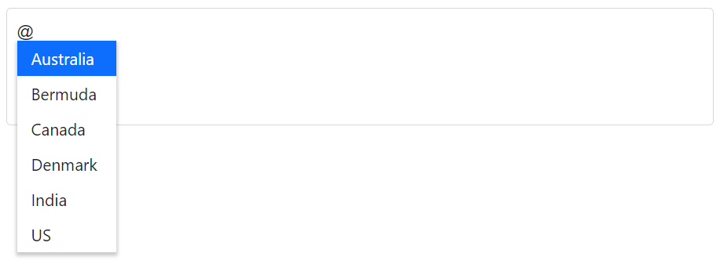

# Working with Data in Blazor Mention Component

The Mention allows you to bind data either from a local source or a remote data service using the `DataSource` property. If you want to bind data from a local source, you can simply assign an enumerable list of data items to the `DataSource` property. If you want to bind data from a remote data service, you can use the [DataManager](https://help.syncfusion.com/cr/blazor/Syncfusion.Blazor.DataManager.html) component to fetch and bind the data to the `Mention` component.

* **TItem** - Specifies the type of the datasource of the Mention component.

## Binding local data

The Mention component typically loads its data from a local data source, such as an array of strings or an array of objects.

The `DataSource` property of the Mention component specifies the data that will be used to populate the list of options that users can choose from when mentioning the item. The `DataSource` property supports several different data types, including:

* `Array of primitive type`: This is an array of simple data types, such as strings or numbers.
* `Array of object`: This is an array of objects, where each object represents a mentionable item and may contain various properties.
* `List of primitive type`: This is a list (a type of collection) of simple data types, such as strings or numbers.
* `List of object`: This is a list of objects, where each object represents a mentionable item and may contain various properties.
* `Observable Collection`: This is a type of collection that allows UI elements to automatically update when the collection is modified.
* `ExpandoObject`: This is a type of object that allows new properties to be added dynamically at runtime.
* `DynamicObject`: This is a type of object that allows properties to be accessed dynamically, rather than through pre-defined methods or properties.








### Primitive type

Bind the data to the Mention as an array or list of the `string`, `int`, `double` and `bool` type items.

The following code demonstrates array of string values to the Mention component.








The following code demonstrates array of integer values to the Mention component.








### Complex data type

The Mention can generate its list items through an array of complex data. For this, the appropriate columns should be mapped to the `Fields` property.

In the following example, the `Code.ID` column and `Country.CountryID` column from complex data have been mapped to the `MentionFieldSettings.Value` and  `MentionFieldSettings.Text` respectively.








### Expando object binding

An [ExpandoObject](https://learn.microsoft.com/en-us/dotnet/api/system.dynamic.expandoobject?view=net-5.0) is a dynamic object that allows you to add and delete properties and methods at runtime. You can bind the data in an `ExpandoObject` to the Mention component by passing the object as the value for the `DataSource` property.

In the following example, the `ExpandoObject` is bound to the collection of vehicles data.








### Observable collection binding

you can bind an [ObservableCollection](https://blazor.syncfusion.com/documentation/common/data-binding/data-updates#observable-collection) to the Mention component. An `ObservableCollection` is a type of collection that implements the `INotifyCollectionChanged` interface. This allows the Mention to be notified when the collection is modified, so it can update its own state accordingly.

In the following example, the `Observable Data` is bound to a collection of colors data.








### Dynamic object binding

You can bind the [DynamicObject](https://learn.microsoft.com/en-us/dotnet/api/system.dynamic.dynamicobject?view=net-5.0) data to the Mention component. In the following example, the `DynamicObject` is bound to the collection of customer data.








### Enum data binding

You can bind an enumeration (enum) data to a Mention component. The following code helps you to get a description value from the enumeration data.









## Binding remote data

The Mention loads the data from remote data services through the `DataSource` property. 

The Mention supports the retrieval of data from the remote data services with the help of the `DataManager` property is used to fetch data from the database and bind it to the Mention.

* [DataManager.Url](https://help.syncfusion.com/cr/blazor/Syncfusion.Blazor.DataManager.html#Syncfusion_Blazor_DataManager_Url) - Defines the service endpoint to fetch data.
* [DataManager.Adaptor](https://help.syncfusion.com/cr/blazor/Syncfusion.Blazor.DataManager.html#Syncfusion_Blazor_DataManager_Adaptor) - Defines the adaptor option. By default, the [ODataAdaptor](https://blazor.syncfusion.com/documentation/data/adaptors#odata-adaptor) is used for remote binding. The adaptor is responsible for processing responses and requests from or to the service endpoint. 
* [Syncfusion.Blazor.Data](https://www.nuget.org/packages/Syncfusion.Blazor.Data/) package provides some predefined adaptors that are designed to interact with particular service endpoints.

### OData v4 adaptor - Binding OData v4 service

The [OData v4 Adaptor](https://blazor.syncfusion.com/documentation/data/adaptors#odatav4-adaptor) is an improved version of OData protocols, and the `DataManager` can also retrieve and consume OData v4 services.

The following sample displays the first 6 contacts from `Customers` table of the `Northwind` Data Service.








### Web API adaptor

The [Web Api Adaptor](https://blazor.syncfusion.com/documentation/data/adaptors#web-api-adaptor) is used to interact with Web API created under OData standards. The `WebApiAdaptor` is extended from the [ODataAdaptor](https://blazor.syncfusion.com/documentation/data/adaptors#odata-adaptor). Hence to use the `WebApiAdaptor`, the endpoint should understand the OData formatted queries sent along with the request. 








### Custom adaptor

The [SfDataManager](https://help.syncfusion.com/cr/aspnetcore-blazor/Syncfusion.Blazor.Data.SfDataManager.html) has custom adaptor support which allows you to perform manual operations on the data. This can be utilized for implementing customize data binding and editing operations in the Mention component.

For implementing custom data binding in the Mention, the `DataAdaptor` class is used. This abstract class acts as a base class for the custom adaptor.

The `DataAdaptor` abstract class has both synchronous and asynchronous method signatures, which can be overridden in the custom adaptor. Following are the method signatures present in this class.

```csharp
public abstract class DataAdaptor
{
    /// <summary>
    /// Performs data Read operation synchronously.
    /// </summary>
    public virtual object Read(DataManagerRequest dataManagerRequest, string key = null)

    /// <summary>
    /// Performs data Read operation asynchronously.
    /// </summary>
    public virtual Task<object> ReadAsync(DataManagerRequest dataManagerRequest, string key = null)
}
```
In custom Adaptor, the data binding operation can be performed in the Mention component by providing the custom adaptor class and overriding the Read or ReadAsync method of the DataAdaptor abstract class.

The following sample code demonstrates implementing custom data binding using custom adaptor.







### Offline mode

The `Offline` property of `DataManager` allows you to specify whether the data should be loaded from the server or from the local cache. If `Offline` is set to `true`, the `DataManager` will try to load data from the local cache first, and if that is not possible, it will try to load it from the server. This can be useful in situations where you want to minimise the number of requests to the server and improve its performance.

The following example is for remote data binding and enabled `Offline` mode.








### Entity framework

Follow these steps to consume data from the [Entity Framework](https://blazor.syncfusion.com/documentation/common/data-binding/bind-entity-framework) in the Mention component.

#### Create DBContext class

The first step is to create a DBContext class called `OrderContext` to connect to a Microsoft SQL Server database.

```csharp
using Microsoft.EntityFrameworkCore;
using System;
using System.Collections.Generic;
using System.Linq;
using System.Threading.Tasks;
using EFDropDown.Shared.Models;

namespace EFDropDown.Shared.DataAccess
{
    public class OrderContext : DbContext
    {
        public virtual DbSet<Shared.Models.Order> Orders { get; set; }

        protected override void OnConfiguring(DbContextOptionsBuilder optionsBuilder)
        {
            if (!optionsBuilder.IsConfigured)
            {
                optionsBuilder.UseSqlServer(@"Data Source=(LocalDB)\MSSQLLocalDB;AttachDbFilename=D:\Blazor\DropDownList\EFDropDown\Shared\App_Data\NORTHWND.MDF;Integrated Security=True;Connect Timeout=30");
            }
        }
    }
}
```

#### Create data access layer to perform data operation

Now, create a class named `OrderDataAccessLayer`, which act as data access layer for retrieving the records from the database table.

```csharp
using Microsoft.EntityFrameworkCore;
using System;
using System.Collections.Generic;
using System.Linq;
using System.Threading.Tasks;
using EFDropDown.Shared.Models;

namespace EFDropDown.Shared.DataAccess
{
    public class OrderDataAccessLayer
    {
        OrderContext db = new OrderContext();

        //To Get all Orders details
        public DbSet<Order> GetAllOrders()
        {
            try
            {
                return db.Orders;
            }
            catch
            {
                throw;
            }
        }
    }
}
```

#### Creating web API controller

A Web API Controller has to be created, which allows the Mention to directly consume data from the Entity framework.

```csharp
using EFDropDown.Shared.DataAccess;
using EFDropDown.Shared.Models;
using Microsoft.AspNetCore.Mvc;
using Microsoft.Extensions.Primitives;
using System;
using System.Collections.Generic;
using System.Linq;
using System.Threading.Tasks;
using System.Web;
using Microsoft.AspNetCore.Http;

namespace EFDropDown.Controllers
{
    [Route("api/[controller]")]
    [ApiController]
    //TreeGrid
    public class DefaultController : ControllerBase
    {
        OrderDataAccessLayer db = new OrderDataAccessLayer();
        [HttpGet]
        public object Get()
        {
            IQueryable<Order> data = db.GetAllOrders().AsQueryable();
            var count = data.Count();
            var queryString = Request.Query;
            if (queryString.Keys.Contains("$inlinecount"))
            {
                StringValues Skip;
                StringValues Take;
                int skip = (queryString.TryGetValue("$skip", out Skip)) ? Convert.ToInt32(Skip[0]) : 0;
                int top = (queryString.TryGetValue("$top", out Take)) ? Convert.ToInt32(Take[0]) : data.Count();
                return new { Items = data.Skip(skip).Take(top), Count = count };
            }
            else
            {
                return data;
            }
         }
    }
}
```

## Events

### OnActionBegin event

The `OnActionBegin` event triggers before fetching data from the remote server.







### OnActionComplete event

The `OnActionComplete` event triggers after data is fetched successfully from the remote server.







### OnActionFailure event

The `OnActionFailure` event triggers when the data fetch request from the remote server fails.







## See also

* [Customization](./customization)
* [How to perform filtering](./filtering-data)