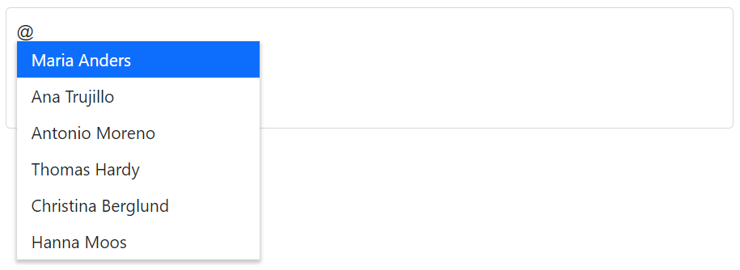

# Working with Data in Blazor Mention Component

The Mention component supports binding data from a local source or a remote service using the [DataSource](https://help.syncfusion.com/cr/blazor/Syncfusion.Blazor.DropDowns.SfDropDownBase-1.html#Syncfusion_Blazor_DropDowns_SfDropDownBase_1_DataSource) property. For local data, assign any supported collection directly to `DataSource`. For remote data, configure a [DataManager](https://help.syncfusion.com/cr/blazor/Syncfusion.Blazor.DataManager.html) instance to fetch and bind data to the Mention.

* TItem - Specifies the type of items in the `DataSource` of the Mention component.

## Binding local data

The Mention component typically loads its data from a local data source, such as a simple collection of primitive data or bind the model in your application.

The `DataSource` property of the Mention component specifies the data that will be used to populate the list of options that users can choose from when mentioning the item. The `DataSource` property supports several different data types, including:

* `Array of primitive type`: This is an array of simple data types, such as strings or numbers.
* `List of primitive type`: This is a list (a type of collection) of simple data types, such as strings or numbers.
* `IEnumerable<TItem>`: This is a sequence of items that can be enumerated.
* `ExpandoObject`: This is a type of object that allows new properties to be added dynamically at runtime.







### Primitive type

Bind arrays or lists of primitive types (for example, `string`, `int`, `double`, `bool`) directly via `DataSource`.

The following code demonstrates binding an array of strings to the Mention component.







The following code demonstrates binding an array of integers to the Mention component.







### Complex data type

Bind arrays or lists of complex objects via `DataSource`, and configure which properties are used for text/value through [MentionFieldSettings](https://help.syncfusion.com/cr/blazor/Syncfusion.Blazor.DropDowns.MentionFieldSettings.html).

In the following example, `CodeFormat.ID` and `Country.CountryName` are mapped to [MentionFieldSettings.Value](https://help.syncfusion.com/cr/blazor/Syncfusion.Blazor.DropDowns.MentionFieldSettings.html#Syncfusion_Blazor_DropDowns_MentionFieldSettings_Value) and [MentionFieldSettings.Text](https://help.syncfusion.com/cr/blazor/Syncfusion.Blazor.DropDowns.MentionFieldSettings.html#Syncfusion_Blazor_DropDowns_MentionFieldSettings_Text), respectively.







### Expando object binding

The [ExpandoObject](https://learn.microsoft.com/en-us/dotnet/api/system.dynamic.expandoobject?view=net-8.0) type allows dynamic properties at runtime. Bind an `IEnumerable<ExpandoObject>` via `DataSource` and map fields using `MentionFieldSettings`..

In the following example, an `ExpandoObject` collection of vehicles is bound to the Mention component.







### Enum data binding

Bind an enumeration’s values to the Mention by assigning the enum list to `DataSource`.







## Binding remote data

Use the `DataManager` class to load data from remote services and bind it to the Mention. Configure the endpoint and adaptor, then assign the `DataManager` instance to the Mention.

* [DataManager.Url](https://help.syncfusion.com/cr/blazor/Syncfusion.Blazor.DataManager.html#Syncfusion_Blazor_DataManager_Url) - Defines the service endpoint to fetch data.
* [DataManager.Adaptor](https://help.syncfusion.com/cr/blazor/Syncfusion.Blazor.DataManager.html#Syncfusion_Blazor_DataManager_Adaptor) - Defines how requests/responses are formatted. By default, the [ODataAdaptor](https://blazor.syncfusion.com/documentation/data/adaptors#odata-adaptor) is used for remote binding. The adaptor processes requests to and responses from the service endpoint.
* The [Syncfusion.Blazor.Data](https://www.nuget.org/packages/Syncfusion.Blazor.Data/) package provides predefined adaptors for common service styles.

### OData v4 adaptor - Binding OData v4 service

The [OData v4 adaptor](https://blazor.syncfusion.com/documentation/data/adaptors#odatav4-adaptor) supports OData v4 protocols. `DataManager` can retrieve and consume OData v4 services.

The following sample displays the first six contacts from the `Customers` table of the Northwind OData service.







### Web API adaptor

The [Web API adaptor](https://blazor.syncfusion.com/documentation/data/adaptors#web-api-adaptor) is used with Web API endpoints that understand OData-style query parameters. `WebApiAdaptor` is derived from [ODataAdaptor](https://blazor.syncfusion.com/documentation/data/adaptors#odata-adaptor); ensure the endpoint accepts OData-formatted queries.







### Offline mode

The `Offline` property of `DataManager` controls whether data is served from local cache first. When `Offline` is `true`, `DataManager` attempts to use cached data before sending network requests, which can reduce server calls and improve performance for URL-based adaptors.

The following example demonstrates remote binding with `Offline` mode enabled.






## Events

### OnActionBegin event

The [OnActionBegin](https://help.syncfusion.com/cr/blazor/Syncfusion.Blazor.DropDowns.SfMention-1.html#Syncfusion_Blazor_DropDowns_SfMention_1_OnActionBegin) event is triggered when a data operation starts (for example, fetching data). The event provides [ActionBeginEventArgs](https://help.syncfusion.com/cr/blazor/Syncfusion.Blazor.DropDowns.ActionBeginEventArgs-1.html) with information about the operation.







### OnActionComplete event

The [OnActionComplete](https://help.syncfusion.com/cr/blazor/Syncfusion.Blazor.DropDowns.SfMention-1.html#Syncfusion_Blazor_DropDowns_SfMention_1_OnActionComplete) event is triggered after a data operation completes successfully. Use it to post-process the fetched data. The event provides [ActionCompleteEventArgs](https://help.syncfusion.com/cr/blazor/Syncfusion.Blazor.DropDowns.ActionCompleteEventArgs-1.html).







### OnActionFailure event

The [OnActionFailure](https://help.syncfusion.com/cr/blazor/Syncfusion.Blazor.DropDowns.SfMention-1.html#Syncfusion_Blazor_DropDowns_SfMention_1_OnActionFailure) event is triggered when a data request fails. Handle this event to log errors, show messages, or retry. The event provides [ActionFailureEventArgs](https://help.syncfusion.com/cr/blazor/Syncfusion.Blazor.DropDowns.ActionFailureEventArgs.html).

In the following example, the `Url` is intentionally incorrect, the server cannot fulfill the request, and `OnActionFailure` is triggered.







## See also

* [Customization](./customization)
* [How to perform filtering](./filtering-data)