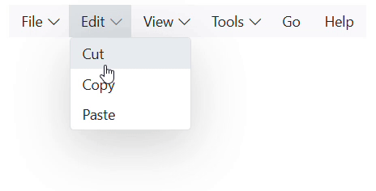

# Animation in Blazor Menu Bar Component

To change the animation of the Menu bar component, [MenuAnimationSettings](https://help.syncfusion.com/cr/blazor/Syncfusion.Blazor.Navigations.MenuAnimationSettings.html) component is used to initialize the animation properties.
The supported effects for Context Menu are,

| Effect | Functionality |
| ------------ | ----------------------- |
| None | Specifies the sub menu transform with no animation effect. |
| SlideDown | Specifies the sub menu transform with slide down effect. |
| ZoomIn | Specifies the sub menu transform with zoom in effect. |
| FadeIn | Specifies the sub menu transform with fade in effect. |

The following sample illustrates how to open Context Menu with `FadeIn` effect with the `Duration` of `800ms`.

```cshtml
<SfMenu TValue="MenuItem">
    <MenuAnimationSettings Effect="MenuEffect.SlideDown" Duration="800"></MenuAnimationSettings>
    <MenuItems>
        <MenuItem Text="File">
            <MenuItems>
                <MenuItem Text="Open"></MenuItem>
                <MenuItem Text="Save"></MenuItem>
                <MenuItem Text="Exit"></MenuItem>
            </MenuItems>
        </MenuItem>
        <MenuItem Text="Edit">
            <MenuItems>
                <MenuItem Text="Cut"></MenuItem>
                <MenuItem Text="Copy"></MenuItem>
                <MenuItem Text="Paste"></MenuItem>
            </MenuItems>
        </MenuItem>
        <MenuItem Text="View">
            <MenuItems>
                <MenuItem Text="Toolbars"></MenuItem>
                <MenuItem Text="Zoom"></MenuItem>
                <MenuItem Text="Full Screen"></MenuItem>
            </MenuItems>
        </MenuItem>
        <MenuItem Text="Tools">
            <MenuItems>
                <MenuItem Text="Spelling & Grammar"></MenuItem>
                <MenuItem Text="Customize"></MenuItem>
                <MenuItem Text="Options"></MenuItem>
            </MenuItems>
        </MenuItem>
        <MenuItem Text="Go"></MenuItem>
        <MenuItem Text="Help"></MenuItem>
    </MenuItems>
</SfMenu>

```

