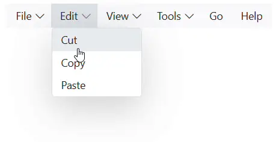

# Animation in Blazor Menu Bar

To change the open/close animation of the Menu Bar component, the [`MenuAnimationSettings`](https://help.syncfusion.com/cr/blazor/Syncfusion.Blazor.Navigations.MenuAnimationSettings.html) child tag of `SfMenu` is used to initialize the animation properties. `Duration` is specified in milliseconds, and `Effect` accepts any value from the [`MenuEffect`](https://help.syncfusion.com/cr/blazor/Syncfusion.Blazor.Navigations.MenuEffect.html) enum.

The supported effects are:

| Effect | Functionality |
| ------------ | ----------------------- |
| None | Transforms the submenu without any animation. |
| SlideDown | Transforms the submenu with a slide-down effect. |
| ZoomIn | Transforms the submenu with a zoom-in effect. |
| FadeIn | Transforms the submenu with a fade-in effect. |

The following sample illustrates how to animate the Menu Bar's submenu with the `SlideDown` effect and a `Duration` of `800` ms.

```cshtml
@using Syncfusion.Blazor.Navigations

<SfMenu TValue="MenuItem">
    <MenuAnimationSettings Effect="MenuEffect.SlideDown" Duration="800"></MenuAnimationSettings>
    <MenuItems>
        <MenuItem Text="File">
            <MenuItems>
                <MenuItem Text="Open"></MenuItem>
                <MenuItem Text="Save"></MenuItem>
                <MenuItem Text="Exit"></MenuItem>
            </MenuItems>
        </MenuItem>
        <MenuItem Text="Edit">
            <MenuItems>
                <MenuItem Text="Cut"></MenuItem>
                <MenuItem Text="Copy"></MenuItem>
                <MenuItem Text="Paste"></MenuItem>
            </MenuItems>
        </MenuItem>
        <MenuItem Text="View">
            <MenuItems>
                <MenuItem Text="Toolbars"></MenuItem>
                <MenuItem Text="Zoom"></MenuItem>
                <MenuItem Text="Full Screen"></MenuItem>
            </MenuItems>
        </MenuItem>
        <MenuItem Text="Tools">
            <MenuItems>
                <MenuItem Text="Spelling & Grammar"></MenuItem>
                <MenuItem Text="Customize"></MenuItem>
                <MenuItem Text="Options"></MenuItem>
            </MenuItems>
        </MenuItem>
        <MenuItem Text="Go"></MenuItem>
        <MenuItem Text="Help"></MenuItem>
    </MenuItems>
</SfMenu>

```

