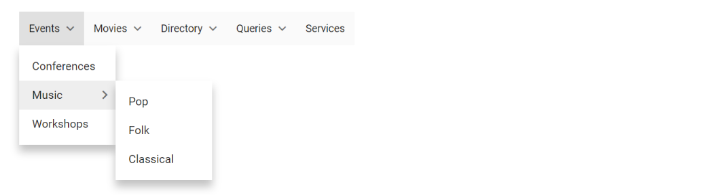
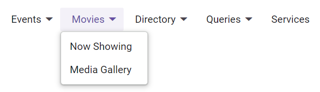

# Data Source Binding and Custom Items in Blazor Menu Bar Component

The [Blazor Menu Bar](https://www.syncfusion.com/blazor-components/blazor-menu-bar) component supports data source binding, including structures such as self-referential data. This allows for dynamic generation of menu hierarchies from various data sources.
## Self-referential data

The Menu Bar can be populated from a self-referential data structure that defines parent-child relationships through a `ParentId` mapping.

In the following example, the **id**, **pId**, and **text** columns from self-referential data have been mapped to the [ItemId](https://help.syncfusion.com/cr/blazor/Syncfusion.Blazor.Navigations.MenuFieldSettings.html#Syncfusion_Blazor_Navigations_MenuFieldSettings_ItemId), [ParentId](https://help.syncfusion.com/cr/blazor/Syncfusion.Blazor.Navigations.MenuFieldSettings.html#Syncfusion_Blazor_Navigations_MenuFieldSettings_ParentId), and [Text](https://help.syncfusion.com/cr/blazor/Syncfusion.Blazor.Navigations.MenuFieldSettings.html#Syncfusion_Blazor_Navigations_MenuFieldSettings_Text) fields, respectively.

```cshtml

@using Syncfusion.Blazor.Navigations

<SfMenu Items="@MenuItems">
    <MenuEvents  TValue="MenuItemModel" OnOpen="onOpen"></MenuEvents>
    <MenuFieldSettings ItemId="Id" Text="Text" ParentId="ParentId"></MenuFieldSettings>
</SfMenu>

@code {

    private string eventName = "";
    public List<CustomMenuItem> MenuItems = new List<CustomMenuItem>
    {
        new CustomMenuItem{ Id = "parent1", Text = "Events" },
        new CustomMenuItem{ Id = "parent2", Text = "Movies" },
        new CustomMenuItem{ Id = "parent3", Text = "Directory" },
        new CustomMenuItem{ Id = "parent4", Text = "Queries", ParentId = null  },
        new CustomMenuItem{ Id = "parent5", Text = "Services", ParentId = null },
        new CustomMenuItem{ Id = "parent6", Text = "Conferences", ParentId = "parent1" },
        new CustomMenuItem{ Id = "parent7", Text = "Music", ParentId = "parent1" },
        new CustomMenuItem{ Id = "parent8", Text = "Workshops", ParentId = "parent1" },

        new CustomMenuItem{ Id = "parent9", Text = "Now Showing", ParentId = "parent2" },
        new CustomMenuItem{ Id = "parent10", Text = "Coming Soon", ParentId = "parent2" },

        new CustomMenuItem{ Id = "parent10", Text = "Media Gallery", ParentId = "parent3" },
        new CustomMenuItem{ Id = "parent11", Text = "Newsletters", ParentId = "parent3" },

        new CustomMenuItem{ Id = "parent12", Text = "Our Policy", ParentId = "parent4" },
        new CustomMenuItem{ Id = "parent13", Text = "Site Map", ParentId = "parent4" },
        new CustomMenuItem{ Id = "parent14", Text = "Pop", ParentId = "parent7" },
        new CustomMenuItem{ Id = "parent15", Text = "Folk", ParentId = "parent7" },
        new CustomMenuItem{ Id = "parent16", Text = "Classical", ParentId = "parent7" }

        };

    public class CustomMenuItem
    {
        public string Id { get; set; }
        public string Text { get; set; }
        public string ParentId { get; set; }
    }

    private void onOpen()
    {
        this.eventName = "OnOpen";
    }
}


```




N> In the above example, `TValue` is specified as `MenuItemModel` because the menu is rendered using the `Items` property.

## Handling Self-Referential Data with CustomMenuItem TValue in MenuTemplate

When using a custom generic type (`TValue="CustomMenuItem"`) with [`MenuTemplates`](https://help.syncfusion.com/cr/blazor/Syncfusion.Blazor.Navigations.MenuTemplates-1.html), the Menu Bar's built-in self-referential data processing based on `ParentId` mapping is not directly supported. To address this limitation, you need to manually map the parent and child menu items within the menu template. In the following example, we demonstrate how to configure the SfMenu component using self-referential data with CustomMenuItem as the TValue in the MenuTemplate.

```cshtml
@using Syncfusion.Blazor.Navigations
<SfMenu Items="@MenuHierarchy">
    <MenuFieldSettings Text="Text" Children="SubMenu"></MenuFieldSettings>
    <MenuEvents TValue="CustomMenuItem" ItemSelected="ItemSelected"></MenuEvents>
    <MenuTemplates TValue="CustomMenuItem">
        <Template>
            @{
                var MenuItems = context;
                <div style="width: 100%; display: flex; justify-content: space-between;">
                    @{
                        <span style="width:100%;">@MenuItems.Text</span>
                    }
                </div>
            }
        </Template>
    </MenuTemplates>
</SfMenu>
@code {
    public List<CustomMenuItem> MenuHierarchy;
    public List<CustomMenuItem> MenuItems = new List<CustomMenuItem>
    {
        new CustomMenuItem{ Id = "parent1", Text = "Events"},
        new CustomMenuItem{ Id = "parent2", Text = "Movies" },
        new CustomMenuItem { Id = "parent3", Text = "Directory" },
        new CustomMenuItem { Id = "parent4", Text = "Queries", ParentId = null },
        new CustomMenuItem { Id = "parent5", Text = "Services", ParentId = null },
        new CustomMenuItem { Id = "parent6", Text = "Conferences", ParentId = "parent1" },
        new CustomMenuItem { Id = "parent7", Text = "Music", ParentId = "parent1" },
        new CustomMenuItem { Id = "parent8", Text = "Workshops", ParentId = "parent1" },
        new CustomMenuItem { Id = "parent9", Text = "Now Showing", ParentId = "parent2" },
        new CustomMenuItem { Id = "parent10", Text = "Coming Soon", ParentId = "parent2" },
        new CustomMenuItem { Id = "parent10", Text = "Media Gallery", ParentId = "parent3" },
        new CustomMenuItem { Id = "parent11", Text = "Newsletters", ParentId = "parent3" },
        new CustomMenuItem { Id = "parent12", Text = "Our Policy", ParentId = "parent4" },
        new CustomMenuItem { Id = "parent13", Text = "Site Map", ParentId = "parent4" },
        new CustomMenuItem { Id = "parent14", Text = "Pop", ParentId = "parent7" },
        new CustomMenuItem { Id = "parent15", Text = "Folk", ParentId = "parent7" },
        new CustomMenuItem { Id = "parent16", Text = "Classical", ParentId = "parent7" }
    };
    protected override async Task OnInitializedAsync()
    {
        MenuHierarchy = BuildMenuHierarchy(MenuItems);
    }
    public List<CustomMenuItem> BuildMenuHierarchy(List<CustomMenuItem> menuItems)
    {
        var menuDict = new Dictionary<string, CustomMenuItem>();
        var rootMenuItems = new List<CustomMenuItem>();
        // Populate the dictionary with cloned items
        foreach (var item in menuItems)
        {
            var clonedItem = CloneMenuItem(item);
            menuDict[clonedItem.Id] = clonedItem;
        }
        // Build the hierarchy
        foreach (var item in menuItems)
        {
            var clonedItem = menuDict[item.Id];
            if (!string.IsNullOrEmpty(item.ParentId) && item.ParentId != null)
            {
                if (menuDict.ContainsKey(item.ParentId))
                {
                    var parentItem = menuDict[item.ParentId];
                    if (parentItem.SubMenu == null)
                    {
                        parentItem.SubMenu = new List<CustomMenuItem>();
                    }
                    parentItem.SubMenu.Add(clonedItem);
                }
            }
            else
            {
                rootMenuItems.Add(clonedItem);
            }
        }
        // Remove ParentId from each item in the hierarchy (optional)
        RemoveParentId(rootMenuItems);
        return rootMenuItems;
    }
    private CustomMenuItem CloneMenuItem(CustomMenuItem item)
    {
        return new CustomMenuItem
            {
                Id = item.Id,
                Text = item.Text,
                ParentId = item.ParentId,
                ImageName = item.ImageName,
                IsSeparator = item.IsSeparator,
                SubMenu = item.SubMenu != null ? new List<CustomMenuItem>(item.SubMenu) : null
            };
    }
    private void RemoveParentId(List<CustomMenuItem> menuItems)
    {
        foreach (var item in menuItems)
        {
            item.ParentId = null;
            if (item.SubMenu != null)
            {
                RemoveParentId(item.SubMenu);
            }
        }
    }
    public class CustomMenuItem
    {
        public string Id { get; set; }
        public string Text { get; set; }
        public string ParentId { get; set; }
        public string ImageName { get; set; }
        public bool IsSeparator { get; set; }
        public List<CustomMenuItem> SubMenu { get; set; }
    }
    private void ItemSelected(MenuEventArgs<CustomMenuItem> args)
    {
        //Selected menu item
        var selectedItem = args.Item.Text;
    }
}
```




## Custom Menu Bar Items

To customize the rendering of Menu Bar items, define a custom template using the [`MenuTemplates`](https://help.syncfusion.com/cr/blazor/Syncfusion.Blazor.Navigations.MenuTemplates-1.html) component. This allows the embedding of rich content, custom styles, or interactive elements directly within each menu item.

The following example demonstrates rendering a Menu Bar with extensively customized items, including images, badges, and a detailed "About Us" card.

```cshtml

@using Syncfusion.Blazor.Navigations
@inject Microsoft.AspNetCore.Components.NavigationManager UriHelper;

<div class="menu-control">
    <SfMenu Items="@data">
        <MenuFieldSettings Text="Value" Children="Options"></MenuFieldSettings>
        <MenuTemplates TValue="CategoryModel">
            <Template>
                @{
                    var MenuItems = context;
                    if (MenuItems.Value != null && MenuItems.Count == null && MenuItems.Url == null)
                    {
                        <div>@MenuItems.Value</div>
                    }
                    else if (MenuItems.Value != null)
                    {
                        <div style="width: 100%;display: flex;justify-content: space-between;">
                            @{
                                if (MenuItems.Url != null)
                                {
                                    
                                }
                                <span style="width:100%;">@MenuItems.Value</span>
                                if (MenuItems.Count != null)
                                {
                                    <span class="e-badge e-badge-success">@MenuItems.Count</span>
                                }
                            }
                        </div>
                    }
                    else
                    {
                        <div tabindex="0" class="e-card">
                            <div class="e-card-header">
                                <div class="e-card-header-caption">
                                    <div class="e-card-header-title">About Us</div>
                                </div>
                            </div>
                            <div class="e-card-content">
                                @MenuItems.About
                            </div>
                            <div class="e-card-actions">
                                <input type="button" class="e-btn e-outline" style="pointer-events: auto;" value="Read More" />
                            </div>
                        </div>
                    }
                }
            </Template>
        </MenuTemplates>
    </SfMenu>
</div>
@code{
    private List<CategoryModel> data = new List<CategoryModel>
{
        new CategoryModel {
            Value = "Products",
            Options = new List<CategoryModel>
        {
                new CategoryModel { Value= "JavaScript", Url= "https://blazor.syncfusion.com/demos/_content/blazor_server_common_net9/images/menu-bar/javascript.png" },
                new CategoryModel { Value= "Angular", Url= "https://blazor.syncfusion.com/demos/_content/blazor_server_common_net9/images/menu-bar/angular.png" },
                new CategoryModel { Value= "ASP.NET Core", Url= "https://blazor.syncfusion.com/demos/_content/blazor_server_common_net9/images/menu-bar/core.png" },
                new CategoryModel { Value= "ASP.NET MVC", Url= "https://blazor.syncfusion.com/demos/_content/blazor_server_common_net9/images/menu-bar/mvc.png" }
            }
        },
        new CategoryModel {
            Value = "Services",
            Options = new List<CategoryModel>
        {
                new CategoryModel { Value= "Application Development", Count= "1200+" },
                new CategoryModel { Value= "Maintenance & Support", Count= "3700+" },
                new CategoryModel { Value= "Quality Assurance" },
                new CategoryModel { Value= "Cloud Integration", Count= "900+" }
            }
        },
        new CategoryModel {
            Value = "About Us",
            Options =  new List<CategoryModel>
    {
                new CategoryModel {
                    Id = "about",
                    About = "We are on a mission to provide world-class best software solutions for web, mobile and desktop platforms. Around 900+ applications are desgined and delivered to our customers to make digital & strengthen their businesses."
                }
            }
        },
        new CategoryModel { Value = "Careers" },
        new CategoryModel { Value = "Sign In" }
    };
    private class CategoryModel
    {
        public List<CategoryModel> Options { get; set; }
        public string Value { get; set; }
        public string Url { get; set; }
        public string Count { get; set; }
        public string About { get; set; }
        public string Id { get; set; }
    }
}
<style>
    .menu-control {
        margin-top: 45px;
        text-align: center;
    }
    /* Common ul & li styles */
    .mobile .e-menu-container ul.e-ul,
    .e-menu-container ul.e-ul {
        padding: 0;
    }

        .mobile .e-menu-container ul.e-ul .e-menu-item,
        .e-menu-container ul.e-ul .e-menu-item {
            display: flex;
            padding: 0 10px;
            outline-color: transparent;
        }
    /** Avatar customization */
    .e-menu-container ul .e-menu-item .e-avatar {
        background-color: inherit;
        font-size: 8px;
        margin-right: 8px;
        align-self: center;
        width: auto;
        overflow: visible;
    }

    .mobile .e-menu-container ul .e-menu-item .e-avatar {
        font-size: 10px;
    }
    /** Badge customization */
    .e-menu-container ul .e-menu-item .e-badge {
        margin-left: 10px;
        align-self: center;
        overflow: visible;
    }
    /** Card customization */
    .e-menu-container ul.e-ul .e-menu-item .e-card {
        width: 290px;
        font-size: inherit;
        background-color: inherit;
        border-color: transparent;
    }

    .mobile .e-menu-container ul.e-ul .e-menu-item .e-card {
        width: 320px;
    }

    .e-menu-container ul.e-ul .e-menu-item .e-card .e-card-content {
        white-space: normal;
        color: inherit;
        padding-top: 0;
        text-align: justify;
        font-size: inherit;
    }

    .e-menu-container ul.e-ul .e-menu-item#about {
        height: auto;
        padding: 0;
    }

        .e-menu-container ul.e-ul .e-menu-item#about.e-focused {
            background-color: transparent;
            outline-color: transparent;
            pointer-events: none;
        }

    .e-menu-container .e-ul .e-menu-item {
        height: 36px;
        line-height: 36px;
    }
</style>

```



