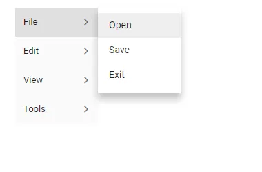

# How to change orientation in Blazor Menu Bar

Orientation in menu items can be changed horizontally or vertically using the [Orientation](https://help.syncfusion.com/cr/blazor/Syncfusion.Blazor.Navigations.SfMenu-1.html#Syncfusion_Blazor_Navigations_SfMenu_1_Orientation) property. By default, it is horizontally aligned.

```cshtml
@using Syncfusion.Blazor.Navigations

<SfMenu TValue="MenuItem" Orientation="Syncfusion.Blazor.Navigations.Orientation.Vertical">
    <MenuItems>
        <MenuItem Text="File">
            <MenuItems>
                <MenuItem Text="Open"></MenuItem>
                <MenuItem Text="Save"></MenuItem>
                <MenuItem Text="Exit"></MenuItem>
            </MenuItems>
        </MenuItem>
        <MenuItem Text="Edit">
            <MenuItems>
                <MenuItem Text="Cut"></MenuItem>
                <MenuItem Text="Copy"></MenuItem>
                <MenuItem Text="Paste"></MenuItem>
            </MenuItems>
        </MenuItem>
        <MenuItem Text="View">
            <MenuItems>
                <MenuItem Text="Toolbar"></MenuItem>
                <MenuItem Text="Sidebar"></MenuItem>
                <MenuItem Text="Full Screen"></MenuItem>
            </MenuItems>
        </MenuItem>
        <MenuItem Text="Tools">
            <MenuItems>
                <MenuItem Text="Spelling & Grammer"></MenuItem>
                <MenuItem Text="Customize"></MenuItem>
                <MenuItem Text="Options"></MenuItem>
            </MenuItems>
        </MenuItem>
    </MenuItems>
</SfMenu>

```

