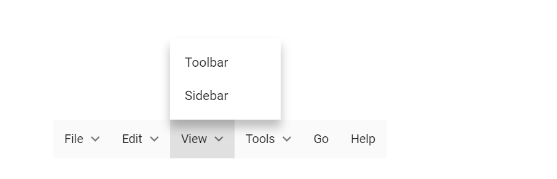

# Change SubMenu Position

The submenu position can be changed by using the [`OnOpen`](https://help.syncfusion.com/cr/blazor/Syncfusion.Blazor~Syncfusion.Blazor.Navigations.MenuEvents~OnOpen.html) event. Assign the `Top` and `Left` position where you want to open the submenu.

In the below sample, the sub menu opens above the parent menu item

```csharp

@using Syncfusion.Blazor.Navigations

<SfMenu TValue="MenuItem">
    <MenuItems>
        <MenuItem Text="File">
            <MenuItems>
                <MenuItem Text="Open"></MenuItem>
                <MenuItem Text="Save"></MenuItem>
                <MenuItem Text="Exit"></MenuItem>
            </MenuItems>
        </MenuItem>
        <MenuItem Text="Edit">
            <MenuItems>
                <MenuItem Text="Cut"></MenuItem>
                <MenuItem Text="Copy"></MenuItem>
                <MenuItem Text="Paste"></MenuItem>
            </MenuItems>
        </MenuItem>
        <MenuItem Text="View">
            <MenuItems>
                <MenuItem Text="Toolbars"></MenuItem>
                <MenuItem Text="Zoomr"></MenuItem>
                <MenuItem Text="Full Screen"></MenuItem>
            </MenuItems>
        </MenuItem>
        <MenuItem Text="Tools">
            <MenuItems>
                <MenuItem Text="Spelling & Grammar"></MenuItem>
                <MenuItem Text="Customize"></MenuItem>
                <MenuItem Text="Options"></MenuItem>
            </MenuItems>
        </MenuItem>
        <MenuItem Text="Go"></MenuItem>
        <MenuItem Text="Help"></MenuItem>
        <MenuEvents TValue="MenuItem" OnOpen="Open"></MenuEvents>
    </MenuItems>
</SfMenu>

@code {

    public void Open(BeforeOpenCloseMenuEventArgs<MenuItem> args)
    {
        if (args.ParentItem.Text == "File")
        {
            args.Left = 390;
            args.Top = 40;
        }
        if (args.ParentItem.Text == "Edit")
        {
            args.Left = 455;
            args.Top = 40;
        }
        if (args.ParentItem.Text == "View")
        {
            args.Left = 520;
            args.Top = 40;
        }
        if (args.ParentItem.Text == "Tools")
        {
            args.Left = 585;
            args.Top = 40;
        }
    }
}

<style>
    #element {
        margin: 25% 5px 20px 30%;
    }
</style>

```

Output be like

