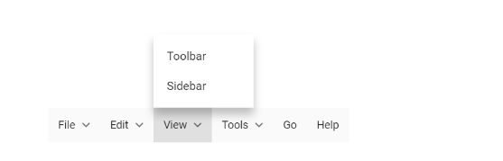

# How to change submenu position in Blazor Menu Bar

The submenu position can be changed by using the [`OnOpen`](https://blazor.syncfusion.com/documentation/menu-bar/menu-events#onopen) event. Assign the `Top` and `Left` position where you want to open the submenu. The `OnOpen` event is wired through the `MenuEvents` component, which receives a `BeforeOpenCloseMenuEventArgs<TValue>` that exposes the `Top` and `Left` properties of the opening submenu.

In the below sample, the submenu opens at a custom `Top` and `Left` position relative to the parent menu item.

```cshtml

@using Syncfusion.Blazor.Navigations

<SfMenu TValue="MenuItem">
    <MenuItems>
        <MenuItem Text="File">
            <MenuItems>
                <MenuItem Text="Open"></MenuItem>
                <MenuItem Text="Save"></MenuItem>
                <MenuItem Text="Exit"></MenuItem>
            </MenuItems>
        </MenuItem>
        <MenuItem Text="Edit">
            <MenuItems>
                <MenuItem Text="Cut"></MenuItem>
                <MenuItem Text="Copy"></MenuItem>
                <MenuItem Text="Paste"></MenuItem>
            </MenuItems>
        </MenuItem>
        <MenuItem Text="View">
            <MenuItems>
                <MenuItem Text="Toolbars"></MenuItem>
                <MenuItem Text="Zoom"></MenuItem>
                <MenuItem Text="Full Screen"></MenuItem>
            </MenuItems>
        </MenuItem>
        <MenuItem Text="Tools">
            <MenuItems>
                <MenuItem Text="Spelling & Grammar"></MenuItem>
                <MenuItem Text="Customize"></MenuItem>
                <MenuItem Text="Options"></MenuItem>
            </MenuItems>
        </MenuItem>
        <MenuItem Text="Go"></MenuItem>
        <MenuItem Text="Help"></MenuItem>
        <MenuEvents TValue="MenuItem" OnOpen="Open"></MenuEvents>
    </MenuItems>
</SfMenu>

@code {

    public void Open(BeforeOpenCloseMenuEventArgs<MenuItem> args)
    {
        if (args.ParentItem == null)
        {
            return;
        }
        args.Top = 40;
        switch (args.ParentItem.Text)
        {
            case "File":
                args.Left = 390;
                break;
            case "Edit":
                args.Left = 455;
                break;
            case "View":
                args.Left = 520;
                break;
            case "Tools":
                args.Left = 585;
                break;
        }
    }
}

```

Output be like


