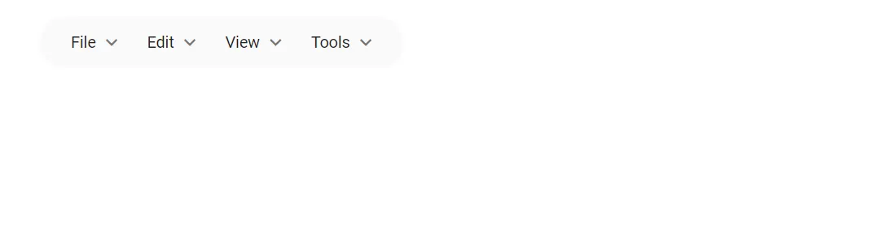

# How to show rounded corner in Blazor Menu Bar

The rounded corner can be achieved by using the [CssClass](https://help.syncfusion.com/cr/blazor/Syncfusion.Blazor~Syncfusion.Blazor.Navigations.SfMenu~CssClass.html) property. Assign a custom CSS class to the Menu Bar component, then apply the `border-radius` CSS property in your page stylesheet to round its corners. The following Razor page demonstrates the full setup; place the `<style>` block inside the same `.razor` file (or in `~/Pages/_Host.cshtml` for a Blazor Server app).

```cshtml
@using Syncfusion.Blazor.Navigations

<SfMenu TValue="MenuItem" CssClass="e-rounded-menu">
    <MenuItems>
        <MenuItem Text="File">
            <MenuItems>
                <MenuItem Text="Open"></MenuItem>
                <MenuItem Text="Save"></MenuItem>
                <MenuItem Text="Exit"></MenuItem>
            </MenuItems>
        </MenuItem>
        <MenuItem Text="Edit">
            <MenuItems>
                <MenuItem Text="Cut"></MenuItem>
                <MenuItem Text="Copy"></MenuItem>
                <MenuItem Text="Paste"></MenuItem>
            </MenuItems>
        </MenuItem>
        <MenuItem Text="View">
            <MenuItems>
                <MenuItem Text="Toolbar"></MenuItem>
                <MenuItem Text="Sidebar"></MenuItem>
                <MenuItem Text="Full Screen"></MenuItem>
            </MenuItems>
        </MenuItem>
        <MenuItem Text="Tools">
            <MenuItems>
                <MenuItem Text="Spelling & Grammer"></MenuItem>
                <MenuItem Text="Customize"></MenuItem>
                <MenuItem Text="Options"></MenuItem>
            </MenuItems>
        </MenuItem>
    </MenuItems>
</SfMenu>
<style>

    /* Styles to achieve rounder corner in menu */
    .e-menu-container.e-rounded-menu:not(.e-menu-popup),
    .e-menu-container.e-rounded-menu .e-menu {
        border-radius: 20px;
    }

    /* Increased the menu component left and right padding for better rounded corner UI */
    .e-menu-container.e-rounded-menu ul.e-menu {
        padding: 0 14px;
    }
</style>

```

