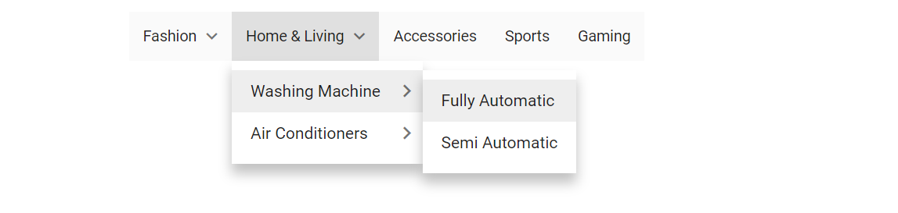

# Icons and Sub-menu Items in Blazor Menu Bar Component

## Icons

Menu items can include an icon or image to provide a clear visual representation of an associated action. To display an icon on a menu item, set the [`IconCss`](https://help.syncfusion.com/cr/blazor/Syncfusion.Blazor.Navigations.MenuItem.html#Syncfusion_Blazor_Navigations_MenuItem_IconCss) property with the appropriate CSS class. By default, the icon is positioned to the left of the menu item text.

In the following example, icons for the top-level `File` and `Edit` menu items, and sub-menu items like `Open`, `Save`, `Cut`, `Copy`, and `Paste`, are added using the `IconCss` property. The `e-icons` classes typically refer to Syncfusion's built-in icon font library.

```cshtml
<SfMenu TValue="MenuItem">
    <MenuItems>
        <MenuItem Text="File" IconCss="e-icons e-file">
            <MenuItems>
                <MenuItem Text="Open" IconCss="e-icons e-open"></MenuItem>
                <MenuItem Text="Save" IconCss="e-icons e-save"></MenuItem>
                <MenuItem Separator="true"></MenuItem>
                <MenuItem Text="Exit"></MenuItem>
            </MenuItems>
        </MenuItem>
        <MenuItem Text="Edit" IconCss="e-icons e-edit">
            <MenuItems>
                <MenuItem Text="Cut" IconCss="e-icons e-cut"></MenuItem>
                <MenuItem Text="Copy" IconCss="e-icons e-copy"></MenuItem>
                <MenuItem Text="Paste" IconCss="e-icons e-paste"></MenuItem>
            </MenuItems>
        </MenuItem>
        <MenuItem Text="View">
            <MenuItems>
                <MenuItem Text="Toolbars">
                    <MenuItems>
                        <MenuItem Text="Menu Bar"></MenuItem>
                        <MenuItem Text="Bookmarks Toolbar"></MenuItem>
                        <MenuItem Text="Customize"></MenuItem>
                    </MenuItems>
                </MenuItem>
            </MenuItems>
        </MenuItem>
        <MenuItem Text="Zoom">
            <MenuItems>
                <MenuItem Text="Zoom In"></MenuItem>
                <MenuItem Text="Zoom Out"></MenuItem>
                <MenuItem Text="Reset"></MenuItem>
            </MenuItems>
        </MenuItem>
        <MenuItem Text="Tools">
            <MenuItems>
                <MenuItem Text="Spelling & Grammar"></MenuItem>
                <MenuItem Text="Customize"></MenuItem>
                <MenuItem Separator="true"></MenuItem>
                <MenuItem Text="Options"></MenuItem>
            </MenuItems>
        </MenuItem>
        <MenuItem Text="Help"></MenuItem>
    </MenuItems>
</SfMenu>

<style>
    .e-file::before {
        content: '\e7cb';
    }

    .e-edit::before {
        content: '\e78f';
    }

    .e-open::before {
        content: '\e70f';
    }

    .e-save::before {
        content: '\e74d';
    }

    .e-cut::before {
        content: '\e73f';
    }

    .e-copy::before {
        content: '\e77b';
    }

    .e-paste::before {
        content: '\e739';
    }
</style>
```




## Navigation

Navigation in the Menu Bar enables directing users to other web pages when a menu item is clicked. This is achieved by assigning a URL to the menu item using the [`Url`](https://help.syncfusion.com/cr/blazor/Syncfusion.Blazor.Navigations.MenuItem.html#Syncfusion_Blazor_Navigations_MenuItem_Url) property.

The following sample demonstrates adding navigation URLs to various sub-menu items. The `Url` property typically handles external links or internal Blazor routes.

```cshtml

@using Syncfusion.Blazor.Navigations

<SfMenu TValue="MenuItem">
    <MenuItems>
        <MenuItem Text="Appliances">
            <MenuItems>
                <MenuItem Text="Washing Machine" Url="https://www.google.com/search?q=washing+machine"></MenuItem>
                <MenuItem Text="Air Conditioners" Url="https://www.google.com/search?q=air+conditioners"></MenuItem>
            </MenuItems>
        </MenuItem>
        <MenuItem Text="Mobile">
            <MenuItems>
                <MenuItem Text="Headphones" Url="https://www.google.com/search?q=headphones"></MenuItem>
                <MenuItem Text="Memory Cards" Url="https://www.google.com/search?q=memory+cards"></MenuItem>
                <MenuItem Text="Power Banks" Url="https://www.google.com/search?q=power+banks"></MenuItem>
            </MenuItems>
        </MenuItem>
        <MenuItem Text="Entertainment">
            <MenuItems>
                <MenuItem Text="Televisions" Url="https://www.google.com/search?q=televisions"></MenuItem>
                <MenuItem Text="Home Theatres" Url="https://www.google.com/search?q=home+theatres"></MenuItem>
                <MenuItem Text="Gaming Laptops" Url="https://www.google.com/search?q=gaming+laptops"></MenuItem>
            </MenuItems>
        </MenuItem>
        <MenuItem Text="Fashion" Url="https://www.google.com/search?q=fashion"></MenuItem>
        <MenuItem Text="Offers" Url="https://www.google.com/search?q=offers"></MenuItem>

    </MenuItems>
</SfMenu>
```



## Multilevel Nesting

The Menu Bar supports multiple levels of nesting, enabling the creation of complex menu hierarchies. This is achieved by defining the [`Items`](https://help.syncfusion.com/cr/blazor/Syncfusion.Blazor.Navigations.MenuItem.html#Syncfusion_Blazor_Navigations_MenuItem_Items) property within a parent `MenuItems` tag, allowing for deeply structured sub-menus.

```cshtml

@using Syncfusion.Blazor.Navigations

<SfMenu TValue="MenuItem">
    <MenuItems>
        <MenuItem Text="Fashion">
            <MenuItems>
                <MenuItem Text="Men Fashion">
                    <MenuItems>
                        <MenuItem Text="Personal Care">
                            <MenuItems>
                                <MenuItem Text="Trimmers"></MenuItem>
                                <MenuItem Text="Shavers"></MenuItem>
                            </MenuItems>
                        </MenuItem>
                        <MenuItem Text="Clothing">
                            <MenuItems>
                                <MenuItem Text="shirts"></MenuItem>
                                <MenuItem Text="Jackets"></MenuItem>
                                <MenuItem Text="TrackSuits"></MenuItem>
                            </MenuItems>
                        </MenuItem>
                    </MenuItems>
                </MenuItem>
                <MenuItem Text="Women Fashion">
                    <MenuItems>
                        <MenuItem Text="Clothing">
                            <MenuItems>
                                <MenuItem Text="Salwars"></MenuItem>
                                <MenuItem Text="Kurtas"></MenuItem>
                                <MenuItem Text="Sarees"></MenuItem>
                            </MenuItems>
                        </MenuItem>
                        <MenuItem Text="Jewellery">
                            <MenuItems>
                                <MenuItem Text="Nosepin"></MenuItem>
                                <MenuItem Text="Anklets"></MenuItem>
                            </MenuItems>
                        </MenuItem>
                    </MenuItems>
                </MenuItem>
            </MenuItems>
        </MenuItem>
        <MenuItem Text="Home & Living">
            <MenuItems>
                <MenuItem Text="Washing Machine">
                    <MenuItems>
                        <MenuItem Text="Fully Automatic"></MenuItem>
                        <MenuItem Text="Semi Automatic"></MenuItem>
                    </MenuItems>
                </MenuItem>
                <MenuItem Text="Air Conditioners">
                    <MenuItems>
                        <MenuItem Text="Inverter AC"></MenuItem>
                        <MenuItem Text="Split AC"></MenuItem>
                    </MenuItems>
                </MenuItem>
            </MenuItems>
        </MenuItem>
        <MenuItem Text="Accessories"></MenuItem>
        <MenuItem Text="Sports"></MenuItem>
        <MenuItem Text="Gaming"></MenuItem>
    </MenuItems>
</SfMenu>
```


