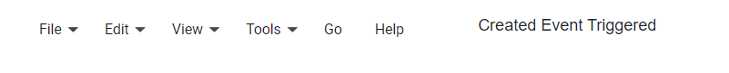

# Events in Blazor Menu Bar

The Blazor Menu Bar component exposes a list of events that fire in response to user actions. The events are wired through the `MenuEvents` child tag of `SfMenu`. When using the `MenuEvents` tag, the `TValue` parameter must be supplied, and it must match the `TValue` of the parent `SfMenu`.

N> All the events should be provided in a single `MenuEvents` tag.

The following table summarizes each event and when it fires. The `args` parameter passed to each handler is described in the [Event arguments](#event-arguments) section below.

| Event | When it fires |
| --- | --- |
| [Created](https://help.syncfusion.com/cr/blazor/Syncfusion.Blazor.Navigations.MenuEvents-1.html#Syncfusion_Blazor_Navigations_MenuEvents_1_Created) | After the Menu Bar has been successfully created. |
| [OnItemRender](https://help.syncfusion.com/cr/blazor/Syncfusion.Blazor.Navigations.MenuEvents-1.html#Syncfusion_Blazor_Navigations_MenuEvents_1_OnItemRender) | While rendering each menu item (fires for every item, including nested submenu items). |
| [OnOpen](https://help.syncfusion.com/cr/blazor/Syncfusion.Blazor.Navigations.MenuEvents-1.html#Syncfusion_Blazor_Navigations_MenuEvents_1_OnOpen) | Before the menu item opens. Cancellable: set `args.Cancel = true` to prevent the open. |
| [OnClose](https://help.syncfusion.com/cr/blazor/Syncfusion.Blazor.Navigations.MenuEvents-1.html#Syncfusion_Blazor_Navigations_MenuEvents_1_OnClose) | Before the submenu closes. Cancellable: set `args.Cancel = true` to prevent the close. |
| [Opened](https://help.syncfusion.com/cr/blazor/Syncfusion.Blazor.Navigations.MenuEvents-1.html#Syncfusion_Blazor_Navigations_MenuEvents_1_Opened) | After the menu item has opened. |
| [Closed](https://help.syncfusion.com/cr/blazor/Syncfusion.Blazor.Navigations.MenuEvents-1.html#Syncfusion_Blazor_Navigations_MenuEvents_1_Closed) | After the menu has closed. |
| [ItemSelected](https://help.syncfusion.com/cr/blazor/Syncfusion.Blazor.Navigations.MenuEvents-1.html#Syncfusion_Blazor_Navigations_MenuEvents_1_ItemSelected) | After a menu item is selected. |

```cshtml

@using Syncfusion.Blazor.Navigations

<SfMenu TValue="MenuItem">
    <MenuItems>
        <MenuItem Text="File">
            <MenuItems>
                <MenuItem Text="Open"></MenuItem>
                <MenuItem Text="Save"></MenuItem>
                <MenuItem Text="Exit"></MenuItem>
            </MenuItems>
        </MenuItem>
        <MenuItem Text="Edit">
            <MenuItems>
                <MenuItem Text="Cut"></MenuItem>
                <MenuItem Text="Copy"></MenuItem>
                <MenuItem Text="Paste"></MenuItem>
            </MenuItems>
        </MenuItem>
        <MenuItem Text="View">
            <MenuItems>
                <MenuItem Text="Toolbars"></MenuItem>
                <MenuItem Text="Zoomr"></MenuItem>
                <MenuItem Text="Full Screen"></MenuItem>
            </MenuItems>
        </MenuItem>
        <MenuItem Text="Tools">
            <MenuItems>
                <MenuItem Text="Spelling & Grammar"></MenuItem>
                <MenuItem Text="Customize"></MenuItem>
                <MenuItem Text="Options"></MenuItem>
            </MenuItems>
        </MenuItem>
        <MenuItem Text="Go"></MenuItem>
        <MenuItem Text="Help"></MenuItem>
    </MenuItems>
    <MenuEvents TValue="MenuItem" Created="created" OnItemRender="onItemRender" OnOpen="onOpen" OnClose="onClose" Opened="opened" Closed="closed" ItemSelected="itemSelected"></MenuEvents>
</SfMenu>
<div id="preview">@eventName Event Triggered</div>

@code {

    private string eventName = "No";

    private void created()
    {
        this.eventName = "Created";
    }

    private void onItemRender()
    {
        this.eventName = "OnItemRender";
    }

    private void onOpen()
    {
        this.eventName = "OnOpen";
    }

    private void onClose()
    {
        this.eventName = "OnClose";
    }

    private void opened()
    {
        this.eventName = "Opened";
    }

    private void closed()
    {
        this.eventName = "Closed";
    }

    private void itemSelected(MenuEventArgs<MenuItem> args)
    {
        //Selected menu item
        var selectedItem = args.Item.Text;
        this.eventName = "ItemSelected";
    }
}

<style>
    #preview {
        float: right;
        padding: 0 350px 0 0;
    }
</style>

```


