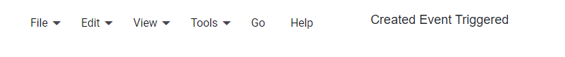

# Events in Blazor Menu Bar Component

The Blazor Menu Bar component provides a comprehensive set of events that can be triggered at various stages of its lifecycle and during user interactions.

The events should be provided to the menu using **MenuEvents** component. When using events of menu, **TValue** must be provided in the **MenuEvents** component.

N> All event handlers should be specified within a single `<MenuEvents>` component instance.

## Created

The Blazor Menu Bar component's [Created](https://help.syncfusion.com/cr/blazor/Syncfusion.Blazor.Navigations.MenuEvents-1.html#Syncfusion_Blazor_Navigations_MenuEvents_1_Created) event triggers once the Menu Bar component has been successfully rendered and initialized. 

## OnItemRender

The Blazor Menu Bar component's [OnItemRender](https://help.syncfusion.com/cr/blazor/Syncfusion.Blazor.Navigations.MenuEvents-1.html#Syncfusion_Blazor_Navigations_MenuEvents_1_OnItemRender) event triggers while each individual menu item is being rendered.

## OnOpen

The Blazor Menu Bar component's [OnOpen](https://help.syncfusion.com/cr/blazor/Syncfusion.Blazor.Navigations.MenuEvents-1.html#Syncfusion_Blazor_Navigations_MenuEvents_1_OnOpen) event triggers immediately *before* a sub-menu opens. 

## OnClose

The Blazor Menu Bar component’s [OnClose](https://help.syncfusion.com/cr/blazor/Syncfusion.Blazor.Navigations.MenuEvents-1.html#Syncfusion_Blazor_Navigations_MenuEvents_1_OnClose) event triggers immediately *before* a sub-menu closes.

## Opened

The Blazor Menu Bar component’s [Opened](https://help.syncfusion.com/cr/blazor/Syncfusion.Blazor.Navigations.MenuEvents-1.html#Syncfusion_Blazor_Navigations_MenuEvents_1_Opened) event triggers *after* a sub-menu has fully opened.

## Closed

The Blazor Menu Bar component’s [Closed](https://help.syncfusion.com/cr/blazor/Syncfusion.Blazor.Navigations.MenuEvents-1.html#Syncfusion_Blazor_Navigations_MenuEvents_1_Closed) event triggers *after* a sub-menu has fully closed.

## ItemSelected

The Blazor Menu Bar component’s [ItemSelected](https://help.syncfusion.com/cr/blazor/Syncfusion.Blazor.Navigations.MenuEvents-1.html#Syncfusion_Blazor_Navigations_MenuEvents_1_ItemSelected) event triggers after a menu item has been selected.

```cshtml

@using Syncfusion.Blazor.Navigations

<SfMenu TValue="MenuItem">
    <MenuItems>
        <MenuItem Text="File">
            <MenuItems>
                <MenuItem Text="Open"></MenuItem>
                <MenuItem Text="Save"></MenuItem>
                <MenuItem Text="Exit"></MenuItem>
            </MenuItems>
        </MenuItem>
        <MenuItem Text="Edit">
            <MenuItems>
                <MenuItem Text="Cut"></MenuItem>
                <MenuItem Text="Copy"></MenuItem>
                <MenuItem Text="Paste"></MenuItem>
            </MenuItems>
        </MenuItem>
        <MenuItem Text="View">
            <MenuItems>
                <MenuItem Text="Toolbars"></MenuItem>
                <MenuItem Text="Zoomr"></MenuItem>
                <MenuItem Text="Full Screen"></MenuItem>
            </MenuItems>
        </MenuItem>
        <MenuItem Text="Tools">
            <MenuItems>
                <MenuItem Text="Spelling & Grammar"></MenuItem>
                <MenuItem Text="Customize"></MenuItem>
                <MenuItem Text="Options"></MenuItem>
            </MenuItems>
        </MenuItem>
        <MenuItem Text="Go"></MenuItem>
        <MenuItem Text="Help"></MenuItem>
    </MenuItems>
    <MenuEvents TValue="MenuItem" Created="created" OnItemRender="onItemRender" OnOpen="onOpen" OnClose="onClose" Opened="opened" Closed="closed" ItemSelected="itemSelected"></MenuEvents>
</SfMenu>
<div id="preview">@eventName Event Triggered</div>

@code {

    private string eventName = "No";

    private void created()
    {
        this.eventName = "Created";
    }

    private void onItemRender()
    {
        this.eventName = "OnItemRender";
    }

    private void onOpen()
    {
        this.eventName = "OnOpen";
    }

    private void onClose()
    {
        this.eventName = "OnClose";
    }

    private void opened()
    {
        this.eventName = "Opened";
    }

    private void closed()
    {
        this.eventName = "Closed";
    }

    private void itemSelected(MenuEventArgs<MenuItem> args)
    {
        //Selected menu item
        var selectedItem = args.Item.Text;
        this.eventName = "ItemSelected";
    }
}

<style>
    #preview {
        float: right;
        padding: 0 350px 0 0;
    }
</style>

```



