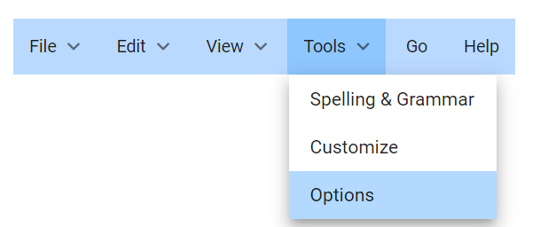

# Styles and Appearance in Blazor Menu Bar Component

To modify the visual appearance of the Menu Bar component, override its default CSS classes. The component exposes specific CSS classes that allow for granular control over different elements. Additionally, users can create custom themes for Syncfusion controls using the [Theme Studio](https://blazor.syncfusion.com/themestudio/?theme=material), a dedicated tool for design customization.

| CSS Class | Purpose of Class |
| ----- | ----- |
| .e-menu-container | To customize the menu wrapper |
| .e-menu-container.e-menu-popup | To customize the menu popup | 
| .e-menu-container .e-ul .e-menu-item | To customize the menu items | 
| .e-menu-container .e-ul .e-menu-item.e-focused | To customize the menu items on focus |
| .e-menu-container ul .e-menu-item .e-caret::before | To customize the menu items caret icon |
| .e-menu-container .e-ul .e-menu-item.e-selected | To customize selected menu item |

## Customizing the Appearance of the Menu

The following CSS example illustrates how to customize the background color of the menu container, as well as the background colors for focused and selected menu items.

```cshtml

@using Syncfusion.Blazor.Navigations

<SfMenu TValue="MenuItem">
    <MenuItems>
        <MenuItem Text="File">
            <MenuItems>
                <MenuItem Text="Open"></MenuItem>
                <MenuItem Text="Save"></MenuItem>
                <MenuItem Text="Exit"></MenuItem>
            </MenuItems>
        </MenuItem>
        <MenuItem Text="Edit">
            <MenuItems>
                <MenuItem Text="Cut"></MenuItem>
                <MenuItem Text="Copy"></MenuItem>
                <MenuItem Text="Paste"></MenuItem>
            </MenuItems>
        </MenuItem>
        <MenuItem Text="View">
            <MenuItems>
                <MenuItem Text="Toolbars"></MenuItem>
                <MenuItem Text="Zoomr"></MenuItem>
                <MenuItem Text="Full Screen"></MenuItem>
            </MenuItems>
        </MenuItem>
        <MenuItem Text="Tools">
            <MenuItems>
                <MenuItem Text="Spelling & Grammar"></MenuItem>
                <MenuItem Text="Customize"></MenuItem>
                <MenuItem Text="Options"></MenuItem>
            </MenuItems>
        </MenuItem>
        <MenuItem Text="Go"></MenuItem>
        <MenuItem Text="Help"></MenuItem>
    </MenuItems>
</SfMenu>

<style>
    .e-menu-container {
        background-color: #bad9ff;
    }

    .e-menu-container .e-menu .e-menu-item.e-selected {
        background-color: #8ec6fe;
    }

    .e-menu-container .e-ul .e-menu-item.e-focused{
        background-color: #b3d9ff;
    }
</style>

```


