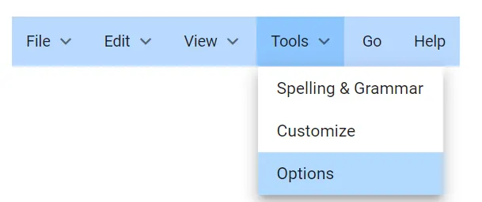

# Style and Appearance in Blazor Menu Bar

To modify the Menu Bar appearance, override the default CSS of the component. The table below lists the CSS classes used by the Menu Bar and the element each class targets. You can also create a custom theme using the Syncfusion [Theme Studio](https://blazor.syncfusion.com/themestudio/?theme=material), which lets you generate a downloadable theme that overrides the default Syncfusion styles for the entire app.

| CSS Class | Purpose of Class |
| ----- | ----- |
| .e-menu-container | To customize the menu wrapper |
| .e-menu-container.e-menu-popup | To customize the menu popup |
| .e-menu-container .e-ul .e-menu-item | To customize the menu items |
| .e-menu-container .e-ul .e-menu-item.e-focused | To customize the menu items on focus |
| .e-menu-container .e-ul .e-menu-item .e-caret | To customize the menu item's caret icon |
| .e-menu-container .e-ul .e-menu-item.e-selected | To customize the selected menu item |

## Customizing the appearance of the menu

Use the following CSS to customize the background color of the menu container, the focus state, and the selected state.

```cshtml

@using Syncfusion.Blazor.Navigations

<SfMenu TValue="MenuItem">
    <MenuItems>
        <MenuItem Text="File">
            <MenuItems>
                <MenuItem Text="Open"></MenuItem>
                <MenuItem Text="Save"></MenuItem>
                <MenuItem Text="Exit"></MenuItem>
            </MenuItems>
        </MenuItem>
        <MenuItem Text="Edit">
            <MenuItems>
                <MenuItem Text="Cut"></MenuItem>
                <MenuItem Text="Copy"></MenuItem>
                <MenuItem Text="Paste"></MenuItem>
            </MenuItems>
        </MenuItem>
        <MenuItem Text="View">
            <MenuItems>
                <MenuItem Text="Toolbars"></MenuItem>
                <MenuItem Text="Zoom"></MenuItem>
                <MenuItem Text="Full Screen"></MenuItem>
            </MenuItems>
        </MenuItem>
        <MenuItem Text="Tools">
            <MenuItems>
                <MenuItem Text="Spelling & Grammar"></MenuItem>
                <MenuItem Text="Customize"></MenuItem>
                <MenuItem Text="Options"></MenuItem>
            </MenuItems>
        </MenuItem>
        <MenuItem Text="Go"></MenuItem>
        <MenuItem Text="Help"></MenuItem>
    </MenuItems>
</SfMenu>

<style>
    .e-menu-container {
        background-color: #bad9ff;
    }

    .e-menu-container .e-menu .e-menu-item.e-selected {
        background-color: #8ec6fe;
    }

    .e-menu-container .e-ul .e-menu-item.e-focused {
        background-color: #b3d9ff;
    }
</style>

```



## See also

* [Menu Bar with Rounded Corner](how-to/menu-with-rounded-corner.md)
* [Animation in Blazor Menu Bar Component](animation.md)