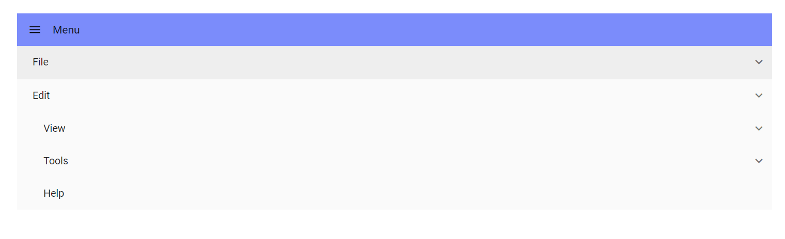
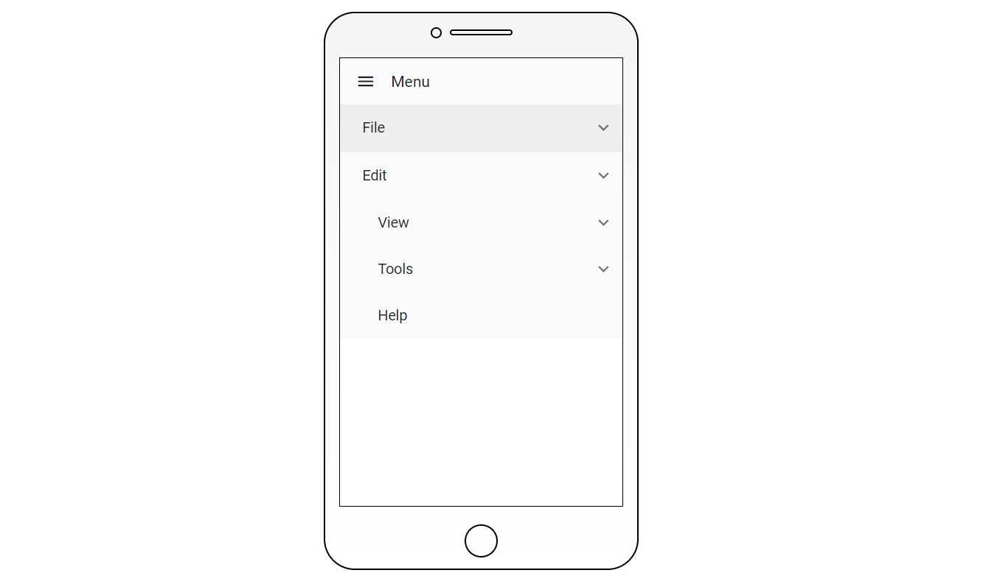

# Use Case Scenarios in Blazor Menu Bar Component

## Scrollable Menu Bar

The Menu Bar component supports horizontal and vertical scrolling to render large Menu Bars and sub menus in an adaptive way. This can be achieved by enabling the [EnableScrolling](https://help.syncfusion.com/cr/blazor/Syncfusion.Blazor.Navigations.SfMenu-1.html) property and by restricting the corresponding Menu Bar/Sub Menu Bar size.

```cshtml

@using Syncfusion.Blazor.Navigations

<SfMenu TValue="MenuItem" EnableScrolling="true" CssClass="e-scrollable-menu">
    <MenuItems>
        <MenuItem Text="File">
            <MenuItems>
                <MenuItem Text="Open"></MenuItem>
                <MenuItem Text="Save"></MenuItem>
                <MenuItem Text="Save As"></MenuItem>
                <MenuItem Text="Print"></MenuItem>
                <MenuItem Text="Share"></MenuItem>
                <MenuItem Text="Info"></MenuItem>
                <MenuItem Text="Exit"></MenuItem>
            </MenuItems>
        </MenuItem>
        <MenuItem Text="Edit">
            <MenuItems>
                <MenuItem Text="Cut"></MenuItem>
                <MenuItem Text="Copy"></MenuItem>
                <MenuItem Text="Paste"></MenuItem>
            </MenuItems>
        </MenuItem>
        <MenuItem Text="View">
            <MenuItems>
                <MenuItem Text="Toolbars"></MenuItem>
                <MenuItem Text="Zoom"></MenuItem>
                <MenuItem Text="Full Screen"></MenuItem>
            </MenuItems>
        </MenuItem>
        <MenuItem Text="Tools">
            <MenuItems>
                <MenuItem Text="Spelling & Grammar"></MenuItem>
                <MenuItem Text="Customize"></MenuItem>
                <MenuItem Text="Options"></MenuItem>
            </MenuItems>
        </MenuItem>
        <MenuItem Text="Insert">
            <MenuItems>
                <MenuItem Text="Comment"></MenuItem>
                <MenuItem Text="Links"></MenuItem>
                <MenuItem Text="Table"></MenuItem>
            </MenuItems>
        </MenuItem>
        <MenuItem Text="Design"></MenuItem>
        <MenuItem Text="Go"></MenuItem>
        <MenuItem Text="Layout"></MenuItem>
        <MenuItem Text="Help"></MenuItem>
    </MenuItems>
</SfMenu>

<style>
    .e-scrollable-menu:not(.e-menu-popup) {
        width: 400px;
    }
</style>

```


## Hamburger Menu

The following example demonstrates the use case of [HamburgerMenu](https://help.syncfusion.com/cr/blazor/Syncfusion.Blazor.Navigations.SfMenu-1.html#Syncfusion_Blazor_Navigations_SfMenu_1_HamburgerMode) mode.

```cshtml

@using Syncfusion.Blazor.Navigations;

<SfMenu TValue="MenuItem" HamburgerMode="true" ShowItemOnClick="true">
    <MenuItems>
        <MenuItem Text="File">
            <MenuItems>
                <MenuItem Text="Open"></MenuItem>
                <MenuItem Text="Save"></MenuItem>
                <MenuItem Text="Exit"></MenuItem>
            </MenuItems>
        </MenuItem>
        <MenuItem Text="Edit">
            <MenuItems>
                <MenuItem Text="Cut"></MenuItem>
                <MenuItem Text="Copy"></MenuItem>
                <MenuItem Text="Paste"></MenuItem>
            </MenuItems>
        </MenuItem>
        <MenuItem Text="View">
            <MenuItems>
                <MenuItem Text="Toolbars">
                    <MenuItems>
                        <MenuItem Text="Menu Bar"></MenuItem>
                        <MenuItem Text="Bookmarks Toolbar"></MenuItem>
                        <MenuItem Text="Customize"></MenuItem>
                    </MenuItems>
                </MenuItem>
            </MenuItems>
        </MenuItem>
        <MenuItem Text="Zoom">
            <MenuItems>
                <MenuItem Text="Zoom In"></MenuItem>
                <MenuItem Text="Zoom Out"></MenuItem>
                <MenuItem Text="Reset"></MenuItem>
            </MenuItems>
        </MenuItem>
        <MenuItem Text="Full Screen"></MenuItem>
        <MenuItem Text="Tools">
            <MenuItems>
                <MenuItem Text="Spelling & Grammar"></MenuItem>
                <MenuItem Text="Customize"></MenuItem>
                <MenuItem Separator="true"></MenuItem>
                <MenuItem Text="Options"></MenuItem>
            </MenuItems>
        </MenuItem>
        <MenuItem Text="Help"></MenuItem>
    </MenuItems>
</SfMenu>

<style>

    .e-menu-header {
        width: 100%;
        background-color: #7b8cfb;
    }
</style>

```



## Mobile View

The following example demonstrates the use case of Menu Bar in Mobile mode with hamburger.

```cshtml

@using Syncfusion.Blazor.Navigations;

<div class="menu-control">
    <div id='layoutcontainer' class="deviceLayout">
        <div class="speaker">
            <div class="camera"></div>
        </div>
        <div class="layout">
            <div id="container">
                <SfMenu TValue="MenuItem" HamburgerMode="true" ShowItemOnClick="true">
                    <MenuItems >
                        <MenuItem Text="File">
                            <MenuItems>
                                <MenuItem Text="Open"></MenuItem>
                                <MenuItem Text="Save"></MenuItem>
                                <MenuItem Separator="true"></MenuItem>
                                <MenuItem Text="Exit"></MenuItem>
                            </MenuItems>
                        </MenuItem>
                        <MenuItem Text="Edit">
                            <MenuItems>
                                <MenuItem Text="Cut"></MenuItem>
                                <MenuItem Text="Copy"></MenuItem>
                                <MenuItem Text="Paste"></MenuItem>
                            </MenuItems>
                        </MenuItem>
                        <MenuItem Text="View">
                            <MenuItems>
                                <MenuItem Text="Toolbars">
                                    <MenuItems>
                                        <MenuItem Text="Menu Bar"></MenuItem>
                                        <MenuItem Text="Bookmarks Toolbar"></MenuItem>
                                        <MenuItem Text="Customize"></MenuItem>
                                    </MenuItems>
                                </MenuItem>
                            </MenuItems>
                        </MenuItem>
                        <MenuItem Text="Zoom">
                            <MenuItems>
                                <MenuItem Text="Zoom In"></MenuItem>
                                <MenuItem Text="Zoom Out"></MenuItem>
                                <MenuItem Text="Reset"></MenuItem>
                            </MenuItems>
                        </MenuItem>
                        <MenuItem Text="Full Screen"></MenuItem>
                        <MenuItem Text="Tools">
                            <MenuItems>
                                <MenuItem Text="Spelling & Grammar"></MenuItem>
                                <MenuItem Text="Customize"></MenuItem>
                                <MenuItem Separator="true"></MenuItem>
                                <MenuItem Text="Options"></MenuItem>
                            </MenuItems>
                        </MenuItem>
                        <MenuItem Text="Help"></MenuItem>
                    </MenuItems>
                </SfMenu>
            </div>
        </div>
        <div class="outerButton"> </div>
    </div>
</div>

<style>
    .deviceLayout #menu {
        -ms-overflow-style: none;
        scrollbar-width: none;
        height: 363px;
    }

        .deviceLayout #menu::-webkit-scrollbar {
            width: 0;
        }

    .menu-control {
        text-align: center;
    }

    #layoutcontainer:not(.deviceLayout) {
        margin-top: 45px;
    }

    .deviceLayout {
        line-height: initial;
        border: 1px solid black;
        width: 285px;
        height: 505px;
        margin: auto;
        margin-bottom: 15px;
        border-radius: 28px;
        position: relative;
        background-image: linear-gradient(to top, #ffffff, #f5f5f5);
    }

        .deviceLayout .speaker {
            border: 1px solid black;
            border-radius: 5px;
            width: 20%;
            height: 5px;
            margin: 15px auto 0px auto;
            position: relative;
        }

        .deviceLayout .outerButton {
            width: 30px;
            height: 30px;
            border: 1px solid black;
            border-radius: 50%;
            position: absolute;
            bottom: calc(0% + 10px);
            left: calc(50% - 15px);
        }

        .deviceLayout .camera {
            position: absolute;
            left: calc(-15% - 10px);
            top: -100%;
            width: 10px;
            height: 10px;
            border-radius: 50%;
            border: 1px solid black;
        }

        .deviceLayout .layout {
            border: 1px solid black;
            margin: 20px 13px 0px 13px;
        }

    .layout #container {
        height: 405px;
        background-color: white;
        overflow: hidden;
    }
</style>

```

