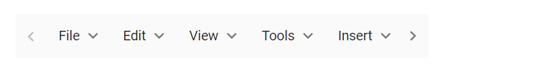
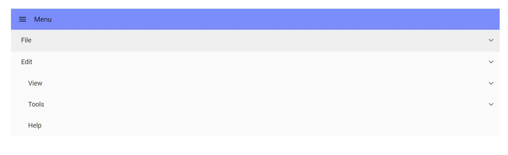
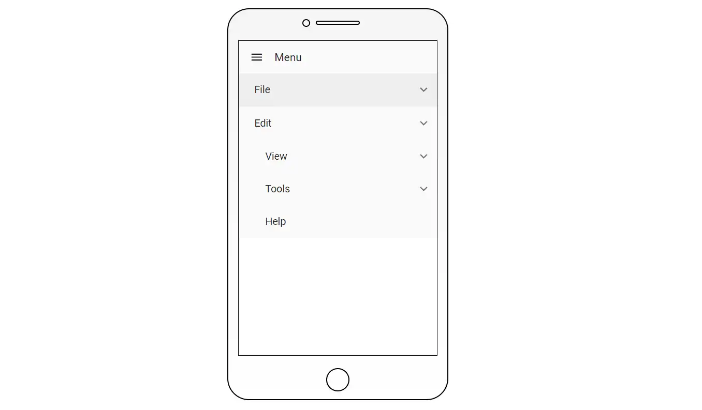

# Use Case Scenarios in Blazor Menu Bar Component

## Scrollable Menu Bar

The Menu Bar component supports horizontal and vertical scrolling to render large menus in a compact, responsive way. Enable it by setting the [EnableScrolling](https://help.syncfusion.com/cr/blazor/Syncfusion.Blazor.Navigations.SfMenu-1.html#Syncfusion_Blazor_Navigations_SfMenu_1_EnableScrolling) property to `true` and constraining the corresponding Menu Bar or submenu size. The scroll direction follows the constrained axis: a fixed `width` produces horizontal scrolling, while a fixed `height` on a submenu produces vertical scrolling.

```cshtml

@using Syncfusion.Blazor.Navigations

<SfMenu TValue="MenuItem" EnableScrolling="true" CssClass="e-scrollable-menu">
    <MenuItems>
        <MenuItem Text="File">
            <MenuItems>
                <MenuItem Text="Open"></MenuItem>
                <MenuItem Text="Save"></MenuItem>
                <MenuItem Text="Save As"></MenuItem>
                <MenuItem Text="Print"></MenuItem>
                <MenuItem Text="Share"></MenuItem>
                <MenuItem Text="Info"></MenuItem>
                <MenuItem Text="Exit"></MenuItem>
            </MenuItems>
        </MenuItem>
        <MenuItem Text="Edit">
            <MenuItems>
                <MenuItem Text="Cut"></MenuItem>
                <MenuItem Text="Copy"></MenuItem>
                <MenuItem Text="Paste"></MenuItem>
            </MenuItems>
        </MenuItem>
        <MenuItem Text="View">
            <MenuItems>
                <MenuItem Text="Toolbars"></MenuItem>
                <MenuItem Text="Zoom"></MenuItem>
                <MenuItem Text="Full Screen"></MenuItem>
            </MenuItems>
        </MenuItem>
        <MenuItem Text="Tools">
            <MenuItems>
                <MenuItem Text="Spelling & Grammar"></MenuItem>
                <MenuItem Text="Customize"></MenuItem>
                <MenuItem Text="Options"></MenuItem>
            </MenuItems>
        </MenuItem>
        <MenuItem Text="Insert">
            <MenuItems>
                <MenuItem Text="Comment"></MenuItem>
                <MenuItem Text="Links"></MenuItem>
                <MenuItem Text="Table"></MenuItem>
            </MenuItems>
        </MenuItem>
        <MenuItem Text="Design"></MenuItem>
        <MenuItem Text="Go"></MenuItem>
        <MenuItem Text="Layout"></MenuItem>
        <MenuItem Text="Help"></MenuItem>
    </MenuItems>
</SfMenu>

<style>
    .e-scrollable-menu:not(.e-menu-popup) {
        width: 400px;
    }
</style>

```



## Hamburger Menu

The following example demonstrates the [Hamburger mode](https://help.syncfusion.com/cr/blazor/Syncfusion.Blazor.Navigations.SfMenu-1.html#Syncfusion_Blazor_Navigations_SfMenu_1_HamburgerMode) of the Menu Bar. When `HamburgerMode="true"` is set, the top-level items collapse behind a hamburger icon on narrow viewports and expand when the icon is clicked. The `ShowItemOnClick="true"` property keeps the menu open after a leaf item is selected, which is the typical mobile / responsive UX.

```cshtml

@using Syncfusion.Blazor.Navigations

<SfMenu TValue="MenuItem" HamburgerMode="true" ShowItemOnClick="true">
    <MenuItems>
        <MenuItem Text="File">
            <MenuItems>
                <MenuItem Text="Open"></MenuItem>
                <MenuItem Text="Save"></MenuItem>
                <MenuItem Text="Exit"></MenuItem>
            </MenuItems>
        </MenuItem>
        <MenuItem Text="Edit">
            <MenuItems>
                <MenuItem Text="Cut"></MenuItem>
                <MenuItem Text="Copy"></MenuItem>
                <MenuItem Text="Paste"></MenuItem>
            </MenuItems>
        </MenuItem>
        <MenuItem Text="View">
            <MenuItems>
                <MenuItem Text="Toolbars">
                    <MenuItems>
                        <MenuItem Text="Menu Bar"></MenuItem>
                        <MenuItem Text="Bookmarks Toolbar"></MenuItem>
                        <MenuItem Text="Customize"></MenuItem>
                    </MenuItems>
                </MenuItem>
            </MenuItems>
        </MenuItem>
        <MenuItem Text="Zoom">
            <MenuItems>
                <MenuItem Text="Zoom In"></MenuItem>
                <MenuItem Text="Zoom Out"></MenuItem>
                <MenuItem Text="Reset"></MenuItem>
            </MenuItems>
        </MenuItem>
        <MenuItem Text="Full Screen"></MenuItem>
        <MenuItem Text="Tools">
            <MenuItems>
                <MenuItem Text="Spelling & Grammar"></MenuItem>
                <MenuItem Text="Customize"></MenuItem>
                <MenuItem Separator="true"></MenuItem>
                <MenuItem Text="Options"></MenuItem>
            </MenuItems>
        </MenuItem>
        <MenuItem Text="Help"></MenuItem>
    </MenuItems>
</SfMenu>

<style>

    .e-menu-header {
        width: 100%;
        background-color: #7b8cfb;
    }
</style>

```



## Mobile view

The following example demonstrates the Menu Bar in [hamburger mode](#hamburger-menu) wrapped in a decorative device frame. The Menu Bar itself is the same as the previous example; the surrounding `.deviceLayout` markup is purely cosmetic to make the result look like a phone screen. The `<style>` block contains both behavior-shaping rules (scrollbar hiding, fixed container height) and cosmetic rules (rounded corners, speaker, camera) — adapt the cosmetic rules for your own layout.

```cshtml

@using Syncfusion.Blazor.Navigations

<div class="menu-control">
    <div id='layoutcontainer' class="deviceLayout">
        <div class="speaker">
            <div class="camera"></div>
        </div>
        <div class="layout">
            <div id="container">
                <SfMenu TValue="MenuItem" HamburgerMode="true" ShowItemOnClick="true">
                    <MenuItems>
                        <MenuItem Text="File">
                            <MenuItems>
                                <MenuItem Text="Open"></MenuItem>
                                <MenuItem Text="Save"></MenuItem>
                                <MenuItem Separator="true"></MenuItem>
                                <MenuItem Text="Exit"></MenuItem>
                            </MenuItems>
                        </MenuItem>
                        <MenuItem Text="Edit">
                            <MenuItems>
                                <MenuItem Text="Cut"></MenuItem>
                                <MenuItem Text="Copy"></MenuItem>
                                <MenuItem Text="Paste"></MenuItem>
                            </MenuItems>
                        </MenuItem>
                        <MenuItem Text="View">
                            <MenuItems>
                                <MenuItem Text="Toolbars">
                                    <MenuItems>
                                        <MenuItem Text="Menu Bar"></MenuItem>
                                        <MenuItem Text="Bookmarks Toolbar"></MenuItem>
                                        <MenuItem Text="Customize"></MenuItem>
                                    </MenuItems>
                                </MenuItem>
                            </MenuItems>
                        </MenuItem>
                        <MenuItem Text="Zoom">
                            <MenuItems>
                                <MenuItem Text="Zoom In"></MenuItem>
                                <MenuItem Text="Zoom Out"></MenuItem>
                                <MenuItem Text="Reset"></MenuItem>
                            </MenuItems>
                        </MenuItem>
                        <MenuItem Text="Full Screen"></MenuItem>
                        <MenuItem Text="Tools">
                            <MenuItems>
                                <MenuItem Text="Spelling & Grammar"></MenuItem>
                                <MenuItem Text="Customize"></MenuItem>
                                <MenuItem Separator="true"></MenuItem>
                                <MenuItem Text="Options"></MenuItem>
                            </MenuItems>
                        </MenuItem>
                        <MenuItem Text="Help"></MenuItem>
                    </MenuItems>
                </SfMenu>
            </div>
        </div>
        <div class="outerButton"> </div>
    </div>
</div>

<style>
    .deviceLayout #menu {
        -ms-overflow-style: none;
        scrollbar-width: none;
        height: 363px;
    }

        .deviceLayout #menu::-webkit-scrollbar {
            width: 0;
        }

    .menu-control {
        text-align: center;
    }

    #layoutcontainer:not(.deviceLayout) {
        margin-top: 45px;
    }

    .deviceLayout {
        line-height: initial;
        border: 1px solid black;
        width: 285px;
        height: 505px;
        margin: auto;
        margin-bottom: 15px;
        border-radius: 28px;
        position: relative;
        background-image: linear-gradient(to top, #ffffff, #f5f5f5);
    }

        .deviceLayout .speaker {
            border: 1px solid black;
            border-radius: 5px;
            width: 20%;
            height: 5px;
            margin: 15px auto 0px auto;
            position: relative;
        }

        .deviceLayout .outerButton {
            width: 30px;
            height: 30px;
            border: 1px solid black;
            border-radius: 50%;
            position: absolute;
            bottom: calc(0% + 10px);
            left: calc(50% - 15px);
        }

        .deviceLayout .camera {
            position: absolute;
            left: calc(-15% - 10px);
            top: -100%;
            width: 10px;
            height: 10px;
            border-radius: 50%;
            border: 1px solid black;
        }

        .deviceLayout .layout {
            border: 1px solid black;
            margin: 20px 13px 0px 13px;
        }

    .layout #container {
        height: 405px;
        background-color: white;
        overflow: hidden;
    }
</style>

```



## See also

* [Styles and Appearances in Blazor Menu Bar Component](style-and-appearance.md)
* [Animation in Blazor Menu Bar Component](animation.md)
* [Menu Bar Events in Blazor](menu-events.md)