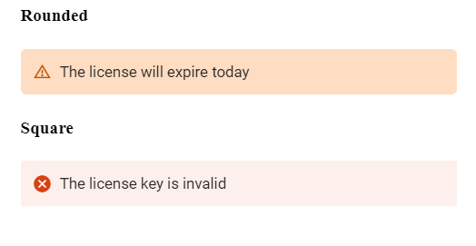
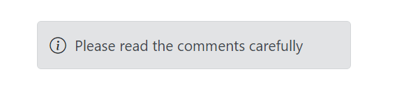

# Customization in Blazor Message

The Message component allows the user to customize the content display positions and appearance. This section explains the details about changing the content alignments and border styles for messages.

## Content Alignment

Normally, the message content is aligned to the **left**. The Message component allows the user to align the message content in the **center** or **right** through the [ContentAlignment](https://help.syncfusion.com/cr/blazor/Syncfusion.Blazor.Notifications.SfMessage.html#Syncfusion_Blazor_Notifications_SfMessage_ContentAlignment) property.

The following example demonstrates the message with different content alignments.




@using Syncfusion.Blazor
@using Syncfusion.Blazor.Notifications

<div class="msg-custom-section">
  <div class="content-section">
    <h4>Content Alignment</h4>
    <SfMessage Severity="MessageSeverity.Success">Your license has been activated successfully</SfMessage>
    <SfMessage Severity="MessageSeverity.Warning" ContentAlignment="HorizontalAlign.Center">The license will expire today</SfMessage>
    <SfMessage Severity="MessageSeverity.Error" ContentAlignment="HorizontalAlign.Right">The license key is invalid</SfMessage>
  </div>
</div>
<style>
  .msg-custom-section .content-section {
    margin: 0 auto;
    max-width: 400px;
    padding-top: 10px;
  }

  .msg-custom-section .e-message {
    margin: 10px 0;
  }
</style>
    




## Rounded and Square

To customize the Message component's appearance, add the custom class to the message through the [CssClass](https://help.syncfusion.com/cr/blazor/Syncfusion.Blazor.Notifications.SfMessage.html#Syncfusion_Blazor_Notifications_SfMessage_CssClass) property. This custom class will be added to the root element. Based on this custom class, the user can override the message styles at the application level.

The following example shows the rounded and squared appearance of the message, which can be achieved by adding the `CssClass` property.




@using Syncfusion.Blazor.Notifications

<div class="msg-custom-section">
  <div class="content-section">
  <h4>Rounded</h4>
    <SfMessage Severity="MessageSeverity.Warning" ContentAlignment="HorizontalAlign.Center" CssClass="rounded">The license will expire today</SfMessage>
    <h4>Square</h4>
    <SfMessage Severity="MessageSeverity.Error" ContentAlignment="HorizontalAlign.Right" CssClass="square">The license key is invalid</SfMessage>
  </div>
</div>
<style>
  .msg-custom-section .content-section {
    margin: 0 auto;
    max-width: 400px;
    padding-top: 10px;
  }

  .msg-custom-section .e-message {
    margin: 10px 0;
  }

  .msg-custom-section .e-message.rounded {
    border-radius: 5px;
  }

  .msg-custom-section .e-message.square {
    border-radius: 1px;
  }
</style>
    





## CSS Message

The Blazor Message has predefined CSS classes that can be defined in the HTML elements, which renders the message without any script reference. This can display a simple message with content and make the code lighter.

The following DOM structure is required to display the simple message with the content.

```bash

<div class="e-message">
    <div class="e-msg-content">..content..</div>
</div>

```

The following DOM structure is required to display the simple message with the content and severity icon.

```bash

<div class="e-message">
    <span class="e-msg-icon"></span>
    <div class="e-msg-content">..content..</div>
</div>

```

The following is the available list of predefined CSS classes to make the appearance of a message.

| Class | Description |
| -------- | -------- |
| e-message | Represents the message wrapper. |
| e-msg-icon | Represents the severity type icon. |
| e-msg-content | Represents the message content. |
| e-msg-close-icon | Represents the close icon. |
| e-info | Represents the information message. |
| e-success | Represents the success message. |
| e-warning | Represents the warning message. |
| e-error | Represents the error message. |
| e-content-center | Aligns the message content to the center. |
| e-content-right | Aligns the message content to the right. |

The following example shows the message which renders without any script reference.




@using Syncfusion.Blazor.Notifications

<div class="msg-default">
    <div id="msg" class="e-message" role="alert">
      <span class="e-msg-icon"></span>
      <div class="e-msg-content">Please read the comments carefully</div>
    </div>
  </div>
<style>
  .msg-custom-section .content-section {
    margin: 0 auto;
    max-width: 400px;
    padding-top: 10px;
  }

  .msg-custom-section .e-message {
    margin: 10px 0;
  }

  .msg-custom-section .e-message.rounded {
    border-radius: 5px;
  }

  .msg-custom-section .e-message.square {
    border-radius: 1px;
  }
</style>
    



