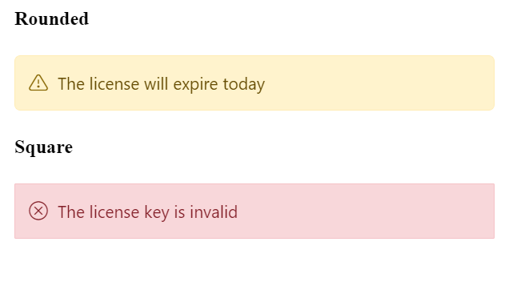

# Customization

The Message can also be customized with its content positions and it appearance.

## Content alignment

The Message content has an different types of alignments such as **Left**, **Right** and **Center**. By default, the message content is aligned to the left. If the user wants to align the content in **Center** or **Right** for their readability, it can be achieved through the `ContentAlignment` property.

The following example demonstrates the message with different content alignments.




@using Syncfusion.Blazor
@using Syncfusion.Blazor.Notifications

  

    <h4>Content Alignment</h4>
    <SfMessage Severity="MessageSeverity.Success">Your license has been activated successfully</SfMessage>
    <SfMessage Severity="MessageSeverity.Warning" ContentAlignment="HorizontalAlign.Center">The license will expire today</SfMessage>
    <SfMessage Severity="MessageSeverity.Error" ContentAlignment="HorizontalAlign.Right">The license key is invalid</SfMessage>
  

    



## Rounded and Square

The following example show the rounded and squared appearance of the message which can be achieved through adding the `CssClass` and customizing the border styles.




@using Syncfusion.Blazor.Notifications

  

  <h4>Rounded</h4>
    <SfMessage Severity="MessageSeverity.Warning" ContentAlignment="HorizontalAlign.Center" CssClass="rounded">The license will expire today</SfMessage>
    <h4>Square</h4>
    <SfMessage Severity="MessageSeverity.Error" ContentAlignment="HorizontalAlign.Right" CssClass="square">The license key is invalid</SfMessage>
  

    



## CSS Message

The Essential JS 2 Message has the following predefined classes that can be defined in the HTML elements which renders the message without any script reference.

| Class | Description |
| -------- | -------- |
| e-message | Used to represent the message styles. |
| e-msg-icon | Used to represent severity type and icon. |
| e-msg-content |  Used to represent the message content. |




@using Syncfusion.Blazor.Notifications

    

      
      
Please read the comments carefully

    

  

    



