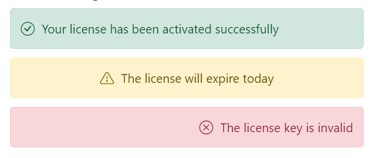

# Customization in Blazor Message

The Message component allows users to customize content alignment and visual appearance. This section explains how to change content alignment and adjust corner radius (rounded or square) using CSS. For an overview and API details, see the Message component documentation (https://blazor.syncfusion.com/documentation/message/getting-started) and the SfMessage API reference (https://help.syncfusion.com/cr/blazor/Syncfusion.Blazor.Notifications.SfMessage.html).

## Content Alignment

By default, message content is aligned to the left. Use the [ContentAlignment](https://help.syncfusion.com/cr/blazor/Syncfusion.Blazor.Notifications.SfMessage.html#Syncfusion_Blazor_Notifications_SfMessage_ContentAlignment) property to align content to the center or right using the HorizontalAlign enum values.

The following example demonstrates messages with different content alignments.




@using Syncfusion.Blazor
@using Syncfusion.Blazor.Notifications

<div class="msg-custom-section">
  <div class="content-section">
    <h4>Content Alignment</h4>
    <SfMessage Severity="MessageSeverity.Success">Your license has been activated successfully</SfMessage>
    <SfMessage Severity="MessageSeverity.Warning" ContentAlignment="HorizontalAlign.Center">The license will expire today</SfMessage>
    <SfMessage Severity="MessageSeverity.Error" ContentAlignment="HorizontalAlign.Right">The license key is invalid</SfMessage>
  </div>
</div>
<style>
  .msg-custom-section .content-section {
    margin: 0 auto;
    max-width: 400px;
    padding-top: 10px;
  }

  .msg-custom-section .e-message {
    margin: 10px 0;
  }
</style>
    





## Rounded and Square

To customize the Message component's appearance, add a custom class to the message via the [CssClass](https://help.syncfusion.com/cr/blazor/Syncfusion.Blazor.Notifications.SfMessage.html#Syncfusion_Blazor_Notifications_SfMessage_CssClass) property. The custom class is appended to the root element (.e-message), allowing styles to be scoped per instance.

The following example shows rounded and square corner styles applied using the CssClass property.




@using Syncfusion.Blazor.Notifications

<div class="msg-custom-section">
  <div class="content-section">
  <h4>Rounded</h4>
    <SfMessage Severity="MessageSeverity.Warning" ContentAlignment="HorizontalAlign.Center" CssClass="rounded">The license will expire today</SfMessage>
    <h4>Square</h4>
    <SfMessage Severity="MessageSeverity.Error" ContentAlignment="HorizontalAlign.Right" CssClass="square">The license key is invalid</SfMessage>
  </div>
</div>
<style>
  .msg-custom-section .content-section {
    margin: 0 auto;
    max-width: 400px;
    padding-top: 10px;
  }

  .msg-custom-section .e-message {
    margin: 10px 0;
  }

  .msg-custom-section .e-message.rounded {
    border-radius: 5px;
  }

  .msg-custom-section .e-message.square {
    border-radius: 1px;
  }
</style>
    




## CSS Message

The Blazor Message provides predefined CSS classes that can be applied to plain HTML elements to render a styled message without component or script references. Ensure a Syncfusion Blazor theme stylesheet is referenced in the app so these classes take effect. This approach provides visual styling only; interactive features (such as close button behavior) require component usage.

The following DOM structure renders a simple message with content:

```bash

<div class="e-message">
    <div class="e-msg-content">..content..</div>
</div>

```

The following DOM structure renders a simple message with content and a severity icon:

```bash

<div class="e-message">
    <span class="e-msg-icon"></span>
    <div class="e-msg-content">..content..</div>
</div>

```

The following is the available list of predefined CSS classes to control the appearance of a message.

| Class | Description |
| -------- | -------- |
| e-message | Represents the message wrapper. |
| e-msg-icon | Represents the severity type icon. |
| e-msg-content | Represents the message content. |
| e-msg-close-icon | Represents the close icon. |
| e-info | Represents the information message. |
| e-success | Represents the success message. |
| e-warning | Represents the warning message. |
| e-error | Represents the error message. |
| e-content-center | Aligns the message content to the center. |
| e-content-right | Aligns the message content to the right. |

The following example shows a message rendered with CSS classes only (no component or script reference). Add appropriate ARIA attributes (for example, role="alert") based on the message purpose for accessibility.




@using Syncfusion.Blazor.Notifications

<div class="msg-default">
    <div id="msg" class="e-message" role="alert">
      <span class="e-msg-icon"></span>
      <div class="e-msg-content">Please read the comments carefully</div>
    </div>
  </div>
<style>
  .msg-custom-section .content-section {
    margin: 0 auto;
    max-width: 400px;
    padding-top: 10px;
  }

  .msg-custom-section .e-message {
    margin: 10px 0;
  }

  .msg-custom-section .e-message.rounded {
    border-radius: 5px;
  }

  .msg-custom-section .e-message.square {
    border-radius: 1px;
  }
</style>
    



