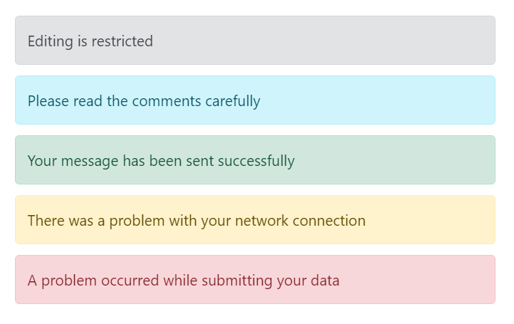
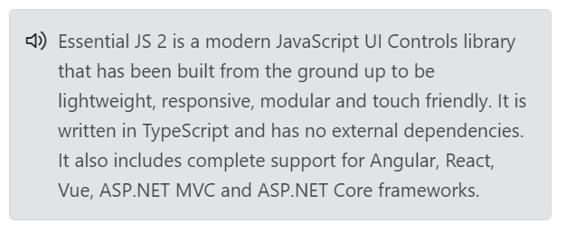
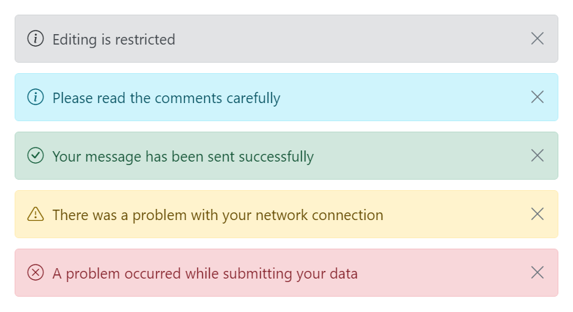

# Icons in Blazor Message

This topic explains how to control icons in the Message component: hide default severity icons, add a custom severity icon with CSS, and show or hide the close icon.

## No Icon

By default, the Message component displays a severity icon that matches the configured severity to provide clear visual context. To hide severity icons, set the [ShowIcon](https://help.syncfusion.com/cr/blazor/Syncfusion.Blazor.Notifications.SfMessage.html#Syncfusion_Blazor_Notifications_SfMessage_ShowIcon) property to false. Severity styling (color/background) still applies even when the icon is hidden.

The following example demonstrates different severity messages without severity icons.




@using Syncfusion.Blazor.Notifications

  

    <SfMessage ShowIcon="@ShowIcon">Editing is restricted</SfMessage>
    <SfMessage Severity="MessageSeverity.Info" ShowIcon="@ShowIcon">Please read the comments carefully</SfMessage>
    <SfMessage Severity="MessageSeverity.Success" ShowIcon="@ShowIcon">Your message has been sent successfully</SfMessage>
    <SfMessage Severity="MessageSeverity.Warning" ShowIcon="@ShowIcon">There was a problem with your network connection</SfMessage>
    <SfMessage Severity="MessageSeverity.Error" ShowIcon="@ShowIcon">A problem occurred while submitting your data</SfMessage>
  

@code {
  private bool ShowIcon = false;
}

    



## Custom Icon

To replace the default severity icon, apply a custom CSS class with [CssClass](https://help.syncfusion.com/cr/blazor/Syncfusion.Blazor.Notifications.SfMessage.html#Syncfusion_Blazor_Notifications_SfMessage_CssClass) and target the icon element (for example, .e-msg-icon::before). A custom glyph font (as shown) or an SVG-based approach can be used to provide a custom icon.

The following example demonstrates a message rendered with a custom severity icon.




@using Syncfusion.Blazor.Notifications

  

    <h4>Custom Message with Icon</h4>
    <SfMessage  CssClass="custom">Essential JS 2 is a modern JavaScript UI Controls library that has
      been built from the ground up to be lightweight, responsive, modular and touch friendly. It is written in TypeScript and has no external dependencies. It also includes complete support for Angular, React, Vue, ASP.NET MVC and ASP.NET Core frameworks.</SfMessage>
  

    



## Close Icon

The Message component can render with or without a close icon. The close icon dismisses the message via click or keyboard activation. By default, the close icon is not shown. To render a close icon, set [ShowCloseIcon](https://help.syncfusion.com/cr/blazor/Syncfusion.Blazor.Notifications.SfMessage.html#Syncfusion_Blazor_Notifications_SfMessage_ShowCloseIcon) to true. Use @bind-Visible to toggle visibility and handle the Closed callback to respond when the message is dismissed.

In the following example, messages are rendered with a close icon.




@using Syncfusion.Blazor.Notifications
@using Syncfusion.Blazor.Buttons

  

    <SfButton Content="Show Default Message" CssClass="@defaultBtnClass" OnClick="@defaultClick"></SfButton>
    <SfMessage ShowIcon="@defaultIcon" Closed="@defaultClosed" ShowCloseIcon="@defaultCloseIcon" @bind-Visible="@defaultVisible">Editing is restricted</SfMessage>
    <SfButton Content="Show Info Message" CssClass="@infoBtnClass" OnClick="@infoClick"></SfButton>
    <SfMessage Severity="MessageSeverity.Info" ShowIcon="@infoIcon" ShowCloseIcon="@infoCloseIcon" Closed="@infoClosed" @bind-Visible="@infoVisible">Please read the comments carefully</SfMessage>
    <SfButton Content="Show Success Message" CssClass="@successBtnClass" OnClick="@successClick"></SfButton>
    <SfMessage Severity="MessageSeverity.Success" ShowIcon="@successIcon" ShowCloseIcon="@successCloseIcon" Closed="@successClosed" @bind-Visible="@successVisible">Your message has been sent successfully</SfMessage>
    <SfButton Content="Show Warning Message" CssClass="@warningBtnClass" OnClick="@warningClick"></SfButton>
    <SfMessage Severity="MessageSeverity.Warning" ShowIcon="@warningIcon" ShowCloseIcon="@warningCloseIcon" Closed="warningClosed" @bind-Visible="@warningVisible">There was a problem with your network connection</SfMessage>
    <SfButton Content="Show Error Message" CssClass="@errorBtnClass" OnClick="@errorClick"></SfButton>
    <SfMessage Severity="MessageSeverity.Error" ShowIcon="@errorIcon" ShowCloseIcon="@errorCloseIcon" Closed="@errorClosed" @bind-Visible="@errorVisible">A problem has been occurred while submitting your data</SfMessage>
  

@code {
  private bool defaultIcon = true;
  private bool successIcon = true;
  private bool warningIcon = true;
  private bool infoIcon = true;
  private bool errorIcon = true;
  private bool defaultVisible = true;
  private bool successVisible = true;
  private bool warningVisible = true;
  private bool errorVisible = true;
  private bool infoVisible = true;
  private bool defaultCloseIcon = true;
  private bool successCloseIcon = true;
  private bool warningCloseIcon = true;
  private bool infoCloseIcon = true;
  private bool errorCloseIcon = true;
  private bool severityChecked = true;
  private bool closeIconChecked = true;
  private string defaultBtnClass = "e-outline e-primary msg-hidden";
  private string infoBtnClass = "e-outline e-primary e-info msg-hidden";
  private string successBtnClass = "e-outline e-primary e-success msg-hidden";
  private string warningBtnClass = "e-outline e-primary e-warning msg-hidden";
  private string errorBtnClass = "e-outline e-primary e-error msg-hidden";

  private void defaultClick()
  {
    this.defaultVisible = true;
    this.defaultBtnClass = "e-outline e-primary msg-hidden";
  }
  private void defaultClosed()
  {
    this.defaultBtnClass = "e-outline e-primary";
  }
  private void infoClick()
  {
    this.infoVisible = true;
    this.infoBtnClass = "e-outline e-primary e-info msg-hidden";
  }
  private void infoClosed()
  {
    this.infoBtnClass = "e-outline e-primary e-info";
  }
  private void successClick()
  {
    this.successVisible = true;
    this.successBtnClass = "e-outline e-primary e-success msg-hidden";
  }
  private void successClosed()
  {
    this.successBtnClass = "e-outline e-primary e-success";
  }
  private void warningClick()
  {
    this.warningVisible = true;
    this.warningBtnClass = "e-outline e-primary e-warning msg-hidden";
  }
  private void warningClosed()
  {
    this.warningBtnClass = "e-outline e-primary e-warning";
  }
  private void errorClick()
  {
    this.errorVisible = true;
    this.errorBtnClass = "e-outline e-primary e-error msg-hidden";
  }
  private void errorClosed()
  {
    this.errorBtnClass = "e-outline e-primary e-error";
  }
}

    



