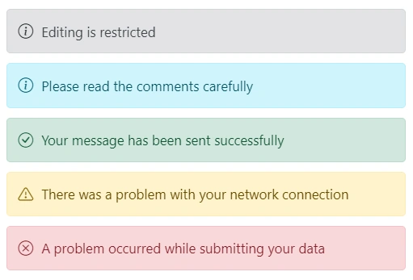

# Severities in the Blazor Message Component

The severity denotes the importance and context of the message to the user. The message contains different severity types. Use the [Severity](https://help.syncfusion.com/cr/blazor/Syncfusion.Blazor.Notifications.SfMessage.html#Syncfusion_Blazor_Notifications_SfMessage_Severity) property to display the messages with different severity levels.

The available severity types are listed below:

- **[Normal](https://help.syncfusion.com/cr/blazor/Syncfusion.Blazor.Notifications.MessageSeverity.html)**: Use for general-purpose messages that do not require special emphasis.
- **[Success](https://help.syncfusion.com/cr/blazor/Syncfusion.Blazor.Notifications.MessageSeverity.html)**: Use to indicate that an operation or action has completed successfully.
- **[Info](https://help.syncfusion.com/cr/blazor/Syncfusion.Blazor.Notifications.MessageSeverity.html)**: Use to provide additional information, guidance, or helpful instructions to users.
- **[Warning](https://help.syncfusion.com/cr/blazor/Syncfusion.Blazor.Notifications.MessageSeverity.html)**: Use to alert users to a potential issue or condition that requires attention but does not prevent them from continuing.
- **[Error](https://help.syncfusion.com/cr/blazor/Syncfusion.Blazor.Notifications.MessageSeverity.html)**: Use to indicate that an operation has failed or cannot be completed.

The default severity type for messages is **[Normal](https://help.syncfusion.com/cr/blazor/Syncfusion.Blazor.Notifications.MessageSeverity.html)**.

The following example demonstrates the severity of the messages.




@using Syncfusion.Blazor.Notifications

  

    <SfMessage Severity="MessageSeverity.Normal">Editing is restricted</SfMessage>
    <SfMessage Severity="MessageSeverity.Info">Please read the comments carefully</SfMessage>
    <SfMessage Severity="MessageSeverity.Success">Your message has been sent successfully</SfMessage>
    <SfMessage Severity="MessageSeverity.Warning">There was a problem with your network connection</SfMessage>
    <SfMessage Severity="MessageSeverity.Error">A problem has been occurred while submitting your data</SfMessage>
  

    



## Dynamically Update Severity in Blazor Message

In addition to setting a fixed severity, you can dynamically update the message severity by binding the [Severity](https://help.syncfusion.com/cr/blazor/Syncfusion.Blazor.Notifications.SfMessage.html#Syncfusion_Blazor_Notifications_SfMessage_Severity) property to a C# variable. This approach is useful when the message state depends on user actions, application logic, or server responses.

The following example demonstrates how to change the message severity at runtime using buttons.




@using Syncfusion.Blazor.Notifications

    <SfMessage Severity="@CurrentSeverity">
        @MessageText
    </SfMessage>

    

        <button class="success-btn" @onclick="ShowSuccess">Success</button>
        <button class="warning-btn" @onclick="ShowWarning">Warning</button>
        <button class="error-btn" @onclick="ShowError">Error</button>
    

@code {
    private MessageSeverity CurrentSeverity = MessageSeverity.Info;
    private string MessageText = "Please review the details.";

    private void ShowSuccess()
    {
        CurrentSeverity = MessageSeverity.Success;
        MessageText = "Data saved successfully.";
    }

    private void ShowWarning()
    {
        CurrentSeverity = MessageSeverity.Warning;
        MessageText = "Some fields require attention.";
    }

    private void ShowError()
    {
        CurrentSeverity = MessageSeverity.Error;
        MessageText = "Failed to save the data.";
    }
}


