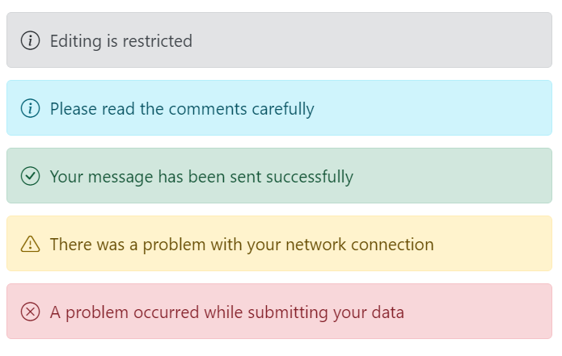

# Severities in Blazor Message

Severity indicates the importance and context of a message. The component supports multiple severity levels configured via the [Severity](https://help.syncfusion.com/cr/blazor/Syncfusion.Blazor.Notifications.SfMessage.html#Syncfusion_Blazor_Notifications_SfMessage_Severity) property on the message (using the MessageSeverity enum). Severity affects the visual style (colors and icon). The default severity is Normal. To hide the severity icon while retaining the style, use the [ShowIcon](https://help.syncfusion.com/cr/blazor/Syncfusion.Blazor.Notifications.SfMessage.html#Syncfusion_Blazor_Notifications_SfMessage_ShowIcon) property.

The available severity types are Normal, Success, Info, Warning, and Error.

The following example demonstrates messages rendered with each severity level.




@using Syncfusion.Blazor.Notifications

  

    <SfMessage>Editing is restricted</SfMessage>
    <SfMessage Severity="MessageSeverity.Info">Please read the comments carefully</SfMessage>
    <SfMessage Severity="MessageSeverity.Success">Your message has been sent successfully</SfMessage>
    <SfMessage Severity="MessageSeverity.Warning">There was a problem with your network connection</SfMessage>
    <SfMessage Severity="MessageSeverity.Error">A problem has been occurred while submitting your data</SfMessage>
  

    



