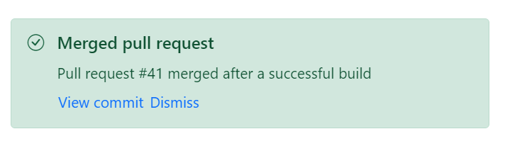

# Template in Blazor Message

The Message component supports templated content, allowing custom structure and elements. Place any valid Razor or HTML—such as headings, paragraphs, or buttons—between the `SfMessage` tags. Severity, icon visibility, and the close icon can still be configured when using templated content.

The following example customizes message content with HTML elements and Blazor Buttons, added directly inside the `SfMessage` tags. The example also demonstrates toggling visibility via a Show button and a Dismiss action.




@using Syncfusion.Blazor.Notifications
@using Syncfusion.Blazor.Buttons

    

        <SfButton Content='Show pull request' CssClass="@showBtnClass" OnClick="@showClick"></SfButton>
        <SfMessage Severity="MessageSeverity.Success" Visible="@visible">
            <h1>Merged pull request</h1>
            
Pull request #41 merged after a successful build

            <SfButton CssClass='e-link' Content='View commit'></SfButton>
            <SfButton CssClass='e-link' Content='Dismiss' OnClick="@dismissClick"></SfButton>
        </SfMessage>
    

@code {
  public string showBtnClass = "e-outline e-primary e-success msg-hidden";
  public bool visible = true;
  public void showClick()
  {
    this.visible = true;
    this.showBtnClass = "e-outline e-primary e-success msg-hidden";
  }
  public void dismissClick()
  {
    this.visible = false;
    this.showBtnClass = "e-outline e-primary e-success";
  }
}

    



