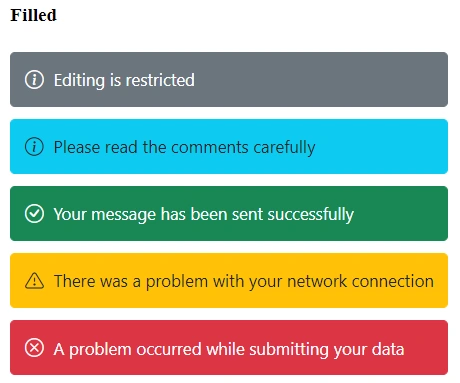
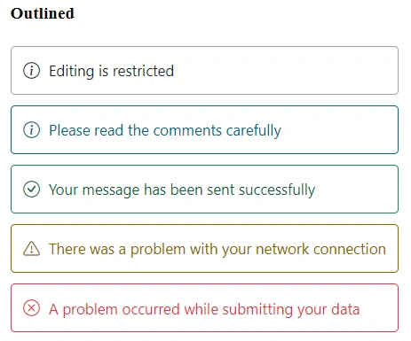
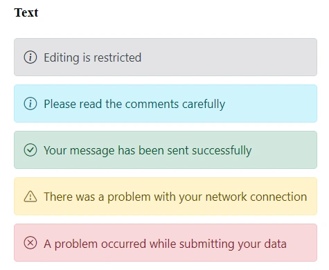
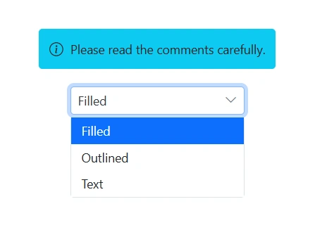

# Variants in the Blazor Message Component

The Message component provides predefined appearance [`variants`](https://help.syncfusion.com/cr/blazor/Syncfusion.Blazor.Notifications.MessageVariant.html) for different use cases. The variants of the message can be changed based on the [Variant](https://help.syncfusion.com/cr/blazor/Syncfusion.Blazor.Notifications.SfMessage.html#Syncfusion_Blazor_Notifications_SfMessage_Variant) property.

The available [`variants`](https://help.syncfusion.com/cr/blazor/Syncfusion.Blazor.Notifications.MessageVariant.html) are [`Text`](https://help.syncfusion.com/cr/blazor/Syncfusion.Blazor.Notifications.MessageVariant.html#fields), [`Outlined`](https://help.syncfusion.com/cr/blazor/Syncfusion.Blazor.Notifications.MessageVariant.html#fields) and [`Filled`](https://help.syncfusion.com/cr/blazor/Syncfusion.Blazor.Notifications.MessageVariant.html#fields). The default variant type for messages is [`Text`](https://help.syncfusion.com/cr/blazor/Syncfusion.Blazor.Notifications.MessageVariant.html#fields).
* [`Text`](https://help.syncfusion.com/cr/blazor/Syncfusion.Blazor.Notifications.MessageVariant.html#fields) - The [severity](https://help.syncfusion.com/cr/blazor/Syncfusion.Blazor.Notifications.MessageSeverity.html) is differentiated using a text color and a light background color.
* [`Outlined`](https://help.syncfusion.com/cr/blazor/Syncfusion.Blazor.Notifications.MessageVariant.html#fields) - The [severity](https://help.syncfusion.com/cr/blazor/Syncfusion.Blazor.Notifications.MessageSeverity.html) is differentiated using a text color and a border without a background.
* [`Filled`](https://help.syncfusion.com/cr/blazor/Syncfusion.Blazor.Notifications.MessageVariant.html#fields) - The [severity](https://help.syncfusion.com/cr/blazor/Syncfusion.Blazor.Notifications.MessageSeverity.html) is differentiated using a text color and a dark background color.

The following example demonstrates the default message with different variant types.




@using Syncfusion.Blazor.Notifications

	

    <h4>Filled</h4>
    <SfMessage Variant="MessageVariant.Filled">Editing is restricted</SfMessage>
    <SfMessage Severity="MessageSeverity.Info" Variant="MessageVariant.Filled">Please read the comments carefully</SfMessage>
    <SfMessage Severity="MessageSeverity.Success" Variant="MessageVariant.Filled">Your message has been sent successfully</SfMessage>
    <SfMessage Severity="MessageSeverity.Warning" Variant="MessageVariant.Filled">There was a problem with your network connection</SfMessage>
    <SfMessage Severity="MessageSeverity.Error" Variant="MessageVariant.Filled">A problem occurred while submitting your data</SfMessage>
  

	  

      <h4>Outlined</h4>
      <SfMessage Variant="MessageVariant.Outlined">Editing is restricted</SfMessage>
      <SfMessage Severity="MessageSeverity.Info" Variant="MessageVariant.Outlined">Please read the comments carefully</SfMessage>
      <SfMessage Severity="MessageSeverity.Success" Variant="MessageVariant.Outlined">Your message has been sent successfully</SfMessage>
      <SfMessage Severity="MessageSeverity.Warning" Variant="MessageVariant.Outlined">There was a problem with your network connection</SfMessage>
      <SfMessage Severity="MessageSeverity.Error" Variant="MessageVariant.Outlined">A problem occurred while submitting your data</SfMessage>
    

    

      <h4>Text</h4>
      <SfMessage>Editing is restricted</SfMessage>
      <SfMessage Severity="MessageSeverity.Info">Please read the comments carefully</SfMessage>
      <SfMessage Severity="MessageSeverity.Success">Your message has been sent successfully</SfMessage>
      <SfMessage Severity="MessageSeverity.Warning">There was a problem with your network connection</SfMessage>
      <SfMessage Severity="MessageSeverity.Error">A problem occurred while submitting your data</SfMessage>
    
    

    



N> The variant appearance (colors, borders) is controlled by the active Syncfusion theme. Switch themes via the fluent2.css/material.css/bootstrap5.css stylesheet to change all variants globally.

## Change Variant Dynamically

The Message variant can also be changed dynamically at runtime using C# code. Bind the [Variant](https://help.syncfusion.com/cr/blazor/Syncfusion.Blazor.Notifications.SfMessage.html#Syncfusion_Blazor_Notifications_SfMessage_Variant) property to a field and update its  on user interactions.




@using Syncfusion.Blazor.Notifications
@using Syncfusion.Blazor.DropDowns

<SfDropDownList TValue="MessageVariant"
                TItem="MessageVariant"
                DataSource="@Variants"
                @bind-Value="CurrentVariant">
</SfDropDownList>

<SfMessage Severity="MessageSeverity.Info"
           Variant="@CurrentVariant">
    Please read the comments carefully.
</SfMessage>

@code {
    private MessageVariant CurrentVariant = MessageVariant.Filled;

    private List<MessageVariant> Variants = new()
    {
        MessageVariant.Filled,
        MessageVariant.Outlined,
        MessageVariant.Text
    };
}
    



