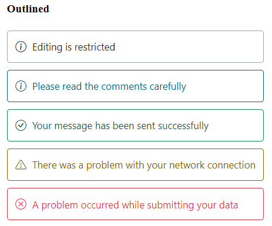
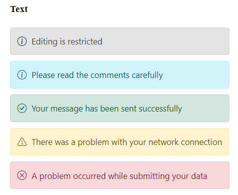

# Variants in Blazor Message

The Message component provides predefined appearance variants for different visual emphasis. Configure the variant using the [Variant](https://help.syncfusion.com/cr/blazor/Syncfusion.Blazor.Notifications.SfMessage.html#Syncfusion_Blazor_Notifications_SfMessage_Variant) property on SfMessage. Variant affects colors, borders, and background styling; severity styling (color/icon) is applied within each variant.

The available variants are Text, Outlined, and Filled. The default variant is Text.
* Text – Differentiates severity with a text color and a light background.
* Outlined – Differentiates severity with a text color and a border, without a background.
* Filled – Differentiates severity with a text color and a dark background.

The following example demonstrates messages rendered with each variant type.




@using Syncfusion.Blazor.Notifications

	

    <h4>Filled</h4>
    <SfMessage Variant="MessageVariant.Filled">Editing is restricted</SfMessage>
    <SfMessage Severity="MessageSeverity.Info" Variant="MessageVariant.Filled">Please read the comments carefully</SfMessage>
    <SfMessage Severity="MessageSeverity.Success" Variant="MessageVariant.Filled">Your message has been sent successfully</SfMessage>
    <SfMessage Severity="MessageSeverity.Warning" Variant="MessageVariant.Filled">There was a problem with your network connection</SfMessage>
    <SfMessage Severity="MessageSeverity.Error" Variant="MessageVariant.Filled">A problem occurred while submitting your data</SfMessage>
  

	  

      <h4>Outlined</h4>
      <SfMessage Variant="MessageVariant.Outlined">Editing is restricted</SfMessage>
      <SfMessage Severity="MessageSeverity.Info" Variant="MessageVariant.Outlined">Please read the comments carefully</SfMessage>
      <SfMessage Severity="MessageSeverity.Success" Variant="MessageVariant.Outlined">Your message has been sent successfully</SfMessage>
      <SfMessage Severity="MessageSeverity.Warning" Variant="MessageVariant.Outlined">There was a problem with your network connection</SfMessage>
      <SfMessage Severity="MessageSeverity.Error" Variant="MessageVariant.Outlined">A problem occurred while submitting your data</SfMessage>
    

    

      <h4>Text</h4>
      <SfMessage>Editing is restricted</SfMessage>
      <SfMessage Severity="MessageSeverity.Info">Please read the comments carefully</SfMessage>
      <SfMessage Severity="MessageSeverity.Success">Your message has been sent successfully</SfMessage>
      <SfMessage Severity="MessageSeverity.Warning">There was a problem with your network connection</SfMessage>
      <SfMessage Severity="MessageSeverity.Error">A problem occurred while submitting your data</SfMessage>
    
    

    



