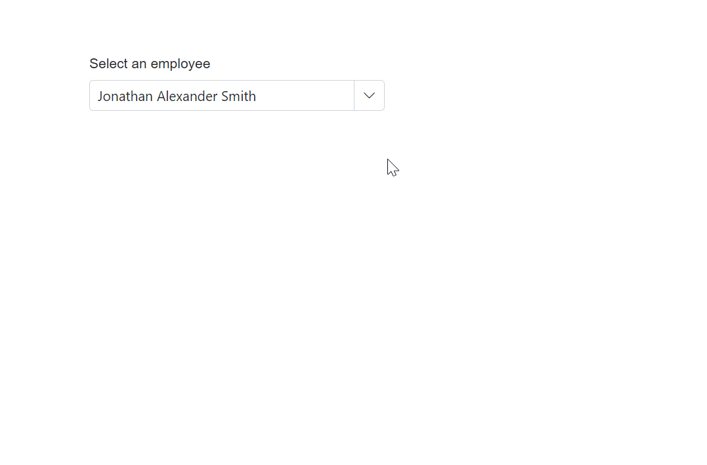
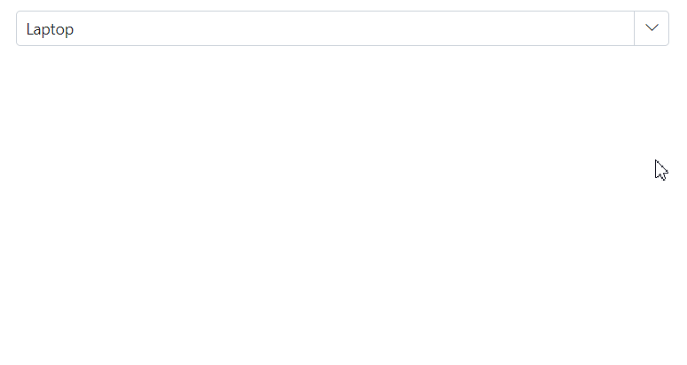

# Configuring the Columns

## TextWrap for column 

The TextWrap in the Blazor MultiColumn ComboBox ensures proper wrapping of text within a specific column’s header or content. By enabling EnableTextWrap, text that exceeds the available space is wrapped for improved readability.

**Key features**

* **TextWrapElement**: This is an enum(Header,Content ,Both) Defines the element where text wrapping is applied.

* **TextOverflowMode**:This is an enum(Ellipsis ,EllipsisWithTooltip) Defines truncates the cell content when it overflows its area.

The following example enables text wrapping for a particular column in the Blazor MultiColumn ComboBox,ensuring that longer text is properly displayed without overflowing.










## Setting the text align

The MultiColumn ComboBox supports auto-generating columns, which simplifies the process by automatically creating columns based on the data source. Additionally, you can customize the column header text to reflect specific data, adjust the column [Width](https://help.syncfusion.com/cr/blazor/Syncfusion.Blazor.MultiColumnComboBox.MultiColumnComboboxColumn.html#Syncfusion_Blazor_MultiColumnComboBox_MultiColumnComboboxColumn_Width) for optimal display, and set the [TextAlign](https://help.syncfusion.com/cr/blazor/Syncfusion.Blazor.MultiColumnComboBox.MultiColumnComboboxColumn.html#Syncfusion_Blazor_MultiColumnComboBox_MultiColumnComboboxColumn_TextAlign) (left, center, or right) to enhance readability.










## Setting the column template

The MultiColumn ComboBox supports [Template](https://help.syncfusion.com/cr/blazor/Syncfusion.Blazor.MultiColumnComboBox.MultiColumnComboboxColumn.html#Syncfusion_Blazor_MultiColumnComboBox_MultiColumnComboboxColumn_Template) within the column, allowing you to define a column template that renders a customized element in each cell.|

In the following sample, it demonstrates how to use Template inside the column.







## Header template

The [HeaderTemplate](https://help.syncfusion.com/cr/blazor/Syncfusion.Blazor.MultiColumnComboBox.MultiColumnComboboxColumn.html#Syncfusion_Blazor_MultiColumnComboBox_MultiColumnComboboxColumn_HeaderTemplate) of the MultiColumn ComboBox component used to customize the header element of a MultiColumn. With this property, you can render custom HTML elements or Blazor components to the header element. This feature allows you to add more functionality to the header, such as sorting or filtering.

In the following sample, defines how to use `HeaderTemplate`.








## Setting display as checkbox 

The MultiColumn ComboBox component allows you to render boolean values as checkboxes in columns. This can be achieved by using the [DisplayAsCheckBox](https://help.syncfusion.com/cr/blazor/Syncfusion.Blazor.MultiColumnComboBox.MultiColumnComboboxColumn.html#Syncfusion_Blazor_MultiColumnComboBox_MultiColumnComboboxColumn_DisplayAsCheckBox)  property. This property is useful when you have a boolean column in your MultiColumn ComboBox and you want to display the values as checkboxes instead of the default text representation of **true** or **false**.

To enable the rendering of boolean values as checkboxes, you need to set the `DisplayAsCheckBox` property to **true**.










## Setting custom attributes

You can customize the appearance of the column headers in MultiColumn ComboBox using the [CustomAttributes](https://help.syncfusion.com/cr/blazor/Syncfusion.Blazor.MultiColumnComboBox.MultiColumnComboboxColumn.html#Syncfusion_Blazor_MultiColumnComboBox_MultiColumnComboboxColumn_CustomAttributes) property.

Set the CustomAttributes property of the target column to a dictionary that defines CSS attributes (for example, a class). The specified CSS is applied to the header cell of that column.

```cshtml
<MultiColumnComboboxColumn Field="Name" Width="200px" CustomAttributes="@(new Dictionary<string, object>() { { "class", "customcss" } })"></MultiColumnComboboxColumn>
```

The following example demonstrates how to customize the appearance of MultiColumn ComboBox columns using custom attributes.











## Setting the format

The [Format](https://help.syncfusion.com/cr/blazor/Syncfusion.Blazor.MultiColumnComboBox.MultiColumnComboboxColumn.html#Syncfusion_Blazor_MultiColumnComboBox_MultiColumnComboboxColumn_Format) property to a column in the SfMultiColumnComboBox, specify a valid format string that matches the data type of the column, such as numeric or date formats. For example, you can apply currency formatting to a price field by using the format "C2".

In the following example, the Price column uses "C2" to display values in a currency format.





 
